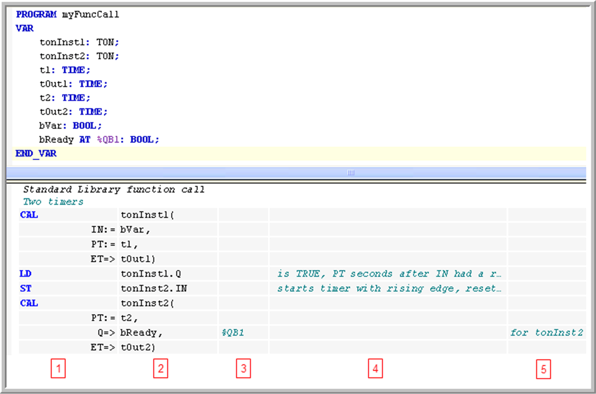
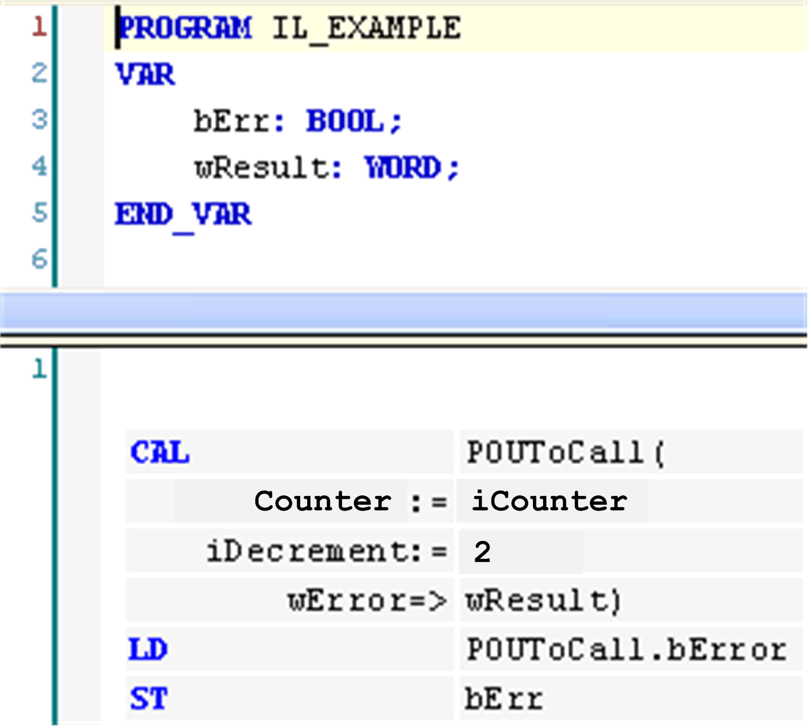

# Working in the IL Editor

## Overview

The IL [Instruction List](D-SE-0083465.html#D-SE-0083465) editor is a table editor. The network structure of FBD or LD programs is also represented in an IL program. Basically, one [network](D-SE-0083474.html#D-SE-0083474) is sufficient in an IL program, but considering switching between FBD, LD and IL you also can use networks for structuring an IL program.

Activate the IL implementation language in the Tools > Options dialog box, category FBD, LD and IL editor, [tab](../../../../../api/crossBook?lang=en-US&virtualBookName=SoMMenu&topicID=D_SE_0084056) IL.

## Tooltip

Tooltips contain information on variables or box parameters.

Refer to [*Working in the FBD and LD Editor View*](D-SE-0083467.html#D-SE-0083467).

## Inserting and Arranging Elements

* The commands for working in the editor are available in the FBD/LD/IL menu. Frequently used commands are also available in the contextual menu.
* Programming units that are elements are inserted each at the current cursor position via the Insert commands, available in the FBD/LD/IL menu.
* You can drag a Network element from the [**ToolBox**](D-SE-0083473.html#D-SE-0083473) onto the up arrow or down arrow on the left-hand side of the editor. A new network is then created above or below the existing element.
* You can use the cut, copy, paste, and delete commands, available in the Edit menu, to arrange elements.
* See also some information on the programming language [Instruction List - IL](D-SE-0083465.html#D-SE-0083465).
* Operators with EN/ENO functionality can be inserted only within the FBD and LD editor.

This chapter explains how the table editor is structured, how you can navigate in the editor and how to use complex operands, calls and jumps.

## Structure of the IL Table Editor

IL table editor



Each program line is written in a table row, structured in fields by the table columns:

| Column | Contains... | Description |
| --- | --- | --- |
| 1 | operator | This field contains the IL operator (LD, ST, CAL, AND, OR, and so on) or a function name.  In case of a function block call, the respective parameters are also specified here. Enter the prefix field `:=` or `=>`.  For further information, refer to [*Modifiers and Operators in IL*](D-SE-0083466.html#D-SE-0083466). |
| 2 | operand | This field contains exactly one operand or a jump label. If more than one operand is needed (multiple/extensible operators AND A, B, C, or function calls with several parameters), write them in the following lines and leave the operator field empty. In this case, add a parameter-separating comma.  In case of a function block, program or action call, add the opening and/or closing brackets. |
| 3 | address | This field contains the address of the operand as defined in the declaration part. You cannot edit this field. Use the option Show symbol address to switch it on or off. |
| 4 | symbol comment | This field contains the comment as defined for the operand in the declaration part. You cannot edit this field. Use the option Show symbol address to switch it on or off. |
| 5 | operand comment | This field contains the comment for the current line. It is editable and can be switched on or off via option Show operand comment. |

## Navigating in the Table

* UP and DOWN arrow keys: Moving to the field above or below.
* TAB: Moving within a line to the field to the right.
* SHIFT + TAB: Moving within in a line to the field to the left.
* SPACE: Opens the currently selected field for editing. Alternatively, performs a further mouse-click on the field. If applicable, the input assistant will be available via the ... button. You can close a currently open edit field by pressing ENTER, confirming the current entries, or by pressing ESC canceling the made entries.
* CTRL + ENTER: Enters a new line below the current one.
* DEL: Removes the current line that is where you have currently selected any field.
* Cut, Copy, Paste: To copy 1 or several lines, select at least 1 field of the line or lines and execute the Copy command. To cut a line, use the Cut command. Paste will insert the previously copied/cut lines before the line where currently a field is selected. If no field is selected, they will be inserted at the end of the network.
* CTRL + HOME scrolls to the begin of the document and marks the first network.
* CTRL + END scrolls to the end of the document and marks the last network.
* PAGE UP scrolls up 1 screen and marks the topmost rectangle.
* PAGE DOWN scrolls down 1 screen and marks the topmost rectangle.

## Multiple Operands (Extensible Operators)

If the same [operator](D-SE-0083466.html#D-SE-0083466) is used with multiple operands, 2 ways of programming are possible:

* The operands are entered in subsequent lines, separated by commas, for example:

  ```
  LD       7
  ADD      2,
           4,
           7
  ST       iVar
  ```
* The instruction is repeated in subsequent lines, for example:

  ```
  LD       7
  ADD      2
  ADD      4
  ADD      7
  ST       iVar
  ```

## Complex Operands

If a complex operand is to be used, enter an opening bracket before, then use the following lines for the particular operand components. Below them, in a separate line, enter the closing bracket.

Example: Rotating a string by 1 character at each cycle.

Corresponding ST code:

```
stRotate := CONCAT(RIGHT(stRotate, (LEN(stRotate) - 1)), (LEFT(stRotate, 1)));
```

```
LD        stRotate
RIGHT(    stRotate
LEN
SUB       1
)
CONCAT(   stRotate
LEFT      1
)
ST        stRotate
```

## Function Calls

Enter the function name in the operator field. Give the (first) input parameter as an operand in a preceding LD operation. If there are further parameters, give the next one in the same line as the function name. You can add further parameters in this line, separated by commas, or in subsequent lines.

The function return value will be stored in the accumulator. The following restriction concerning the IEC standard applies.

NOTE: A function call with multiple return values is not possible. Only 1 return value can be used for a succeeding operation.

Example: Function GeomAverage, which has 3 input parameters, is called. The first parameter is given by X7 in a preceding operation. The second one, 25, is given with the function name. The third one is given by variable tvar, either in the same line or in the subsequent one. The return value is assigned to variable Ave.

Corresponding ST code:

```
Ave := GeomAverage(X7, 25, tvar);
```

Function call in IL:

```
LD             X7
GeomAverage    25
               tvar
ST             Ave
```

## Function Block Calls and Program Calls

Use the CAL- or CALC [operator](D-SE-0083466.html#D-SE-0083466). Enter the function block instance name or the program name in the operand field (second column) followed by the opening bracket. Enter the input parameters each in one of the following lines:

Operator field: Parameter name

Prefix field:

* `:=` for input parameters
* `=>` for output parameter

Operand field: Current parameter

Postfix field:

* `,` if further parameters follow

  `)` after the last parameter
* `()` in case of parameter-less calls

Example: Call of POUToCAll with 2 input and 2 output parameters.

Corresponding ST code:

```
POUToCall(Counter := iCounter, iDecrement:=2, bError=>bErr, wError=>wResult);
```

Program call in IL with input and output parameters:



It is not necessary to use all parameters of a function block or program.

NOTE: Complex expressions cannot be used. These must be assigned to the input of the function block or program before the call instruction.

## Action Call

To be performed like a function block or program call, the action name is to be appended to the instance name or program name.

Example: Call of action ResetAction.

Corresponding ST code:

```
Inst.ResetAction();
```

Action call in IL:

```
CAL      Inst.ResetAction()
```

## Method Call

To be performed like a function call, the instance name with appended method name is to be entered in the first column (operator).

Example: Call of method `Home`.

Corresponding ST code:

```
Z := IHome.Home(TRUE, TRUE, TRUE);
```

Method call in IL:

```
LD             TRUE
IHome.Home     TRUE
               TRUE
ST             Z
```

## Jump

A [jump](D-SE-0083476.html#D-SE-0083476) is programmed by `JMP` in the first column (operator) and a label name in the second column (operand). The label is to be defined in the target network in the [label](D-SE-0083477.html#D-SE-0083477) field.

The statement list preceding the unconditional jump has to end with one of the following commands: ST, STN, S, R, CAL, RET, or another JMP.

This is not the case for a [conditional jump](D-SE-0083476.html#D-SE-0083476). The execution of the jump depends on the value loaded.

Example: Conditional jump instruction; in case `bCallRestAction` is TRUE, the program should jump to the network labeled with `Cont`.

Conditional jump instruction in IL:

```
LDN        bCallResetAction
JMPC       Cont
```

EIO0000002854.09