# Cursor Positions in FBD, LD, and IL

## IL Editor

This is a text editor, structured in form of a table. Each table cell is a possible cursor position. Also refer to [*Working in the IL Editor View*](D-SE-0083468.html#D-SE-0083468).

## FBD and LD Editor

These are graphic editors, see below examples (1) to (15) showing the possible cursor positions: text, input, output, box, contact, coil, return, jump, line between elements and network.

Actions such as cut, copy, paste, delete, and other editor-specific commands refer to the current cursor position or selected element. See [*Working in the FBD and LD Editor*](D-SE-0083467.html#D-SE-0083467).

Basically, in FBD a dotted rectangle around the respective element indicates the current position of the cursor. Additionally, texts and boxes become blue- or red-shadowed.

In LD, coils and contacts become red-colored as soon as the cursor is positioned on.

The cursor position determines which elements are available in the contextual menu for getting [inserted](D-SE-0083467.html#D-SE-0083467__D-SE-0083467.4).

## Possible Cursor Positions

(1) Every text field

|  |  |
| --- | --- |
|  |  |

In the left image, the possible cursor positions are marked by a red-frame. The right image shows a box with the cursor being placed in the AND field. Keep in mind the possibility to enter addresses instead of variable names if configured appropriately in the FBD, LD and IL editor Options dialog box.

(2) Every input:

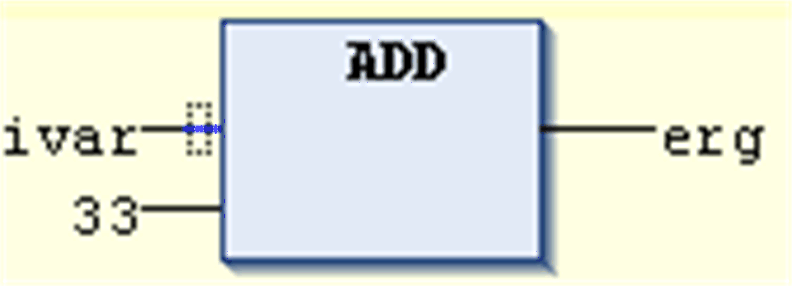

(3) Every operator, function, or function block:

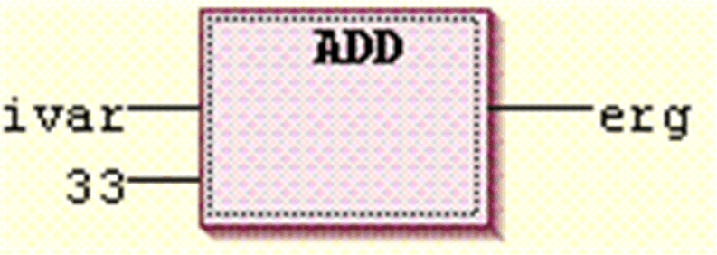

(4) Outputs if an assignment or a jump comes afterward:

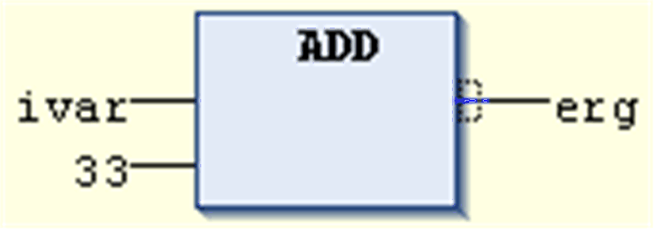

(5) Just before the lined cross above an assignment before a jump or a return instruction:

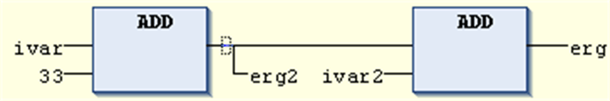

(6) The right-most cursor position in the network or anywhere else in the network besides the other cursor positions. This will select the whole network:

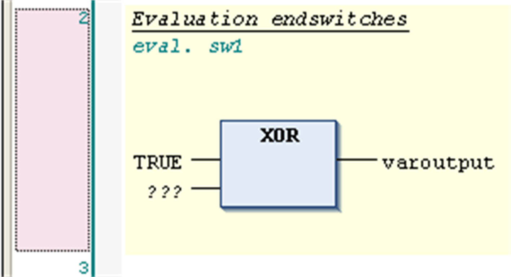

(7) The lined cross directly in front of an assignment:

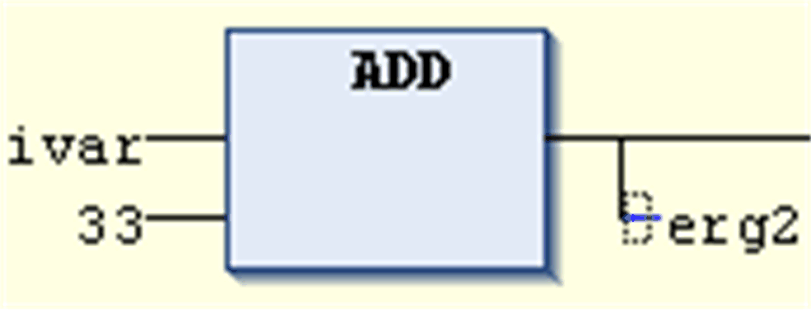

(8) Every contact:

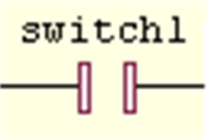

(9) Every coil:

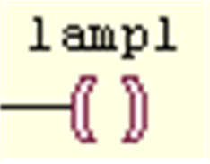

(10) Every return and jump:

|  |  |
| --- | --- |
|  |  |

(11) The connecting line between the contacts and the coils:

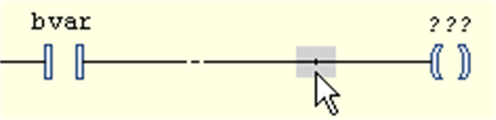

(12) Branch or subnetwork within a network:

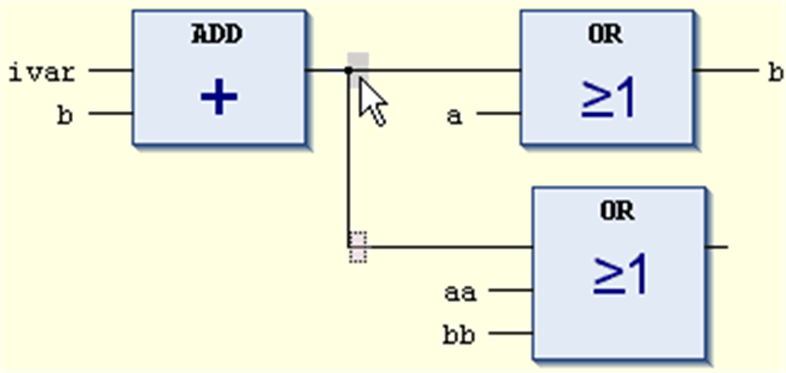

(13) The connection line between parallel contacts (Pos. 1...4):

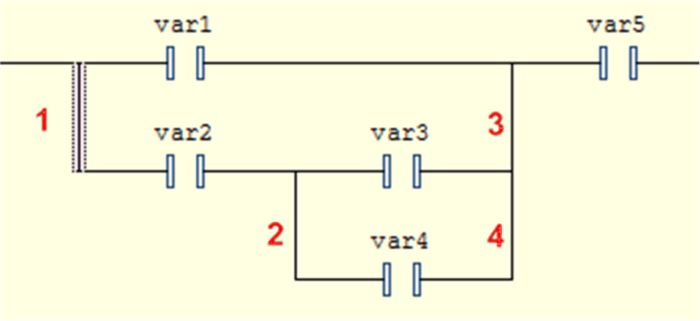

(14) Before or after a network:

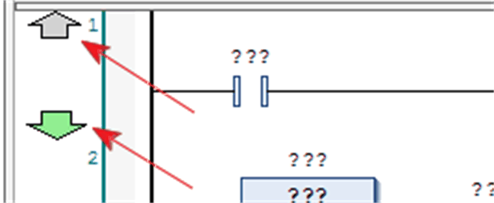

You can add new networks on the left-most side of the editor. The insertion of a new network before an existing network is only possible before network 1.

(15) Begin or end of a network:

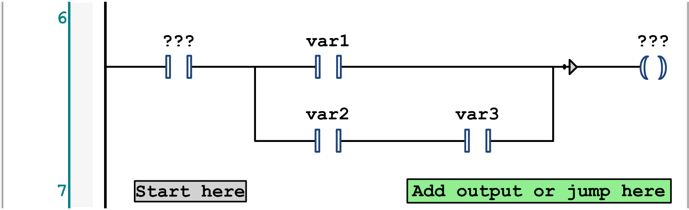

You can add contacts and function blocks at the begin of a network on the field Start here. You can add the elements return, jump, and coil at the end of a network on the field Add output or jump here.

EIO0000002854.09