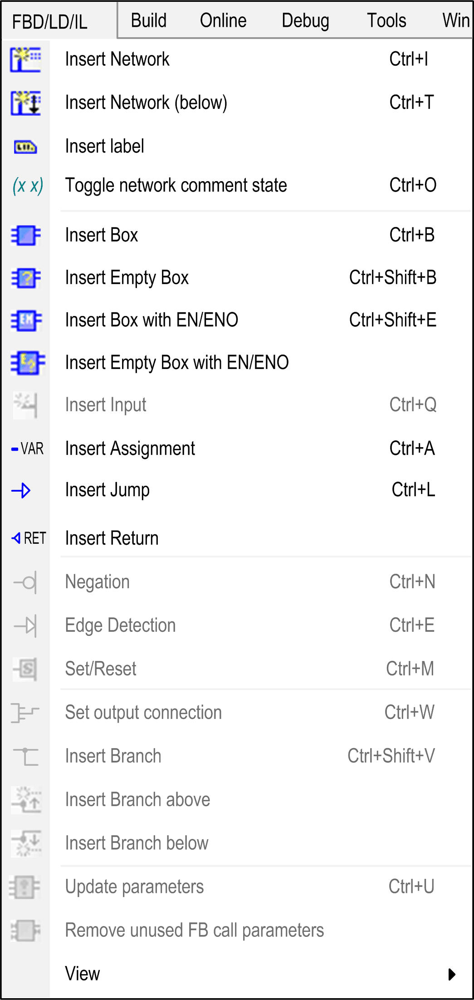

# FBD/LD/IL Menu

## Overview

When the cursor is placed in the [FBD/LD/IL Editor](D-SE-0083462.html#D-SE-0083462) window, the FBD/LD/IL menu is available in the menu bar, providing the commands for programming in the currently set editor view.

FBD/LD/IL menu in FBD editor view:

* For a description of the commands, refer to the chapter *FBD/LD/IL Editor Commands*.
* For configuration of the menu, refer to the description of the Customize Menu.

EIO0000002854.09