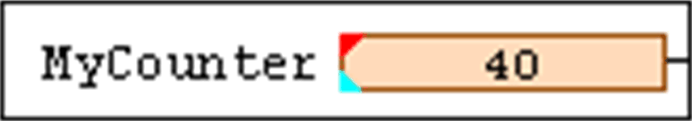
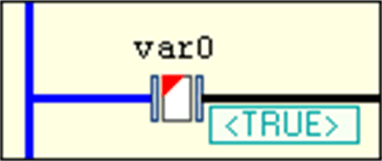
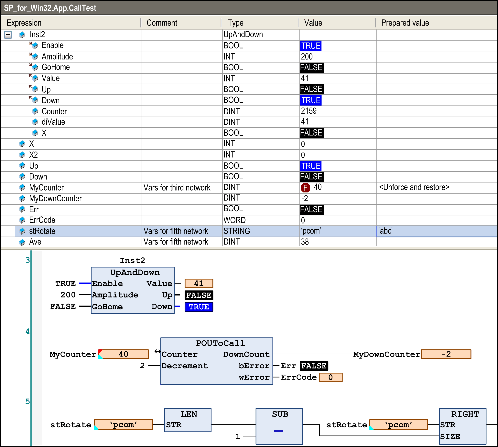
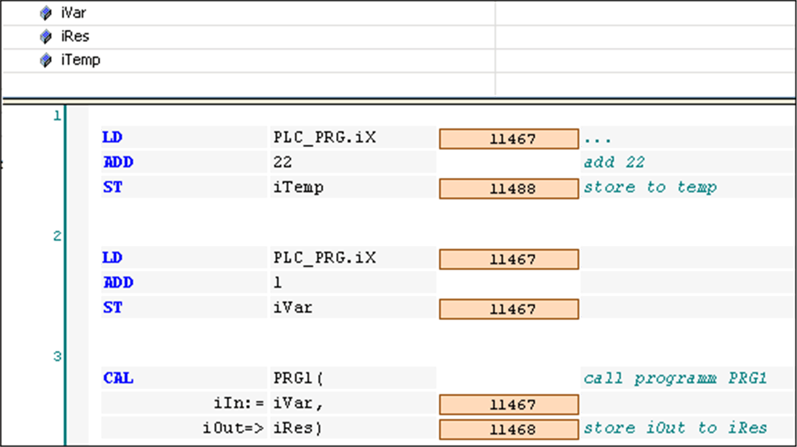
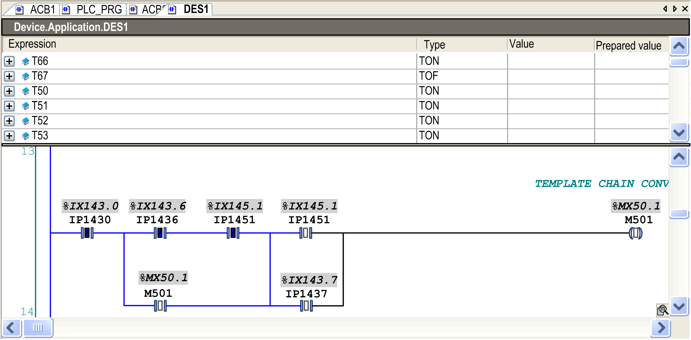
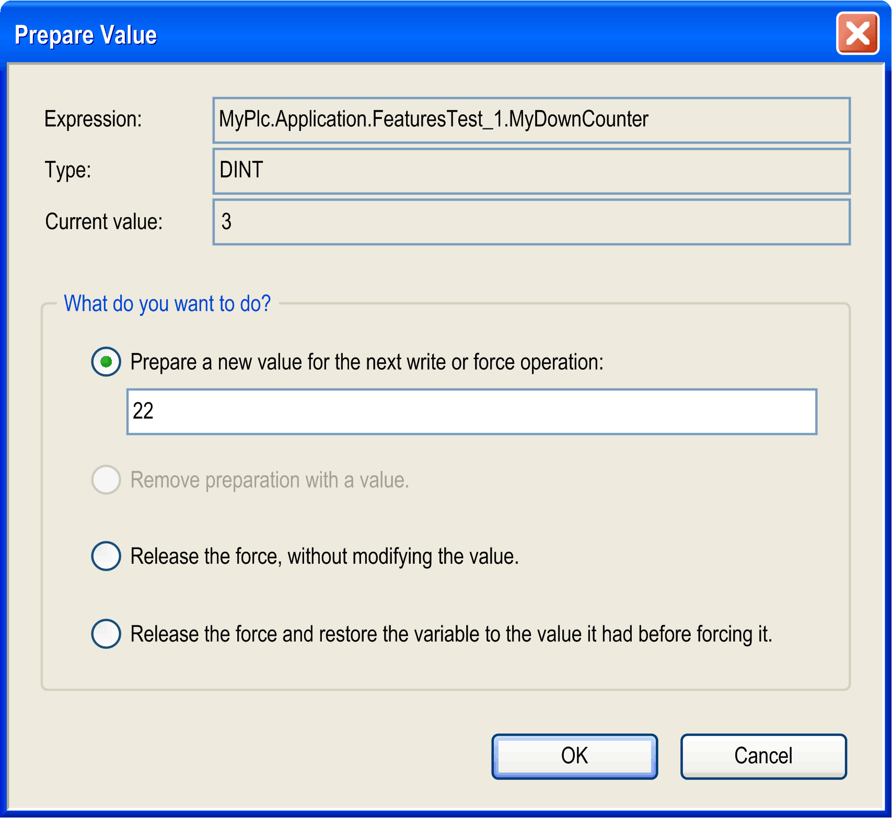
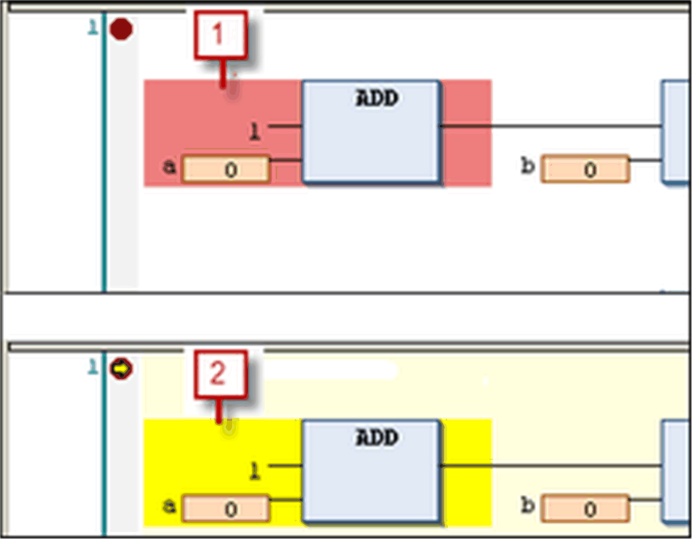
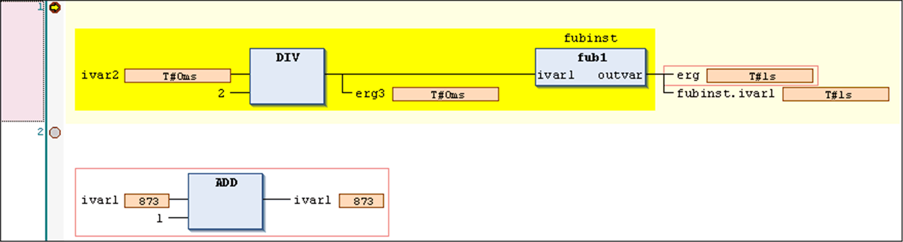
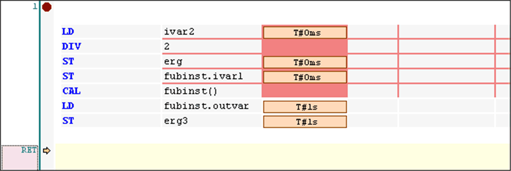

# FBD/LD/IL Editor in Online Mode

## Overview

In online mode, the FBD/LD/IL editor provides views for [Monitoring](#D-SE-0083471__D-SE-0083471.3) and for writing and forcing the values and expressions on the controller.

Debugging functionality (breakpoints, stepping, and so on) is available, see [*Breakpoint or Halt Positions*](#D-SE-0083471__D-SE-0083471.5).

* For information on how to open objects in online mode, refer to the chapter [*User Interface in Online Mode*](D-SE-0083360.html#D-SE-0083360).
* Keep in mind that the editor window of an FBD, LD, or IL object also includes the Declaration Editor in the upper part. Also refer to the chapter [*Declaration Editor in Online Mode*](D-SE-0083520.html#D-SE-0083520).

## Monitoring

If the inline monitoring is not explicitly deactivated in the Options dialog box, it will be supplemented in FBD or LD editor by small monitoring windows behind each variable or by an additional monitoring column showing the actual values (inline monitoring). This is even the case for unassigned function block inputs and outputs.

The inline monitoring window of a variable shows a little red triangle in the upper left corner if the variable is currently [forced](#D-SE-0083471__D-SE-0083471.4), a blue triangle in the lower left corner if the variable is currently prepared for writing or forcing. In LD, for contacts and coils the currently prepared value (TRUE or FALSE) will be displayed down right below the element.

Example for a variable which is currently forced and prepared for releasing the force

Example for a contact variable which is currently prepared to get written or forced with value TRUE

Online view of an FBD program

Online view of an IL program

In online view, ladder networks have animated connections:

* Connections with value TRUE are displayed in bold blue.
* Connections with value FALSE are displayed in bold black.
* Connections with no known value or with an analog value are displayed in standard outline (black and not bold).

The values of the connections are calculated from the monitoring values.

Online view of an LD program

Open a function by double-click or execute the command Browse - Go To Definition from the contextual menu. Refer to the description of the [*User Interface in Online Mode*](D-SE-0083360.html#D-SE-0083360) for further information.

## Forcing/Writing of Variables

In online mode, you can prepare a value for forcing or writing a variable either in the [declaration editor](D-SE-0083520.html#D-SE-0083520) or within the editor. Double-click a variable in the editor to open the following dialog box:

Dialog box Prepare Value

You find the name of the variable completed by its path within the device tree (Expression), its type, and current value. By activating the corresponding item, you can do the following:

* Preparing a new value which has to be entered in the edit field.
* Removing a prepared value.
* Releasing the forced variable.
* Releasing the forced variable and resetting it to the value it was assigned to just before forcing.

The selected action will be carried out on executing the menu command Force values (in the Online menu) or by pressing F7.

For information on how the current state of a variable (forced, prepared value) is indicated at the respective element in the network, refer to the section [*Monitoring*](#D-SE-0083471__D-SE-0083471.3).

## Breakpoint or Halt Positions

Possible positions you can define for a breakpoint (halt position) for debugging purposes are those positions at which values of variables can change (statements), at which the program flow branches out, or at which another POU is called.

These are the following positions:

* On the network as a whole such that the breakpoint will be applied to the first possible position within the network.
* On a [box](D-SE-0083478.html#D-SE-0083478), if this contains a statement. Therefore it is not possible on operator boxes like for example `ADD, DIV`. See the Note below.
* On an assignment.
* At the end of a POU at the point of return to the caller; in online mode, automatically an empty network will be displayed for this purpose. Instead of a network number, it is identified by `RET`.

NOTE: You cannot set a breakpoint directly on the first box of a network. If, however, a breakpoint is set on the complete network, the halt position will automatically be applied to the first box.

For the currently possible positions, refer to the selection list within the View > Breakpoints dialog box.

A network containing any active breakpoint position is marked with the breakpoint symbol (red filled circle) right to the network number and a red-shaded rectangle background for the first possible breakpoint position within the network. Deactivated breakpoint positions are indicated by a non-filled red circle or a surrounding non-filled red rectangle.

Breakpoint set and breakpoint reached

**1** breakpoint set

**2** breakpoint reached

As soon as a breakpoint position is reached during stepping or program processing, a yellow arrow will be displayed in the breakpoint symbol and the red shaded area will change to yellow.

Halt positions shown in FBD

Halt position shown in IL

NOTE: A breakpoint will be set automatically in all methods which may be called. If an interface-managed method is called, breakpoints will be set in all methods of function blocks implementing that interface and in all derivative function blocks subscribing the method. If a method is called via a pointer on a function block, breakpoints will be set in the method of the function block and in all derivative function blocks which are subscribing to the method.

EIO0000002854.09