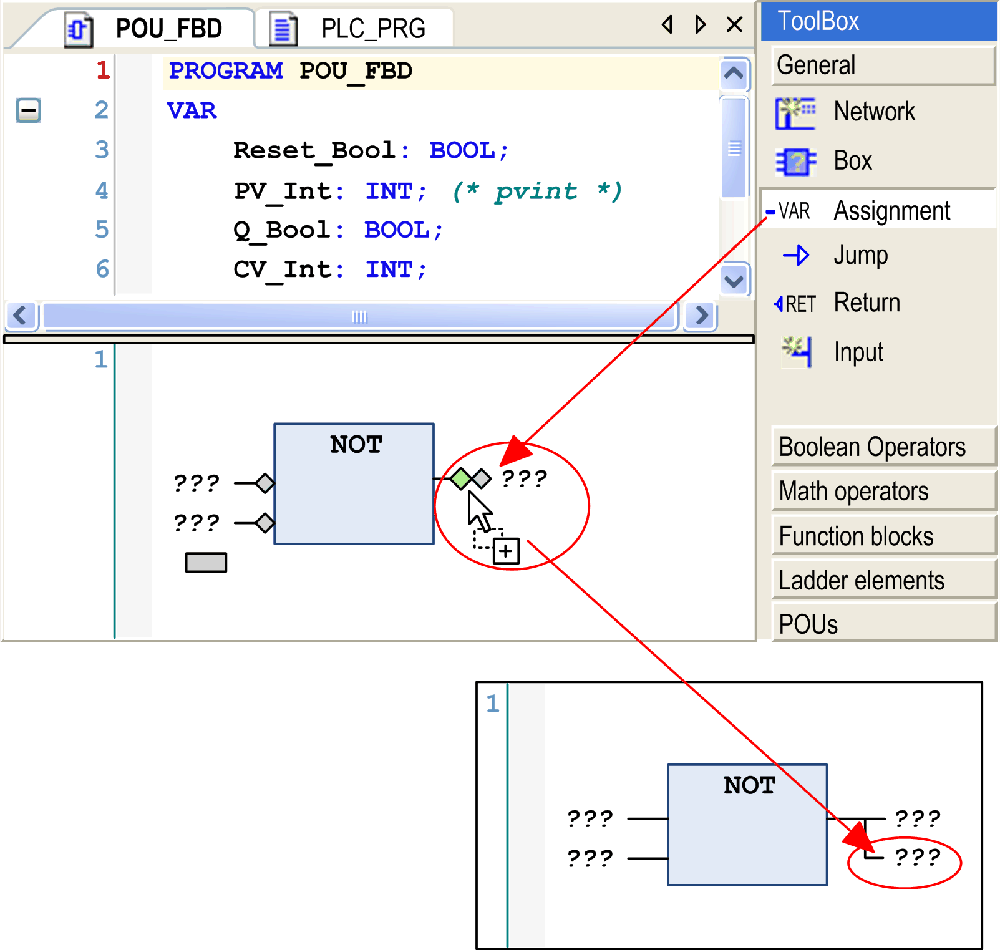

# FBD/LD/IL Toolbox

## Overview

The [FBD/LD/IL Editor](D-SE-0083462.html#D-SE-0083462) provides a toolbox which offers the programming elements for being inserted in the editor window by drag and drop. Open the toolbox by executing the command ToolBox which is in the View menu.

It depends on the currently active editor view which elements are available for inserting (see the respective description of the insert commands).

The elements are sorted in categories: General (general elements such as Network, Assignment and so on), Boolean operators, Math operators, Other operators (for example, `SEL, MUX, LIMIT`, and `MOVE`), Function blocks (for example, `R_TRIG, F_TRIG, RS, SR, TON, TOF, CTD, CTU`), Ladder elements, and POUs (user-defined).

The POUs category lists all POUs which have been defined below the same application as the FBD/LD/IL object which is open in the editor. If a POU has been assigned a bitmap in its properties, then this will be displayed before the POU name. Otherwise, the standard icon for indicating the POU type will be used. The list will be updated automatically when POUs are added or removed from the application.

The category Other operators contains among `SEL, MUX, LIMIT`, and `MOVE` operators a conversion placeholder element. You can drag and drop this element to the desired position of the network. The conversion type is set automatically, dependent on the required type of the insert position. In some situations however the required conversion type cannot be determined automatically. Change the element manually in this case.

To unfold the category folders, click the button showing the respective category name. See in the following image: The category General is unfolded, the others are folded. The image shows an example for inserting an Assignment element by drag and drop from the toolbox.

Only the section General in the toolbox is unfolded:

Insert from toolbox

To insert an element in the editor, select it in the toolbox by a mouse-click and bring it to the editor window by drag and drop. The possible insert positions will be indicated by position markers, which appear as long as the element is drawn - keeping the mouse button pressed - across the editor window. The nearest possible position will light up green. When you release the mouse button, the element will be inserted at the green position.

If you drag a box element on an existing box element, the new one replaces the old one. If inputs and outputs already have been assigned, those will remain as defined, but they will not be connected to the new element box.

EIO0000002854.09