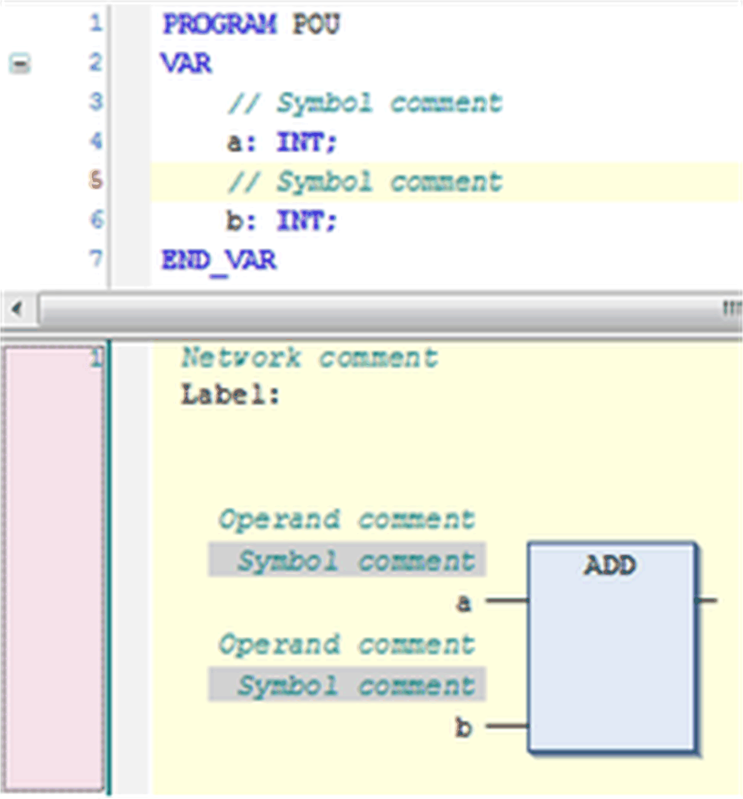

# Network in FBD/LD/IL

## Overview

A network is the basic entity of an [FBD](D-SE-0083463.html#D-SE-0083463) or [LD](D-SE-0083464.html#D-SE-0083464) program. In the FBD/LD editor, the networks are arranged in a vertical list. Each network is designated on the left side by a serial network number and has a structure consisting of either a logical or an arithmetic expression, a program, function or function block call, and possibly jump or return instructions.

The [IL Editor](D-SE-0083465.html#D-SE-0083465), due to the common editor base with the FBD and LD editors, also uses the network element. If an object initially was programmed in FBD or LD and then is converted to IL, the networks will be still present in the IL program. Vice versa, if you start programming an object in IL, you need at least 1 network element which might contain all instructions, but you can also use further networks to structure the program.

A network optionally can get assigned a title, a comment and a [label](D-SE-0083477.html#D-SE-0083477).

You can switch the visibility of the title, the comment fields, and the network separator on and off in the FBD, LD and IL editor options dialog box. If the option is activated, click in the network directly below the upper border to open an edit field for the title. For entering a comment, correspondingly open an edit field directly below the title field. The comment can be multi-lined. Press ENTER to insert line breaks. Press CTRL + ENTER to terminate the input of the comment text.

Whether and how a network comment is displayed in the editor, is defined in the FBD, LD, and IL editor options dialog box.

To add a [label](D-SE-0083477.html#D-SE-0083477), which then can be addressed by a [jump](D-SE-0083476.html#D-SE-0083476), use the command Insert label . If a label is defined, it will be displayed below the title and comment field or - if those are not available - directly below the upper border of the network.

Comments and label in a network

You can set a network in comment state. This indicates that the network is not processed but displayed and handled as a comment. To achieve this, use the command Toggle network comment state.

On a currently selected network ([cursor position 6](D-SE-0083469.html#D-SE-0083469__D-SE-0083469.4)), you can apply the default commands for copying, cutting, inserting, and deleting.

NOTE: Right-clicking ([cursor position 6](D-SE-0083469.html#D-SE-0083469__D-SE-0083469.4)) titles, comments, or labels will select this entry only instead of the whole network. So the execution of the default commands does not affect the network.

To insert a network, use command Insert Network or drag it from the [toolbox](D-SE-0083473.html#D-SE-0083473). A network with all belonging elements can also be [copied or moved](D-SE-0083467.html#D-SE-0083467) by drag and drop within the editor.

You can also create [subnetworks](D-SE-0083480.html#D-SE-0083480) by inserting branches.

## RET Network

In online mode, an additional empty network will be displayed below the existing networks. Instead of a network number, it is identified by RET.

It represents the position at which the execution will return to the calling POU and provides a possible [halt position](D-SE-0083471.html#D-SE-0083471).

EIO0000002854.09