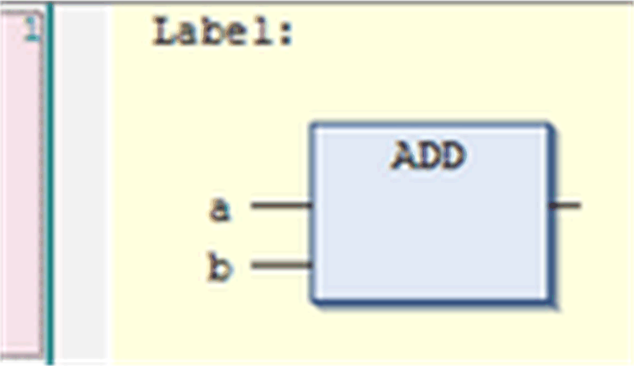

# Label in FBD/LD/IL

## Overview

Below the network comment field each [FBD](D-SE-0083463.html#D-SE-0083463), [LD](D-SE-0083464.html#D-SE-0083464) or IL network have a text input field for defining a label. The label is an optional identifier for the network and can be addressed when defining a [jump](D-SE-0083476.html#D-SE-0083476). It can consist of any sequence of characters.

Position of a label in a network

See the Tools > Options > FBD, LD and IL editor dialog box for defining the display of comment and title.

EIO0000002854.09