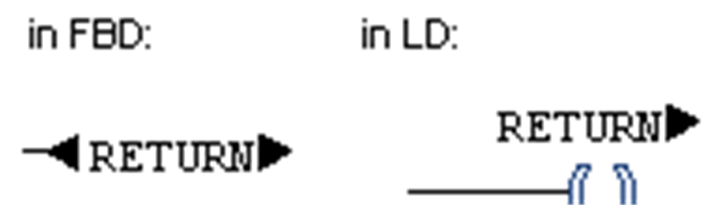

# `RETURN` Instruction in FBD/LD/IL

## Overview

With a `RETURN` instruction, the [FBD](D-SE-0083463.html#D-SE-0083463), [LD](D-SE-0083464.html#D-SE-0083464) or [IL](D-SE-0083465.html#D-SE-0083465) POU can be exited.

In an FBD or LD network, you can place it in parallel or at the end of the previous elements. If the input of a `RETURN` is TRUE, the processing of the POU will immediately be exited.

Execute the command Insert Return to insert a `RETURN` instruction. Alternatively, drag the element from the [toolbox](D-SE-0083473.html#D-SE-0083473) or [copy or move](D-SE-0083467.html#D-SE-0083467) it from another position within the editor.

`RETURN` element

In IL, the [RET](D-SE-0083466.html#D-SE-0083466) instruction is used for the same purpose.

EIO0000002854.09