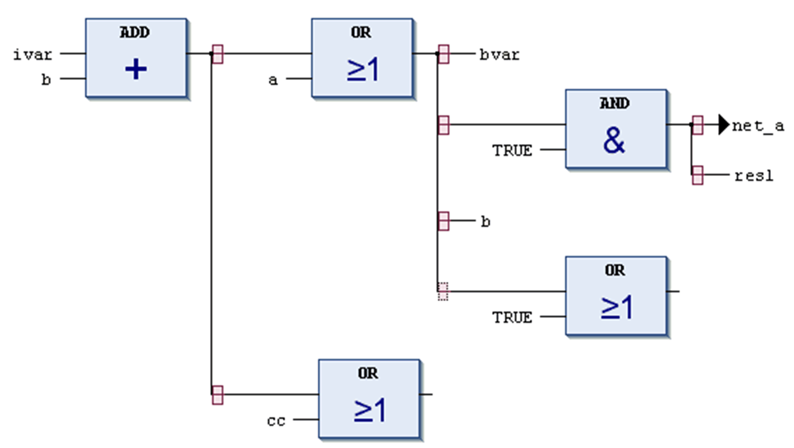
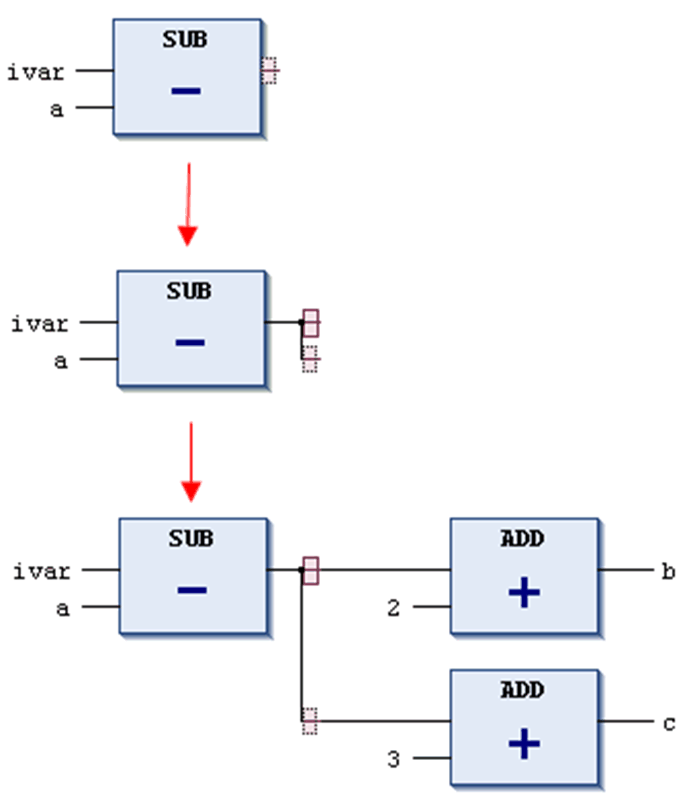
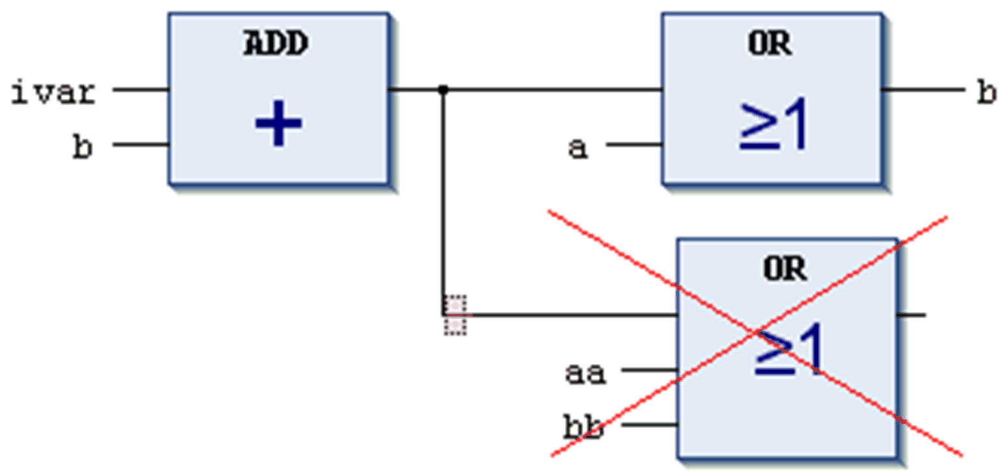

# Branch / Hanging Coil in FBD/LD/IL

## Overview

In a [Function Block Diagram](D-SE-0083463.html#D-SE-0083463) or [Ladder Diagram](D-SE-0083464.html#D-SE-0083464) network, a branch or a hanging coil splits up the processing line as from the current cursor position. The processing line will continue in 2 subnetworks which will be executed 1 after each other from top to bottom. Each subnetwork can get a further branch, such allowing multiple branching within a network.

Each subnetwork gets an own marker (an upright rectangle symbol). You can select it ([cursor position 11](D-SE-0083469.html#D-SE-0083469__D-SE-0083469.4)) in order to perform actions on this arm of the branch.

Branch markers

In FBD, insert a branch via command Insert branch. Alternatively, drag the element from the [toolbox](D-SE-0083473.html#D-SE-0083473). For the possible insert positions, refer to the description of the Insert branch command.

NOTE: Cut and paste is not implemented for subnetworks.

A branch has been inserted at the SUB box output in the example shown below. This created 2 subnetworks, each selectable by their subnet marker. After that, an ADD box was added in each subnetwork.

Network in FBD with inserted branch

To delete a subnetwork, first remove all elements of the subnetwork, that is all elements which are positioned to the right of the marker of the subnetwork. Then select the marker and execute the standard Delete command or press the Delete key.

In the following image, the 3-input-OR element has to be deleted before you can select and delete the marker of the lower subnetwork.

Delete branch or subnetwork

## Execution in Online Mode

The particular branches will be executed from left to right and then from top to bottom.

## IL (Instruction List)

The [IL](D-SE-0083465.html#D-SE-0083465) does not support networks with branches. They will stay in the original representation.

## Parallel Branches

You can use parallel branches for setting up [parallel branch](D-SE-0083481.html#D-SE-0083481) evaluation in ladder networks.

In contrast to the open branch (without the junction point), the parallel branches are closed. They have common split and junction points.

EIO0000002854.09