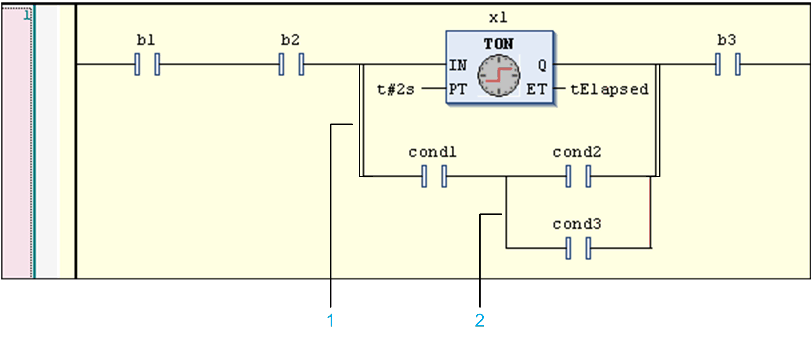
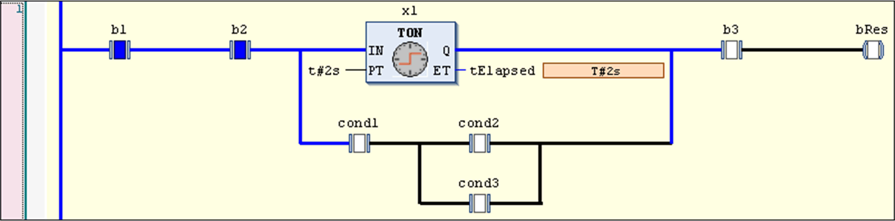
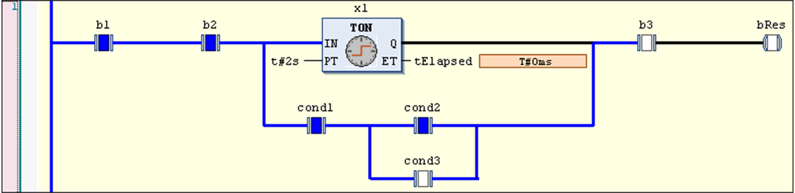

# Parallel Branch

## Overview

A parallel branch allows you to implement a parallel evaluation of logical elements. This is accomplished via a methodology described as Short Circuit Evaluation (SCE). SCE allows you to by-pass the execution of a function block with a boolean output if certain parallel conditions are evaluated to be TRUE. The condition can be represented in the LD editor by a parallel branch to the function block branch. The SCE condition is defined by 1 or several contacts within this branch, connected parallel or sequentially.

The vertical connections of short circuit evaluation branches executed in parallel are represented by a double line in order to differentiate them from OR constructs that are represented by a single line (see the figure *Parallel branch for SCE in a ladder network*).

NOTE: The term branch is also used for another element that splits off a signal flow. This [branch](D-SE-0083480.html#D-SE-0083480) as opposed to the parallel branch has no junction point.

The parallel branch works as follows: first it will be parsed for the branches not containing a function block. If 1 of such branches is evaluated to be TRUE, then the function block in the parallel branch will not be called and the value at the input of the function block branch will be passed to the output. If the SCE condition is evaluated to be FALSE, then the function block will be called and the boolean result of the function block execution call will be passed on.

If all branches contain function blocks, then they will be evaluated in top-to-bottom order and the outputs of them will be combined with logical OR operations. If there are no branches containing a function block call, then the normal OR operation will be performed.

To insert a parallel branch with SCE function, select the function block box and execute the command Insert Contact Parallel above or Insert Contact Parallel below. This is only possible if the first input and the main output of the function block are of type BOOL.

Below is an example of the generated language model for the given network.

## Example for SCE

The function block instance x1 (TON) has a boolean input and a boolean output. Its execution can be skipped if the condition in the parallel branch is evaluated to be TRUE. This condition value results from the OR and AND operations connecting the contacts cond1, cond2 and cond3.

Parallel branch for SCE in a ladder network



**1** The double vertical connection lines indicate a construct that is subject to an SCE.

**2** The single vertical connection line indicates an OR construct.

The processing is as shown in the following, whereby P\_IN and P\_OUT represent the boolean value at the input (split point) and output (junction point) of the parallel branch, respectively.

```
P_IN := b1 AND b2;
IF ((P_IN AND cond1) AND (cond2 OR cond3)) THEN
   P_OUT := P_IN;
ELSE
   x1(IN := P_IN, PT := {p 10}t#2s);
   tElapsed := x1.ET;
   P_OUT := x1.Q;
END_IF
bRes := P_OUT AND b3;
```

The following images show the dataflow (blue) in case the function block is executed (condition resulting from cond1, cond2 and cond3 is FALSE) or bypassed (condition is TRUE).

Condition=FALSE, function block is executed:



Condition=TRUE, function block is bypassed:



EIO0000002854.09