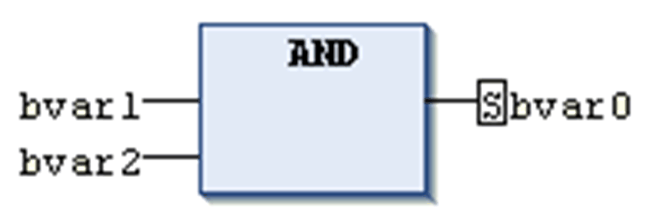

# Set/Reset in FBD/LD/IL

## FBD and LD

A boolean output in [FBD](D-SE-0083463.html#D-SE-0083463) or correspondingly an [LD](D-SE-0083464.html#D-SE-0083464) coil can be set or reset. To change between the set states, use the respective command Set/Reset from the contextual menu when the output is selected. The output or coil will be marked by an S or an R.

|  |  |
| --- | --- |
| Set | If value TRUE arrives at a set output or coil, this output/coil will become TRUE and remain TRUE. This value cannot be overwritten at this position as long as the application is running. |
| Reset | If value TRUE arrives at a reset output or coil, this output/coil will become FALSE and remain FALSE. This value cannot be overwritten at this position as long as the application is running. |

Set output in FBD

In the LD editor, you can insert set and reset coils by drag and drop. To perform this action, use either the ToolBox, category Ladder elements, or the `S` and `R` elements from the tool bar.

Example:

Set coil, reset coil

For further information, see [Set/Reset Coil](D-SE-0083484.html#D-SE-0083484).

## IL

In an Instruction List, use the [S and R](D-SE-0083466.html#D-SE-0083466__D-SE-0083466.3) operators to set or reset an operand.

EIO0000002854.09