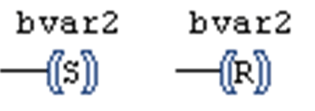

# Set/Reset Coil

## Overview

[Coils](D-SE-0083488.html#D-SE-0083488) can also be defined as set or reset coils.

You can recognize a set coil by the `S` in the coil symbol: (S). A set coil will not overwrite the value TRUE in the appropriate boolean variable. That is, the variable once set to TRUE remains TRUE.

You can recognize a reset coil by the `R` in the coil symbol: (R). A reset coil will not overwrite the value FALSE in the appropriate boolean variable. That is, the variable once set to FALSE will remain FALSE.

In the LD editor, you can insert set coils and reset coils directly via drag and drop from the ToolBox, category Ladder elements. In doing so, you can also replace already inserted coil elements by others.

Set coil, reset coil

EIO0000002854.09