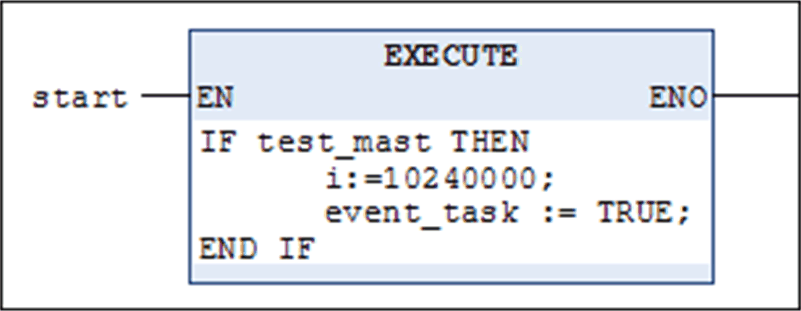
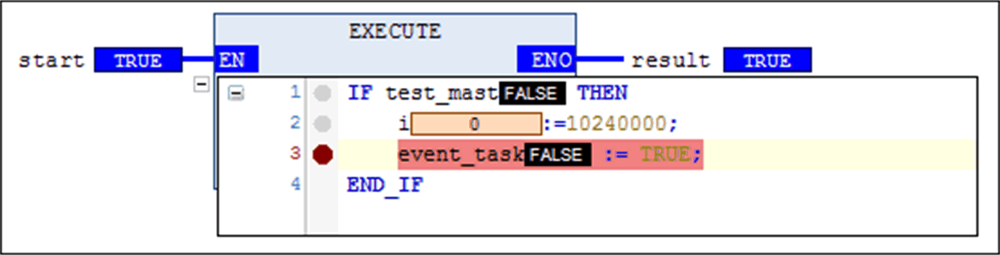

# Execute

## Overview

The `Execute` element is a block with EN/ENO that you can insert in an FBD or LD network and that you can fill with ST code. The ST code is executed when the block is activated for processing with a TRUE signal at the EN input.

Drag the `Execute` element from the [toolbox](../../../../../api/crossBook?lang=en-US&virtualBookName=D-SE-0083473.html#D-SE-0083473) into the network or execute the FBD/LD/IL > Execute [command](../../SoMMenu&topicID=D_SE_0084143) to insert the element.

## Entering ST Code

| Step | Action | Comment |
| --- | --- | --- |
| 1 | Click the input field with the text `Enter ST-Code here...` in the box. | The [ST editor](D-SE-0083510.html#D-SE-0083510) opens providing the usual functionalities. |
| 2 | Enter ST code. | The necessary variable declarations are inserted in the declaration section of the FBD/LD/IL function block. |
| 3 | Complete entering code by clicking out of the block or pressing Ctrl + Enter. | – |

## Online Mode

In online mode, you can open the ST editor by clicking the plus sign under the `EN` input on the function block. The usual online functionalities (monitoring, debugging) are available in the editor.

## Example

Examples for an `Execute` block in the FBD network.

Offline mode, ST program inserted

Online mode, ST editor open

EIO0000002854.09