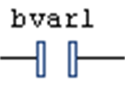

# Contact

## Overview

This is an LD element.

In [LD](D-SE-0083464.html#D-SE-0083464) in its left part, each network contains 1 or several contacts. Contacts are represented by 2 vertical, parallel lines.

Contacts pass on condition ON (TRUE) or OFF (FALSE) from left to right. A boolean variable is assigned to each contact. If this variable is TRUE, the condition is passed from left to right and finally to a coil in the right part of the network. Otherwise the right connection receives the value FALSE.

You can connect multiple contacts in series as well as in parallel. Contacts in parallel represent a logical 'OR' condition such that only one of them need be TRUE to have the parallel branch transmit the value TRUE. Conversely, contacts in series represent a logical 'AND' condition whereas all the contacts must be TRUE to have the final contact transmit TRUE.

Therefore, the contact arrangement corresponds to either an electric parallel or a series circuit.

A contact can also be negated. This is indicated by the slash in the contact symbol.

A negated contact passes on the incoming condition (TRUE or FALSE) only if the assigned boolean variable is FALSE.

You can insert a contact in an LD network via one of the commands Insert Contact or Insert Contact (right) Insert Contact Parallel (above), Insert Contact Parallel (below), Insert Rising Edge Contact, or Insert Falling Edge Contact which are part of the LD menu. Alternatively, you can insert the element via drag and drop from the [**ToolBox**](D-SE-0083473.html#D-SE-0083473) or from another position within the editor (drag and drop).

You can replace an already inserted contact by a new contact or a negated contact. For this purpose, drag a contact or a negated contact from the [toolbox](D-SE-0083473.html#D-SE-0083473) onto an existing contact and drop it there.

## FBD and IL

If you are working in [FBD](D-SE-0083463.html#D-SE-0083463) or [IL](D-SE-0083465.html#D-SE-0083465) view, the command will not be available. But contacts and coils inserted in an LD network will be represented by corresponding FBD elements or IL instructions.

EIO0000002854.09