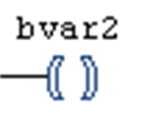
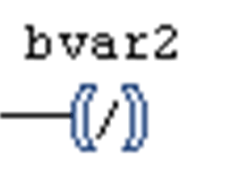

# Coil

## Overview

This is an LD element.

On the right side of an LD network, there can be any number of coils which are represented by parentheses.

They can only be arranged in parallel. A coil transmits the value of the connections from left to right and copies it to an appropriate boolean variable. At the entry line, the value ON (TRUE) or the value OFF (FALSE) can be present.

Coils can also be negated. This is indicated by the slash in the coil symbol.

In this case the negated value of the incoming signal will be copied to the appropriate boolean variable.

You can insert a coil in a network via one of the commands Insert Coil, Insert Set Coil, Insert Reset Coil, or Insert Negated Coil in the LD menu. Alternatively, you can insert the element via drag and drop from the ToolBox (Ladder elements) or via drag and drop from another position within the editor. Also refer to [*Set and Reset Coils*](D-SE-0083484.html#D-SE-0083484).

## FBD and IL

If you are working in [FBD](D-SE-0083463.html#D-SE-0083463) or [IL](D-SE-0083465.html#D-SE-0083465) view, the command will not be available. But contacts and coils inserted in an LD network will be represented by corresponding FBD elements or IL instructions.

EIO0000002854.09