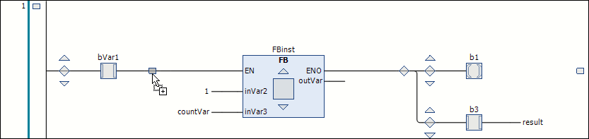

# General Information on the Ladder Editor

## Overview

The Ladder editor is a network-based editor for the IEC programming language LD (Ladder Diagram). Compared to the [FBD/LD/IL Editor](D-SE-0083460.html), it provides simplified editing capabilities. In the FBD/LD/IL editor, it was required to insert separate elements from the ToolBox for variants of elements. With the Ladder editor, variants of elements are created according to the selected insertion position or by switching a modifier.

To convert function blocks that were created in the FBD/LD/IL editor to the Ladder format, use the [Convert to New Ladder command](../../../../../api/crossBook?lang=en-US&virtualBookName=SoMMenu&topicID=ConvertLadder_454176E7).

## How to Create Network Elements

To program a circuit diagram in the implementation part of the Ladder editor, create one or more network elements as follows:

| Step | Action |
| --- | --- |
| 1 | Insert the required elements from the ToolBox or by using the [Ladder editor commands](../../../../../api/crossBook?lang=en-US&virtualBookName=SoMMenu&topicID=LadderEditComm_4518C4C9). |
| 2 | Link the elements. |
| 3 | Assign inputs, outputs and modifiers to the elements. |

Optionally, assign the following elements to a network element:

* Title
* Comment
* Jump label

It is also possible to comment out a network.

## How to Insert Elements

To insert an element, drag it from the ToolBox to a possible insertion position that is indicated when you move the element over the implementation part. Insertion positions are indicated by the following symbols:

* Square with a gray background inside an existing element symbol
* Rhombus on a connecting line
* Triangle pointing up or down for insertion above or below

While moving the mouse over the implementation part, possible positions are indicated by a plus symbol that is displayed at the cursor. When you release the mouse button, the element is inserted. Selected areas in the editor are highlighted in red and outlined. Commands for modifying (Edge Detection, Set/Reset, EN/ENO), deleting, refactoring, searching are available in the contextual menu.

## Online Mode and General Settings

In online mode, you can perform monitoring and debugging with breakpoints as well as writing and forcing of values.

Configure settings concerning the editing in the Ladder editor in the [Tools > Options > Ladder Editor dialog box](../../../../../api/crossBook?lang=en-US&virtualBookName=SoMMenu&topicID=LadderEditor_44B3FC46).

EIO0000002854.09