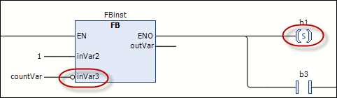
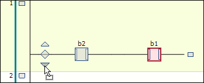
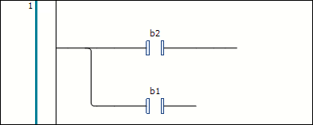
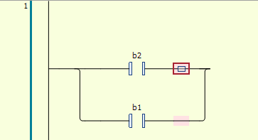
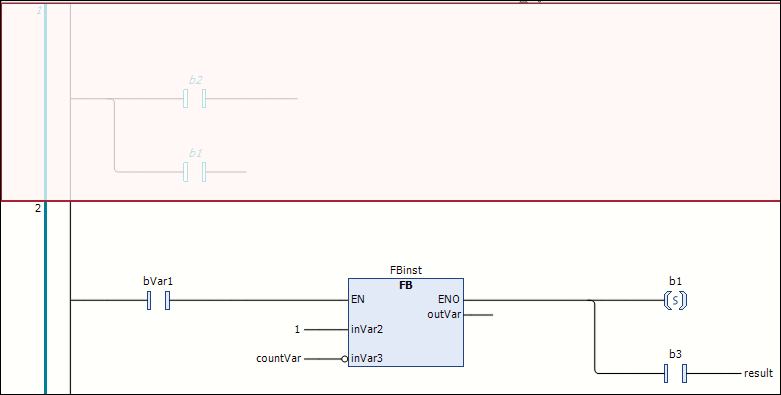
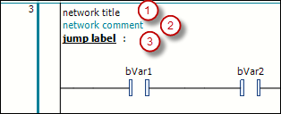

# Programming in the Ladder Editor

## Overview

This section lists instructions that describe individual actions when working in the Ladder editor. A specific program is not created.

As a prerequisite, a POU that is created in the Ladder Diagram implementation language is available in your project. This POU must be open and editable in the Ladder editor.

## Inserting, Updating, Repositioning, and Modifying Elements in a Network

| Task | Description |
| --- | --- |
| Inserting an element | Insert an element as described in [How to Insert Elements](GenInfoLadder-49E70E75.html#GenInfoLadder-49E70E75__HowToInsertElements-49EC2336). The element is inserted in the processing line of the network. |
| Inserting a block | Insert a Block element in the network.  Double-click the three question marks [`???`] in the element box to replace them with the name of the block from the project or a library. It is a good practice to use the Input Assistant by clicking the ... button. |
| Updating a block | After you have called a function block from your project in the ladder editor and modified the function block, run the [Ladder > Update Parameters command](../../../../../api/crossBook?lang=en-US&virtualBookName=SoMMenu&topicID=UpdateParams_45405777) to update in the ladder diagram. |
| Inserting an input | Insert an Input element before the Block. To assign variables, replace the three question marks [`???`] of the element with the variable name. [The Auto Declare dialog box opens, if configured](../../../../../api/crossBook?lang=en-US&virtualBookName=SoMMenu&topicID=D_SE_0083913). |
| Selecting / repositioning elements | To reposition an element, select it in the network so that it is highlighted in red. If, for example, a block is selected, the box inside the block symbol is displayed with a red background.  Drag the element to a possible insertion position that is indicated by the cursor symbol becoming a square, and release the mouse button. |
| Replacing elements | To replace an existing element with another one, drag the new element onto the one you want to replace. When the element to be replaced becomes green, release the mouse button. |
| Adding a new network | To add a new network, drag the Network element to the implementation part.  As a result, square insertion points are displayed in the left margin area where the network numbering is displayed. The new network is inserted above the insertion point. |

## Assigning Modifiers

To assign modifiers to elements, select, for example, the input pin of a function block and open the contextual menu. Select the Negate command to negate the input, or one of the Set/Reset or edge detection commands (Edge detection > Rising Edge, Edge detection > Falling Edge). As a result, the input is marked with the corresponding symbol.

Example: Negated input at the block, set coil

## Creating and Editing Branches

In contrast to the [FBD/LD/IL Editor](../../../../../api/crossBook?lang=en-US&virtualBookName=D-SE-0083460.html), the Ladder editor does not provide elements for [Branches](../../SoMMenu&topicID=ElementBranch_45993B1E). Create and edit branches by positioning or repositioning elements as follows.

1. Create the following network:

   
2. Drag the second contact to the insertion position marked with a downward pointing arrow in front of the first contact. As a result, a parallel branch open to the end is created, in which each branch contains a contact.

   
3. To create a closed branch from the open branch (to program an OR construct), select both branches after the contact element (multiselection). The selection is indicated by the small square with a red background on the line. Right-click and run the [Close Parallel Branch command](../../../../../api/crossBook?lang=en-US&virtualBookName=SoMMenu&topicID=CloseParaBra_451FBA09). As a result, the two parallel branches that were open at the end are converted to a closed branch.

   

There are two options to reopen a closed branch:

* Select one of the two branches and drag the selection box to that of the other branch.
* Select both branches and run the [Open Parallel Branch command](../../../../../api/crossBook?lang=en-US&virtualBookName=SoMMenu&topicID=OpenParaBra_451EBC34).

  NOTE: If you have closed branches of multiple parallel branches, then the Open Parallel Branch command opens the branches.

## Commenting Out a Network

To comment out a network, select a network so that it is displayed with a red background. From the contextual menu, run the [Outcommented command](../../../../../api/crossBook?lang=en-US&virtualBookName=SoMMenu&topicID=Outcommented_451A7350). As a result, the network contents are displayed in gray and the texts in italics. The network is not included in the executable object file.

## Adding a Network Title, Network Comment or Jump Label

You can add a network title (1), a network comment (2), and/or a jump label (3) to a network. To achieve this, click in the first, second, or third line in the upper left corner of the Network element. A jump label is used as a target when inserting a Jump element.

Refer to the [Tools > Options > Ladder Editor dialog box](../../../../../api/crossBook?lang=en-US&virtualBookName=SoMMenu&topicID=LadderEditor_44B3FC46) to display the elements.

EIO0000002854.09