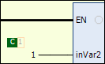
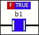
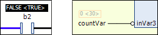
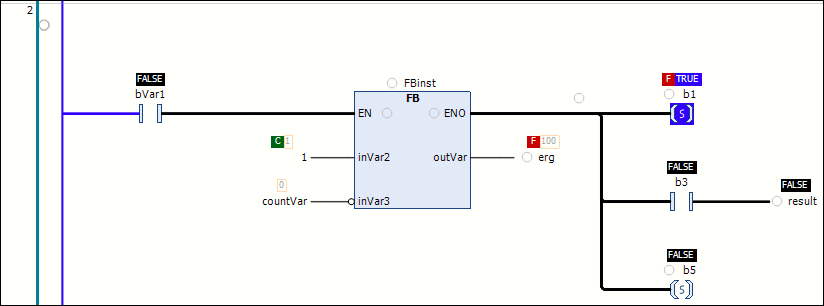

# Monitoring and Detecting Errors

## Overview

In online mode, the Ladder editor supports value monitoring and the writing and forcing of values. You can set breakpoints, and the color-coded representation of the connections allows for a flow control with calculated values.

## Monitoring

In online mode, the value of each variable is displayed in the editor. Constant variables are indicated by a green C symbol. Configure the display of the values in the [Tools > Options > Ladder Editor dialog box](../../../../../api/crossBook?lang=en-US&virtualBookName=SoMMenu&topicID=LadderEditor_44B3FC46).

Example of a constant value:

## Writing and Forcing Values

A variable that is being forced, is indicated by a red F symbol before the forced value. If a value has been prepared for writing or forcing, then this value is displayed directly after the present value in angle brackets.

Example of a forced value:

Example of a prepared value:

## Color-Coded Representations of Connections

In the online view of a Ladder diagram, the connecting lines are displayed in different colors.

* Connections with the value TRUE are indicated by a thick blue line.
* Connections with the value FALSE are indicated by a thick black line.
* Connections with an undetermined or analog value are displayed as a thin black line.

NOTE: The value of the connections is not read from the monitored variables, but it is calculated by the programming system. Thus, this is not a genuine flow control.

Example of connecting lines and breakpoint positions:

## Breakpoints

Breakpoints can be set at positions where the values of variables can change (instructions), where the program branches, or where another POU is called. Possible breakpoint positions are indicated by an empty gray circle. Set breakpoints are displayed as a solid red circle. Refer to the [figure indicating connecting lines and breakpoint positions](#MonitoringLadder-4A4738C1__ExampleOfConnectingLinesAndBreakpoi-4A4B578D).

Breakpoints can be set at the following positions:

* On a POU that can be called (function block, function, program, action, method). It is not possible with operator blocks (for example: `ADD`, `DIV`).
* On assignments.
* Before parallel branches.
* At the end of the block at the position of the return to the calling block.
* On `EN` input and `ENO` output of a block.
* On the network, this indicates that a breakpoint is set in the network.

NOTE: A breakpoint is automatically set in the different methods that can be called. Thus, if a method managed by an interface is called, then breakpoints are set in the methods of function blocks that implement this interface as well as in the derived function blocks that use the method. If a method is called by a pointer to a function block, then the breakpoints are set in the method of the function block and in the derived function blocks that use the method.

EIO0000002854.09