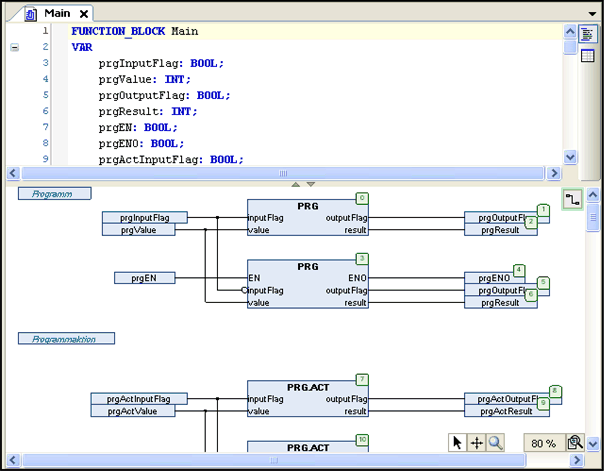

# CFC Editor

## Overview

The CFC editor is a graphical editor available for programming objects in the [continuous function chart (CFC) programming language](D-SE-0083490.html#D-SE-0083490) , which is an extension to the IEC 61131-3 programming languages. Choose the language when you add a new program organization unit (POU) object to your project. For large projects, consider using the [page-oriented version](D-SE-0083496.html#D-SE-0083496).

The editor will be available in the lower part of the window which opens when opening a CFC POU object. This window also includes the [declaration editor](D-SE-0083518.html#D-SE-0083518) in its upper part.

CFC editor

The CFC editor in contrast to the FBD / LD editor allows free [positioning](D-SE-0083494.html#D-SE-0083494) of the elements, which allows direct insertion of feedback paths. The sequence of processing is determined by a list which contains all currently inserted elements and can be modified.

The following elements are available in a [toolbox](D-SE-0083493.html#D-SE-0083493) and can be inserted via drag and drop:

* box (operators, functions, function blocks, and programs)
* input
* output
* jump
* label
* return
* composer
* selector
* connection marks
* comments

You can connect the input and output pins of the elements by drawing a line with the mouse. The path of the connecting line will be created automatically and will follow the shortest possible route. The connecting lines are automatically adjusted as soon as the elements are moved. For further information, refer to the description of [inserting and arranging elements](D-SE-0083494.html#D-SE-0083494). For complex charts, you can use [connection marks](D-SE-0083493.html#D-SE-0083493__D-SE-0083493.3) instead of lines. You may also consider the possibility of modifying the routing.

It may happen that elements get positioned in a way that they cover already routed connections. These collisions are indicated by red connection lines. If there are any collisions in the chart, the button in the upper right corner of the editor view gets a red outline: . To edit the collisions step by step, click this button and execute the command Show next collision. Then the next found concerned connection will be selected.

For complex charts, you can use [connection marks](D-SE-0083493.html#D-SE-0083493__D-SE-0083493.3) instead of lines. You may also wish to use the page-oriented version of the CFC editor.

A zoom function allows you to change the dimension of the editor window: Use the  button in the lower right corner of the window and choose between the listed zoom factors. Alternatively, you can select the entry ... to open a dialog box where you can type in any arbitrary factor.

You can call the commands for working in the CFC editor from the contextual menu or from the CFC menu which is available as soon as the CFC editor is active.

EIO0000002854.09