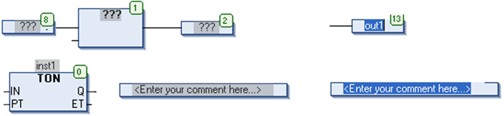
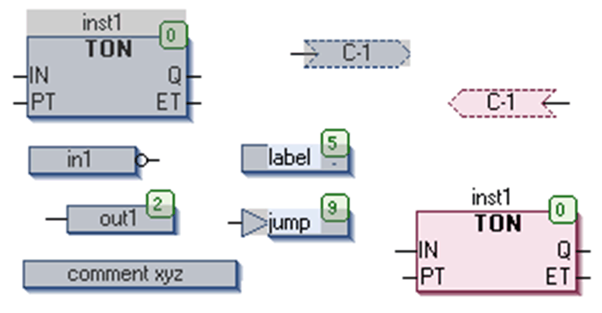
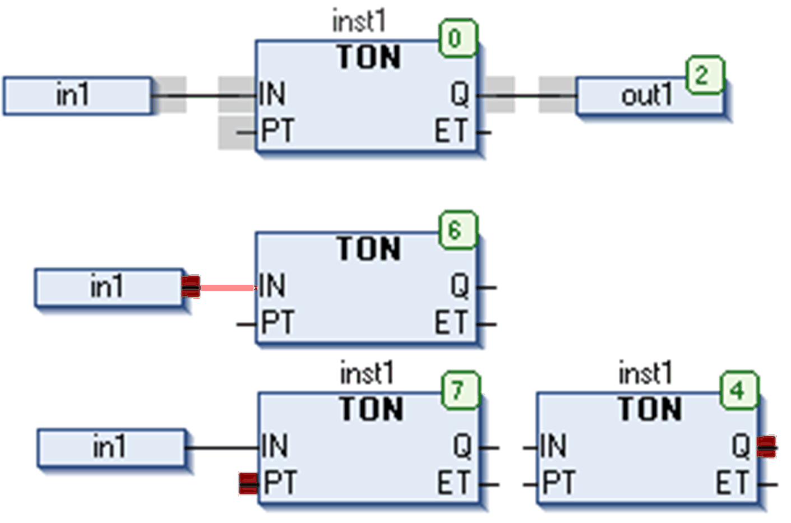

# Cursor Positions in CFC

## Overview

Cursor positions in a CFC program are indicated by a gray background when hovering over the programming element.

When you click one of these shadowed areas, before releasing the mouse-button, the background color will change to red. As soon as you release the mouse-button, this will become the current cursor position, with the respective element or text being selected and displayed as red-colored.

There are 3 categories of cursor positions. See the possible positions indicated by a gray shaded area as shown in the illustrations of the following paragraphs.

## Cursor Positioned on a Text

If the cursor is positioned on a text and you click on the mouse-button, it is displayed as blue-shaded and can be edited. The ... button is available for opening the input assistant. Primarily after having inserted an element, the characters `???` represent the name of the element. Replace these characters by a valid identifier. After that a tool tip is displayed by positioning the cursor on the name of a variable or a box parameter. The tool tip contains the type of the variable or parameter and, if it exists, the associated comment in a second line.

Possible cursor positions and an example of selected text:

## Cursor Positioned on the Body of an Element

If the cursor is positioned on the body of an element (box, input, output, jump, label, return, comment, connection mark), these will be displayed as red-colored and can be moved by moving the mouse.

Possible cursor positions and example of a selected body:

## Cursor Positioned on the Body on Input or Output Connection of an Element

If the cursor is positioned on an input or output connection of an element, a red filled square will indicate that position (point of connection). It can be negated or set/reset.

Possible cursor positions (gray shadows) and examples of selected output and input positions (red squares):

EIO0000002854.09