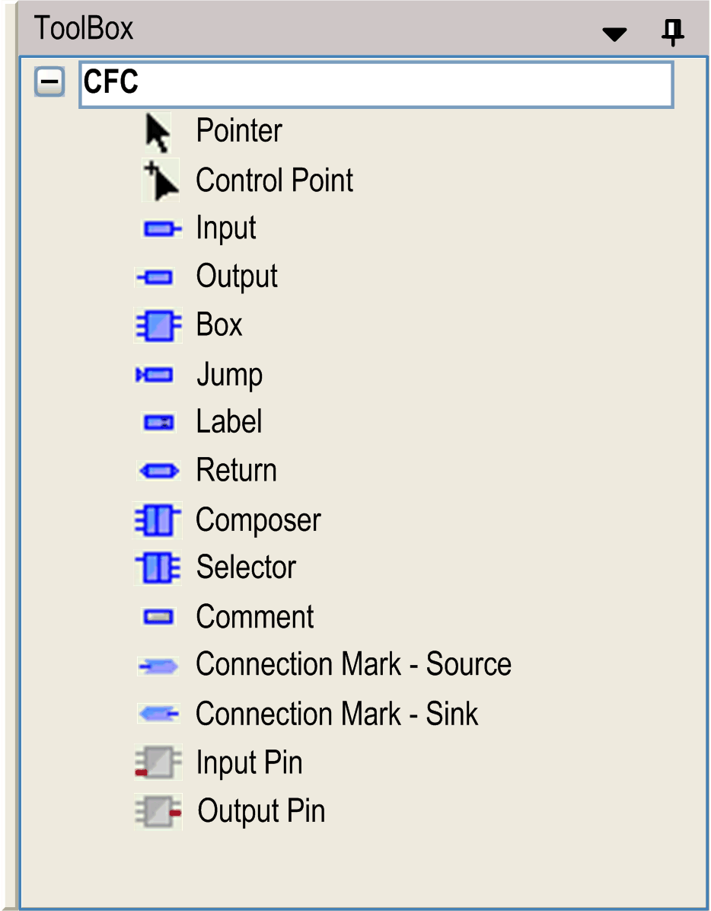
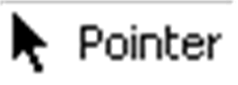
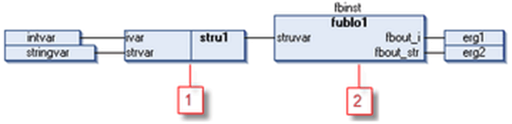
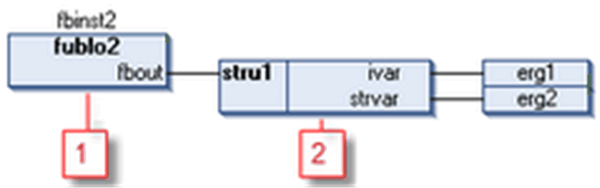

# CFC Elements / ToolBox

## Overview

The graphical elements available for programming in the [CFC editor](D-SE-0083491.html#D-SE-0083491) window are provided by a toolbox. Open the toolbox in a view window by executing the command ToolBox in the View menu.



Select the desired element in the toolbox and [insert](D-SE-0083494.html#D-SE-0083494__D-SE-0083494.3) it in the editor window via drag and drop.

Besides the programming elements, there is an entry , at the top of the toolbox list. As long as this entry is selected, the cursor has the shape of an arrow and you can select elements in the editor window for positioning and editing.

## CFC Elements

| Name | Symbol | Description |
| --- | --- | --- |
| page |  | The number of the page is given automatically according to its position. You can enter the name (`Overview` in this example) in the orange field at the top of the page. |
| control point |  | A control point is needed to fix a manually modified connection line routing. This helps to prevent the modification from being reverted by the command Route all Connections. By 2 control points you can mark a definite segment of a line for which you want to modify the routing. |
| input |  | You can select the text offered by `???` and replace it by a variable or constant. The input assistance serves to select a valid identifier. |
| output |  |
| box |  | You can use a box to represent operators, functions, function blocks, and programs. You can select the text offered by `???` and replace it by an operator, function, function block, or program name. The input assistance serves to select one of the available objects.  If you insert a function block, another `???` will be displayed above the box. Replace the question marks by the name of the function block instance. If a function block with constant input parameters is instantiated, then the box element shows a field Parameters... in the bottom left corner of the box. Click this button to open a dialog box for editing the input parameters. Refer to the [*Edit Parameters...* chapter](../../../../../api/crossBook?lang=en-US&virtualBookName=SoMMenu&topicID=D_SE_0084092).  If you replace an existing box by another (by modifying the entered name) and the new one has a different minimum or maximum number of input or output pins, the pins will be adapted correspondingly. If pins are to be removed, the lowest one will be removed first. |
| jump |  | Use the jump element to indicate at which position the execution of the program should continue. This position is defined by a label (see below). Therefore, replace the text offered by `???` by the label name. |
| label |  | A label marks the position to which the program can jump (see the element jump).  In online mode, a return label for marking the end of POU is automatically inserted. |
| return |  | In online mode, a return element is automatically inserted in the first column and after the last element in the editor. In stepping, it is automatically jumped to before execution leaves the POU. |
| composer |  | Use a composer to handle an input of a box which is of type of a structure. The composer will display the structure components and thus make them accessible in the CFC for the programmer. For this purpose name the composer like the concerned structure (by replacing `???` by the name) and connect it to the box instead of using an input element. |
| selector |  | A selector in contrast to the composer is used to handle an output of a box which is a type of structure. The selector will display the structure components and thus make them accessible in the CFC for the programmer. For this purpose, name the selector like the concerned structure (replace `???` by the name) and connect it to the box instead of using an output element. |
| comment |  | Use this element to add any comments to the chart. Select the placeholder text and replace it with any desired text. To obtain a new line within the comment, press CTRL + ENTER. |
| connection mark – source  connection mark – sink |  | You can use connection marks instead of a [connection line](D-SE-0083494.html#D-SE-0083494__D-SE-0083494.7) between elements. This can help to clear complex charts.  For a valid connection, assign a connection mark – source element at the output of an element and assign a connection mark – sink (see below) at the input of another element. Assign the same name to both marks (no case-sensitivity).  Naming:  The first connection mark – source element inserted in a CFC by default is named `C-1` and can be modified manually. In its counterpart connection mark – sink, replace the `???` by the same name string as used in the source mark.The editor will verify that the names of the marks are unique. If the name of a source mark is changed, the name of the connected sink mark will automatically be renamed as well. However, if a sink mark is renamed, the source mark will keep the old name. This allows you to reconfigure connections. Likewise, removing a connection mark does not remove its counterpart.  To use a connection mark in the chart, drag it from the toolbox to the editor window and then connect its pin with the output or input pin of the respective element. Alternatively you can convert an existing normal connection line by using the command Connection Mark. This command allows you to change connection marks back to normal connection lines as well.  For figures showing some examples of connection marks, refer to the chapter *Connection Mark*. |
| input pin |  | Depending on the box type, you can add an additional input. For this purpose, select the box element in the CFC network and draw the input pin element on the box.  You can drag an input or output connection to another position at the box while keeping pressed the Ctrl key. |
| output pin | – | Depending on the box type, you can add an additional output. For this purpose, select the box element in the CFC network and draw the output pin element on the box.  You can drag an input or output connection to another position at the box while keeping pressed the Ctrl key. |

## Example of a Composer

A CFC program `cfc_prog` handles an instance of function block `fublo1`, which has an input variable `struvar` of type structure. Use the composer element to access the structure components.

Structure definition `stru1` :

```
TYPE stru1 :
STRUCT
  ivar:INT;
  strvar:STRING:='hallo';
END_STRUCT
END_TYPE
```

Declaration and implementation of function block `fublo1`:

```
FUNCTION_BLOCK fublo1
VAR_INPUT
  struvar:STRU1;
END_VAR
VAR_OUTPUT
  fbout_i:INT;
  fbout_str:STRING;
END_VAR
VAR
  fbvar:STRING:='world';
END_VAR
fbout_i:=struvar.ivar+2;
fbout_str:=CONCAT (struvar.strvar,fbvar);
```

Declaration and implementation of program `cfc_prog`:

```
PROGRAM cfc_prog
VAR
  intvar: INT;
  stringvar: STRING;
  fbinst: fublo1;
  erg1: INT;
  erg2: STRING;
END_VAR
```

Composer element



**1** composer

**2** function block with input variable `struvar` of type structure `stru1`

## Example of a Selector

A CFC program `cfc_prog` handles an instance of function block `fublo2`, which has an output variable `fbout` of type structure `stru1`. Use the selector element to access the structure components.

Structure definition `stru1`:

```
TYPE stru1 :
STRUCT
  ivar:INT;
  strvar:STRING:='hallo';
END_STRUCT
END_TYPE
```

Declaration and implementation of function block `fublo1`:

```
FUNCTION_BLOCK fublo2
VAR_INPUT CONSTANT
  fbin1:INT;
  fbin2:DWORD:=24354333;
  fbin3:STRING:='hallo';
END_VAR
VAR_INPUT
  fbin : INT;
END_VAR
VAR_OUTPUT
  fbout : stru1;
  fbout2:DWORD;
END_VAR
VAR
  fbvar:INT;
  fbvar2:STRING;
END_VAR
```

Declaration and implementation of program `cfc_prog`:

```
VAR
  intvar: INT;
  stringvar: STRING;
  fbinst: fublo1;
  erg1: INT;
  erg2: STRING;
  fbinst2: fublo2;
END_VAR
```

The illustration shows a selector element where the unused pins have been removed by executing the command Remove Unused Pins.



**1** function block with output variable `fbout` of type structure `stru1`

**2** selector

EIO0000002854.09