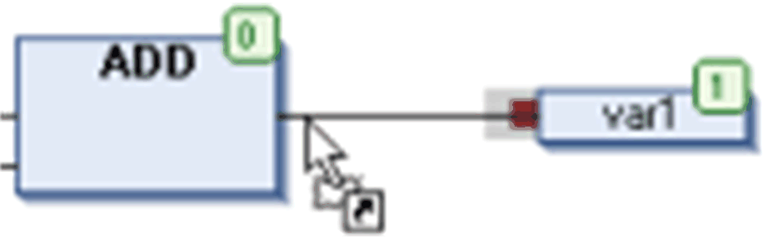
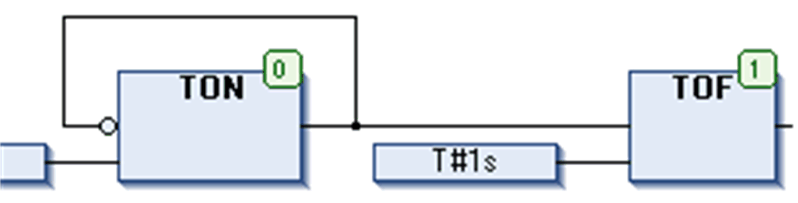

# Working in the CFC Editor

## Overview

The elements available for programming in the CFC editor are provided in the [**ToolBox**](D-SE-0083493.html#D-SE-0083493) which by default is available in a window as soon as the CFC editor is opened.

The Tools > Options > CFC editor defines general settings for working within the editor.

## Inserting

To insert an element, select it in the [**ToolBox**](D-SE-0083493.html#D-SE-0083493) by a mouse-click, keep the mouse-button pressed and drag the element to the desired position in the editor window. During dragging, the cursor will be displayed as an arrow plus a rectangle and a plus-sign. When you release the mouse-button, the element will be inserted.

## Selecting

To select an inserted element for further actions such as editing or rearranging, click an element body to select the element. It will be displayed by default as red-shaded. By additionally pressing the SHIFT key, you can click and select further elements. You can also press the left mouse-button and draw a dotted rectangle around all elements which you want to select. As soon as you release the button the selection will be indicated. By command Select all , all elements are selected at once.

By using the arrow keys you can shift the selection mark to the next possible cursor position. The sequence depends on the execution order or the elements, which is indicated by [element numbers](#D-SE-0083494__D-SE-0083494.12).

When an input pin is selected and you press CTRL + LEFT ARROW, the corresponding output will be selected. When an output pin is selected and you press CTRL + LEFT ARROW, the corresponding outputs will be selected.

## Drag and Drop of Variables

You can directly insert variables from the [GVL](D-SE-0083428.html#D-SE-0083428) or a [POU](D-SE-0083405.html#D-SE-0083405) as an input or output element of a function block. To achieve this, select the variable in the GVL or POU, and drag it to the input or output pin of a function block. The input or output element for this variable is automatically created and connected to the pin of the function block.

## Replacing Boxes

To replace an existing box element, replace the currently inserted identifier by that of the desired new element. The number of input and output pins will be adapted if necessary due to the definition of the POUs and thus some existing assignments could be removed.

## Moving

To move an element, select the element by clicking the element body (see possible [cursor positions](D-SE-0083492.html#D-SE-0083492)) and drag it, while keeping the mouse-button pressed, to the desired position. Then release the mouse-button to place the element. You also can use the Cut and Paste commands for this purpose.

## Connecting

You can connect the input and output pins of 2 elements by a connection line or via connection marks.

Connection line: You can either select a valid point of connection that is an input or output pin of an element (refer to [*Cursor Positions in CFC*](D-SE-0083492.html#D-SE-0083492)), and then draw a line to another point of connection with the mouse. Or you can select 2 points of connection and execute the command Select connected pins. A selected possible point of connection is indicated by a red filled square. When you draw a line from such a point to the target element, you can identify the possible target point of connection. When you then position the cursor over a valid connection point, an arrow symbol is added to the cursor when moving over that point, indicating the possible connection.

The following figure provides an example: After a mouse-click on the input pin of the `var1` element, the red rectangle is displayed showing that this is a selected connection point. By keeping the mouse button pressed, move the cursor to the output pin of the ADD box until the cursor symbol appears as shown in the figure. Now release the mouse button to establish the connection line.

The shortest possible connection is created taking into account the other elements and connections.

You can drag an input or output connection to another position at the box while keeping pressed the Ctrl key.

Connection marks: you could as well use connection marks instead of connection lines in order to simplify complex charts. Refer to the description of [connection marks](D-SE-0083493.html#D-SE-0083493__D-SE-0083493.3).

## Copying

To copy an element, select it and use the Copy and Paste commands.

## Editing

After you have inserted an element, by default the text part is represented by `???`. To replace this by the desired text (POU name, label name, instance name, comment, and so on), click the text to obtain an edit field. Also the button ... will be available to open the Input Assistant.

## Deleting

You can delete a selected element or connection line by executing the command Delete, which is available in the contextual menu or press the Delete key.

## Opening a Function Block

If a function block is added to the editor, you can open this block with a double-click. Alternatively, use the command Browse > Go To Definition from the contextual menu.

## Execution Order, Element Numbers

The sequence in which the elements in a CFC network are executed in online mode is indicated by numbers in the upper right corner of the box, output, jump, return, and label elements. The processing starts at the element with the lowest number, which is 0.

You can modify the execution order by commands which are available in the submenu Execution Order of the CFC menu.

When adding an element, the number will automatically be given according to the topological sequence (from left to right and from top to bottom). The new element receives the number of its topological successor if the sequence has already been changed, and all higher numbers are increased by 1.

Consider that the number of an element remains constant when it is moved.

Consider that the sequence influences the result and must be changed in certain cases.

## Changing Size of the Working Sheet

In order to get more space around an existing CFC chart in the editor window, you can change the size of the working area (working sheet). Do this by selecting and dragging all elements with the mouse or use the cut-and-paste commands (refer to [*Moving*](#D-SE-0083494__D-SE-0083494.6))

Alternatively, you can use a special dimension settings dialog box. This may save time in the case of large charts. Refer to the description of the Edit Working Sheet [dialog box](../../../../../api/crossBook?lang=en-US&virtualBookName=SoMMenu&topicID=D_SE_0084079). In case of page-oriented CFC, you can use the Edit Page Size [command](../../../../../api/crossBook?lang=en-US&virtualBookName=SoMMenu&topicID=D_SE_0084080).

EIO0000002854.09