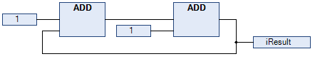
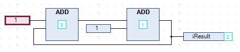

# Execution Order in CFC

## Overview

The execution order of elements within POUs is uniquely determined in text-based and network-based editors. In the CFC editor, however, you can position the elements freely, so the execution order is initially not unique. Therefore, EcoStruxure Machine Expert determines the execution order by data flow and, in the case of multiple networks, by the topological position of the elements. The elements are sorted from top to bottom and from left to right to achieve a unique execution order.

The chronological order of the elements in the chart can be indicated by temporarily displaying the execution order. For networks with feedback, you can define an element as the starting point in the feedback loop.

EcoStruxure Machine Expert V2.0 and later versions allow you to edit the execution order in a CFC object explicitly by selecting the Explicit Execution Order Mode in the CFC Execution Order [tab of the CFC object](../../../../../api/crossBook?lang=en-US&virtualBookName=SoMMenu&topicID=D_SE_0083921) Properties.

## Data Flow

In general, the term data flow describes the chronological order of reading or writing which data when and how in which programming object. A POU can process an arbitrary number of data flows. These data flows can also be executed independently of each other.

## Displaying the Execution Order

By default, the Auto Data Flow Mode is selected in the CFC Execution Order [tab of the CFC object](../../../../../api/crossBook?lang=en-US&virtualBookName=SoMMenu&topicID=D_SE_0083921) Properties and the execution order of a CFC object is determined automatically.

To temporarily display the execution order in the CFC editor, proceed as follows:

| Step | Action | Comment |
| --- | --- | --- |
| 1 | Create a new project using the Standard project template and specify a name. | Example name: `Minimal` |
| 2 | Insert the function block `FB_DOIt` with inputs and outputs in ST implementation language. | Example:   ``` FUNCTION_BLOCK FB_DoIt VAR_INPUT iAlfa : INT; iBravo: INT; sCharlie : STRING := 'Charlie'; xItem : BOOL; END_VAR VAR_OUTPUT     iResult : INT;     sResult : STRING;     xResult : BOOL; END_VAR VAR END_VAR iResult := iAlfa + iBravo; IF xItem = TRUE THEN xResult := TRUE; END_IF ``` |
| 3 | Create the function block ExecuteCFC in CFC implementation language. | Example:   ``` PROGRAM ExecuteCFC VAR fb_DoIt_0: FB_DoIt; fb_DoIt_1: FB_DoIt; iFinal_1: INT; iFinal_0: INT; xFinal: BOOL; END_VAR ```     Programming objects recently created in CFC have selected the option Auto Data Flow Mode. The optimum execution order of the programming objects is defined internally. |
| 4 | Execute the command CFC > Execution Order > Display Execution Order. | **Result**: The execution order of the object is displayed: The boxes and inputs are numbered according to the chronological processing order. This temporary display is removed as soon as you click again in the CFC editor. |

## Manually Determining the Execution Order in Feedback Networks

To manually determine the execution order in feedback networks, proceed as follows:

| Step | Action | Comment |
| --- | --- | --- |
| 1 | Create a CFC program with feedback. | Example: The POU `PrgPositiveFeedback` counts.   ``` PROGRAM PrgPositiveFeedback VAR     iResult: INT; END_VAR ``` |
| 2 | Select an element within the feedback. | **Result**: The selected element is highlighted red. |
| 3 | Execute the command CFC > Execution Order > Set Start of Feedback. | **Result**: The selected element is assigned number `0` (the lowest number of the feedback) and is indicated by the  symbol. At runtime, this POU is processed first. |

To undo this numbering, proceed as follows:

1. Select the POU defined as start POU.
2. Execute the command CFC > Execution Order > Set Start of Feedback.

**Result**: The POU is no longer defined as start POU and the execution order is defined internally.



To display the execution order by data flow, execute the command CFC > Execution Order > Display Execution Order.



## Manually Defining the Execution Order

The default Auto Data Flow Mode determines the order of CFC objects automatically to achieve execution that is optimized by time and by cycle. With this mode activated, you do not need to care for defining the execution order during the development process.

NOTE: The Explicit Execution Order Mode allows you to define the execution order manually. Note, that it is your responsibility to adapt the execution order and to assess the consequences and impacts. For your support, the execution order is permanently displayed.

To manually define the execution order, proceed as follows:

| Step | Action | Result |
| --- | --- | --- |
| 1 | In the Devices or POUs tree, right-click a CFC object and execute the command Properties. | The Properties dialog box opens. |
| 2 | Select the CFC Execution Order tab. | The Execution order list displays the selected mode. |
| 3 | From the Execution order list, select the option Explicit Execution Order Mode. | – |
| 4 | Click OK to confirm and to close the dialog box. | * The Explicit Execution Order Mode is activated. * The networks are numbered in the CFC editor. * The following commands are available in the CFC > Execution Order menu:    + Display Execution Order [command](../../../../../api/crossBook?lang=en-US&virtualBookName=SoMMenu&topicID=D_SE_0105997)   + Set Start of Feedback [command](../../../../../api/crossBook?lang=en-US&virtualBookName=SoMMenu&topicID=D_SE_0105998) |
| 5 | Open a CFC object. | – |
| 6 | Select a numbered element and execute the command CFC > Execution Order > Send to Front. | The execution order is resorted and the selected element is assigned the number 0. |

EIO0000002854.09