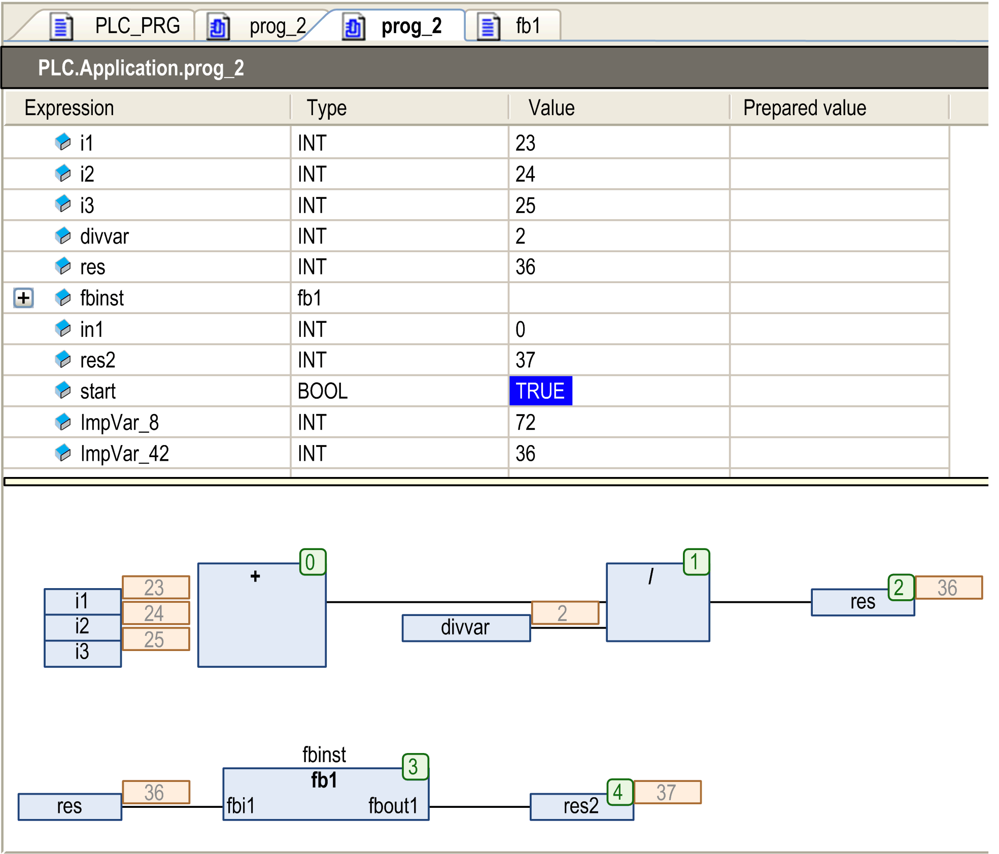
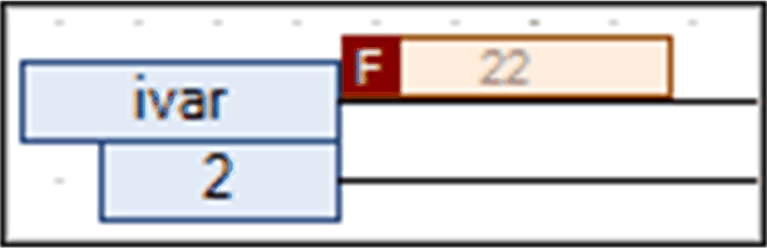
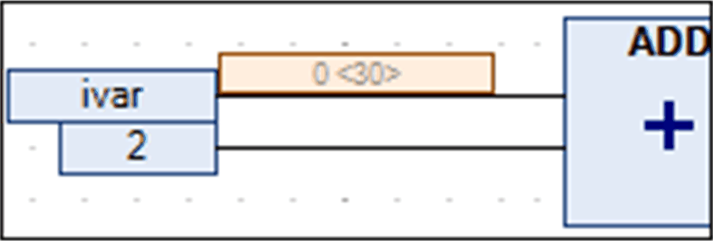
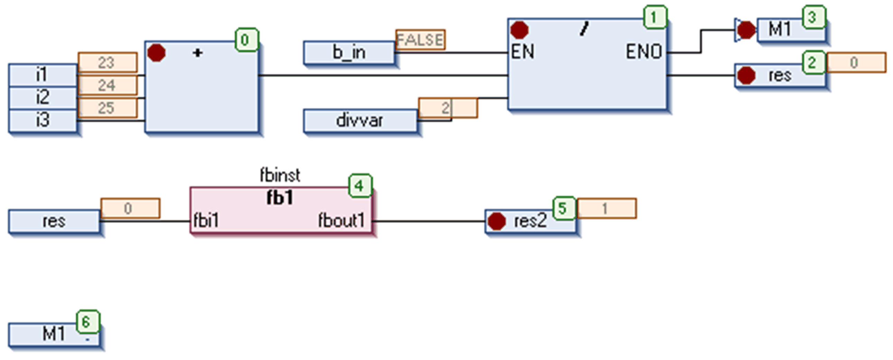

# CFC Editor in Online Mode

## Overview

In online mode, the CFC editor provides views for monitoring, writing and forcing the variables and expressions on the controller. The debugging functionality (breakpoints, stepping, and so on) is available as described below.

* For information on how to open objects in online mode, refer to the description of the [user interface in online mode](D-SE-0083360.html#D-SE-0083360).
* The editor window of a CFC object also includes the declaration editor in the upper part. Refer to the description of the [declaration editor in online mode](D-SE-0083520.html#D-SE-0083520).
* For information on how to edit parameters in the CFC editor, refer to the description of the Edit Parameters... [command](../../../../../api/crossBook?lang=en-US&virtualBookName=SoMMenu&topicID=D_SE_0084092).

## Monitoring

The actual values are displayed in small monitoring windows behind each variable (inline monitoring).

Online view of a program object PLC\_PRG:

Note for the online view of a function block POU, that monitoring is only possible in an instance view. In the base implementation of the function block POU, no values are displayed. The column Value contains the text Value of the expression and the inline monitoring fields in the implementation part show three question marks each.

Boolean connections are monitored in the colors TRUE = blue and FALSE = black.

## Forcing/Writing Variables

In online mode, you can prepare a value for forcing or writing a monitored variable either in the declaration editor or - if the option Prepare values in implementation part is activated - also in the implementation part. For working in the declaration editor, refer to the chapter [*Declaration Editor in Online Mode*](D-SE-0083520.html#D-SE-0083520). In the implementation part, click the monitoring box next to the respective element or directly the element to open the Prepare Value [dialog box](D-SE-0083511.html#D-SE-0083511__D-SE-0083511.5). For boolean variables, no dialog box opens, but clicking the value currently displayed next to the variable directly toggles between the possible values to be forced or written. In the monitoring box of a currently forced variable a red F is displayed.

Forced value in the implementation part

If the CFC option Prepare values in implementation part is enabled, then the value currently prepared for writing or forcing is displayed behind the current value in angle brackets in the monitoring field of a variable.

Prepared value in the implementation part

## Breakpoint Positions in CFC Editor

The possible breakpoint positions basically are those positions in a POU at which values of variables can change or at which the program flow branches out or another POU is called. See possible positions in the following image.

Breakpoint positions in CFC editor:

NOTE: A breakpoint will be set automatically in all methods which may be called. If an interface-managed method is called, breakpoints will be set in all methods of function blocks implementing that interface and in all derivative function blocks subscribing the method. If a method is called via a pointer on a function block, breakpoints will be set in the method of the function block and in all derivative function blocks which are subscribing to the method.

EIO0000002854.09