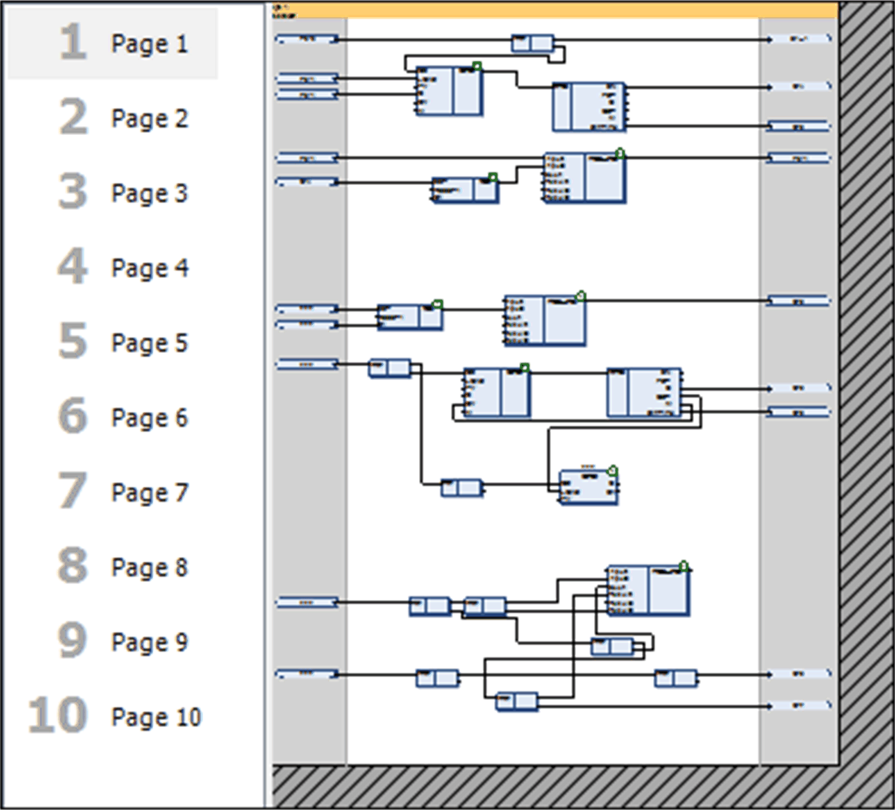
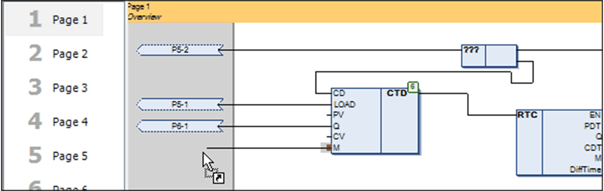

# CFC Editor Page-Oriented

## Overview

In addition to the CFC standard editor, EcoStruxure Machine Expert provides the CFC editor pagination. Besides the [tools](D-SE-0083493.html#D-SE-0083493) and commands of the standard CFC editor, this editor allows you to arrange the elements on any number of different pages.

NOTE: You cannot convert POUs created in the language CFC page-oriented to normal CFC and vice versa. You can copy elements between these 2 editors with the copy and paste commands (via clipboard) or the drag and drop function.

CFC pagination

To change the size of the page execute the command Edit Page Size.

## Connections Between 2 Pages

Connections between 2 pages are realized with the elements connection mark – source and connection mark – sink (refer to the description of connection marks). You can place the connection mark – source by drag and drop to the right margin - the connection mark – sink to the left margin. If you draw a connection line from an input or output of an element to the margin, the connection mark is placed automatically. Click the ... button to open the list of connection marks provided by the Input Assistant.

Use the arrow keys to navigate within the diagram from one element to the next.

Insertion of connection marks

## Execution Order

The execution order of the pages is from top to the bottom. Within a page, the order follows the rules of the standard CFC editor (refer to further information of [execution order, element numbers](D-SE-0083494.html#D-SE-0083494__D-SE-0083494.12) and to the chapter [*Execution Order in CFC*](D-SE-0106762.html#D-SE-0106762)). You can change the execution order of elements only within the associated page. You cannot change the execution order of elements on different pages.

EIO0000002854.09