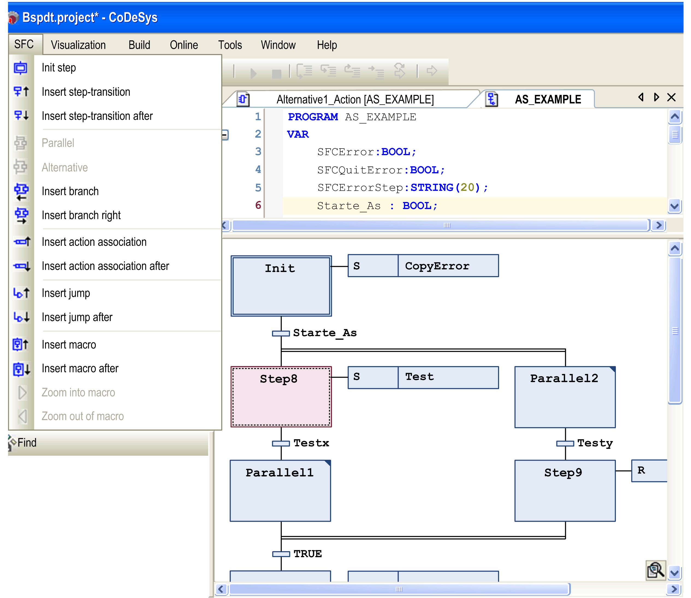

# SFC Editor

## Overview

The SFC editor is available for programming objects in the IEC 61131-3 programming language [SFC - Sequential Function Chart](D-SE-0083499.html#D-SE-0083499). Choose the language when you add a new POU object to the project.

The SFC editor is a graphical editor. Perform general settings concerning behavior and display in the Options > SFC editor dialog box.

The SFC editor is available in the lower part of the window which opens when you edit an SFC POU object. This window also includes the [**Declaration Editor**](D-SE-0083518.html#D-SE-0083518) in the upper part.

SFC editor

## Working with the SFC Editor

The [elements](D-SE-0083503.html#D-SE-0083503) used in an SFC diagram are available in the SFC menu. The menu is available as soon as the SFC editor is active. Arrange them in a sequence or in parallel sequences of steps which are connected by transitions. For further information, refer to [*Working in the SFC Editor*](D-SE-0083501.html#D-SE-0083501).

You can edit the properties of steps in a separate [properties](D-SE-0083502.html#D-SE-0083502) window. Among others, you can define the minimum and maximum time of activity for each step.

You can access [implicit variables](D-SE-0083505.html#D-SE-0083505) for controlling the processing of an SFC (for example, step status, timeout analyzation, reset).

EIO0000002854.09