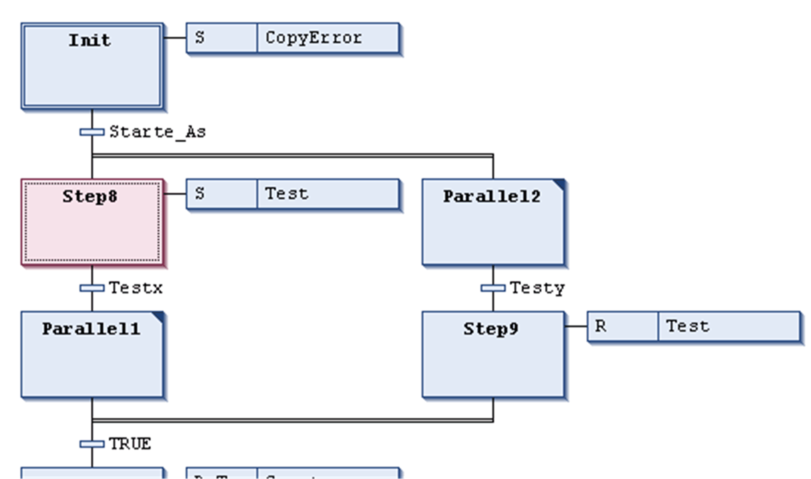

# SFC - Sequential Function Chart Language

## Overview

The Sequential Function Chart (SFC) is a graphically oriented language which describes the chronological order of particular actions within a program. These actions are available as separate programming objects, written in any available programming language. In SFC, they are assigned to step elements and the sequence of processing is controlled by transition elements. For a detailed description on how the steps will be processed in online mode, refer to [*Sequence of Processing in SFC*](D-SE-0083506.html#D-SE-0083506).

For information on how to use the SFC editor in EcoStruxure Machine Expert, refer to the description of the [*SFC Editor*](D-SE-0083498.html#D-SE-0083498).

## Example

Example for a sequence of steps in an SFC module:

EIO0000002854.09