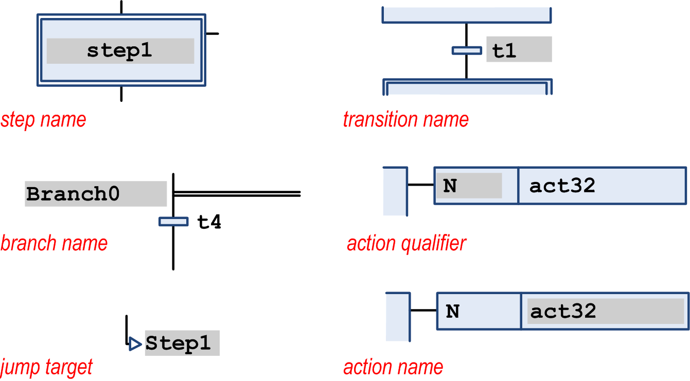
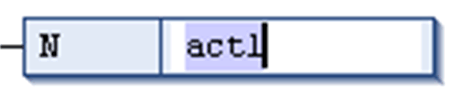
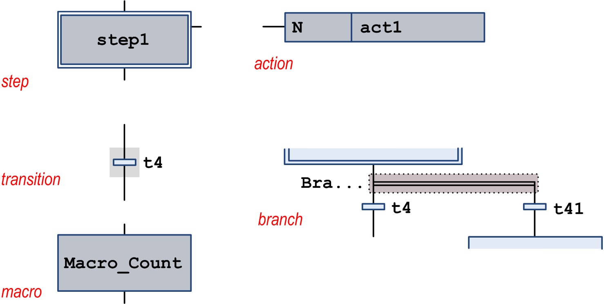
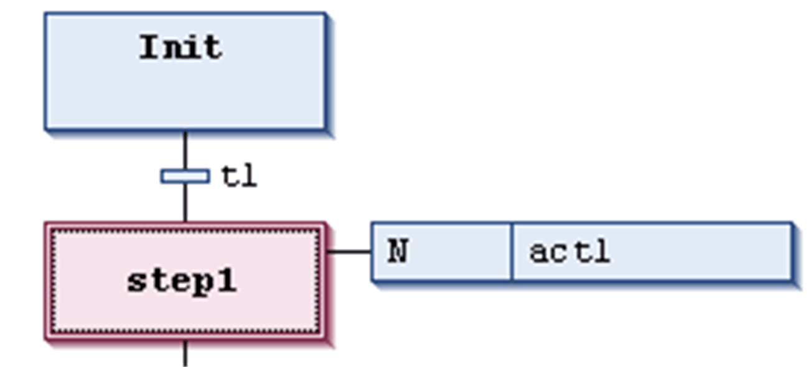

# Cursor Positions in SFC

## Overview

Possible cursor positions in an SFC diagram in the [SFC editor](D-SE-0083498.html#D-SE-0083498) are indicated by a gray shadow when moving with the cursor over the elements.

## Cursor Positions in Texts

There are 2 categories of cursor positions: texts and element bodies. See the possible positions indicated by a gray shaded area as shown in the following illustrations:

Possible cursor positions in texts:

When you click a text cursor position, the string will become editable.

Select action name for editing:

## Cursor Positions in Element Bodies

Possible cursor positions in element bodies:

When you click a shadowed area, the element is selected. It gets a dotted frame and is displayed as red-shaded (for multiple selection, refer to [*Working in the SFC Editor*](D-SE-0083501.html#D-SE-0083501) ).

Selected step element

EIO0000002854.09