# SFC Elements / ToolBox

## Overview

You can insert the graphic elements usable for programming in the SFC editor window by executing the commands from the SFC menu.

For information on working in the editor, refer to the description in the chapter [*Working in the SFC Editor*](D-SE-0083501.html#D-SE-0083501)

The following elements are available and are described in this chapter:

* [step](#D-SE-0083503__D-SE-0083503.3)
* [transition](#D-SE-0083503__D-SE-0083503.3)
* [action](#D-SE-0083503__D-SE-0083503.5)
* [branch (alternative)](#D-SE-0083503__D-SE-0083503.9)
* [branch (parallel)](#D-SE-0083503__D-SE-0083503.10)
* [jump](#D-SE-0083503__D-SE-0083503.12)
* [macro](#D-SE-0083503__D-SE-0083503.13)

## Step / Transition

To insert a single step or a single transition, execute the command Step or Transition from the ToolBox. Steps and transitions can also be inserted in combination, via command Insert step-transition (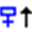) or Insert step-transition after (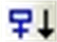) from the toolbar.

A step is represented by a box primarily containing an automatically generated step name. It is connected to the preceding and subsequent transition by a line. The box frame of the first step within an SFC, the initial step, is double-lined.

The transition is represented by a small rectangle. After inserting it has a default name, `Trans<n>`, whereby `n` is a running number.

Example for step and subsequent transition:

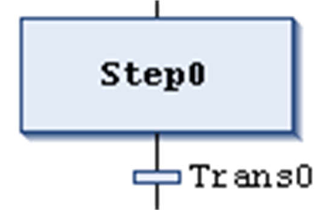

Example for initial step and subsequent transition:

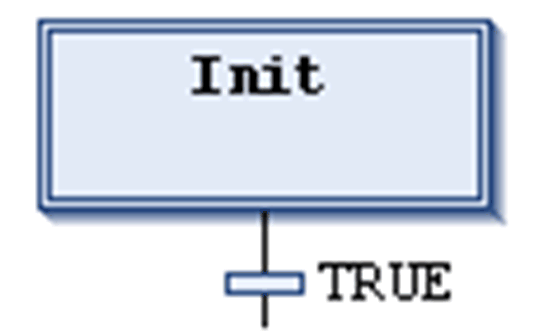

You can edit the step and transition names inline.

Step names must be unique in the scope of the parent POU. Consider this especially when using actions programmed in SFC. Otherwise an error will be detected during the build process.

You can transform each step to an initial step by executing the command Init step or by activating the respective step property. An initial step will be executed first when the IL-POU is called.

Each step is defined by the step [properties](D-SE-0083502.html#D-SE-0083502).

After you have inserted a step, associate the actions to be performed when the step is active (processed); see below for further information on [actions](#D-SE-0083503__D-SE-0083503.5).

## About Transitions

A transition has to provide the condition on which the subsequent step shall become active as soon as the condition value is TRUE. Therefore, a transition condition must have the value TRUE or FALSE.

A transition condition can be defined in the following 2 ways:

| Type of Definition | Type of Condition | Description |
| --- | --- | --- |
| direct | inline | Replace the default transition name by one of the following elements:   * boolean variable * boolean address * boolean constant * instruction having a boolean result (example: (i<100) AND b).   You cannot specify programs, function blocks, or assignments here. |
| using a separate transition or property object | multi-use | Replace the default transition name by the name of a transition () or property object () available in the project. (This allows multiple use of transitions; see for example `condition_xy` in the figures below.)  The object like an inline transition can contain the following elements:   * boolean variable * address * constant * instruction * multiple statements with arbitrary code |

NOTE: If a transition produces multiple statements, assign the desired expression to a transition variable.

NOTE: Transitions which consist of a transition or a property object are indicated by a small triangle in the upper right corner of the rectangle.

Transition object (multiple use transition):

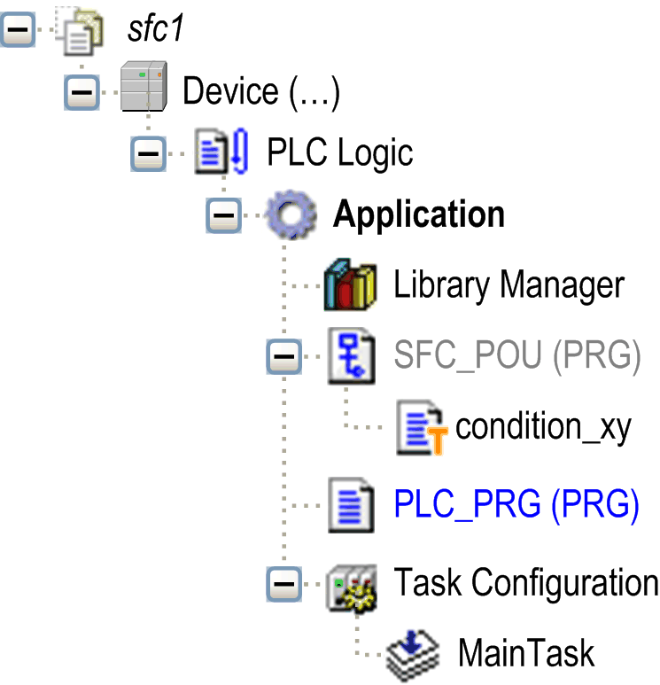

Examples of transitions:

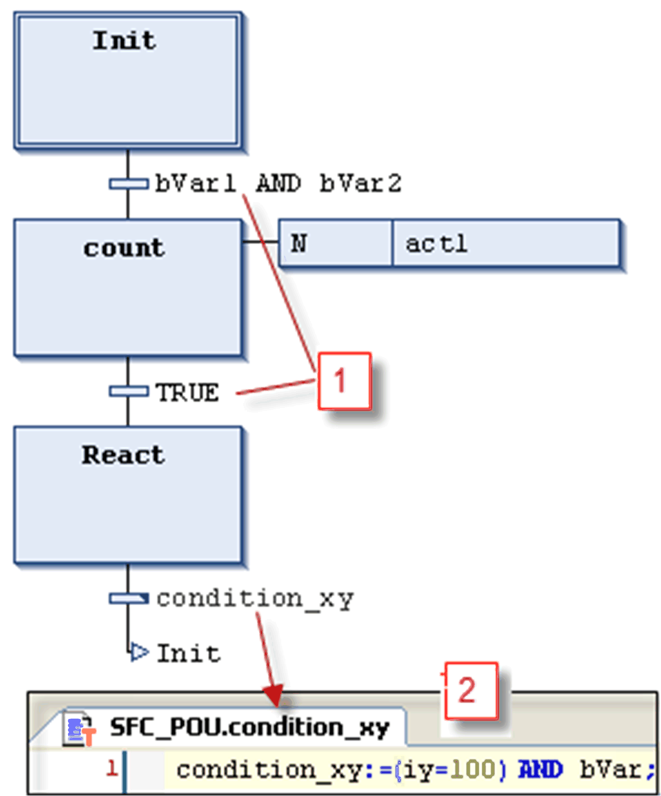

**1** Transition conditions entered directly

**2** Transition `condition_xy` programmed in ST

Multiple use conditions (transitions or properties) are indicated by a triangle:

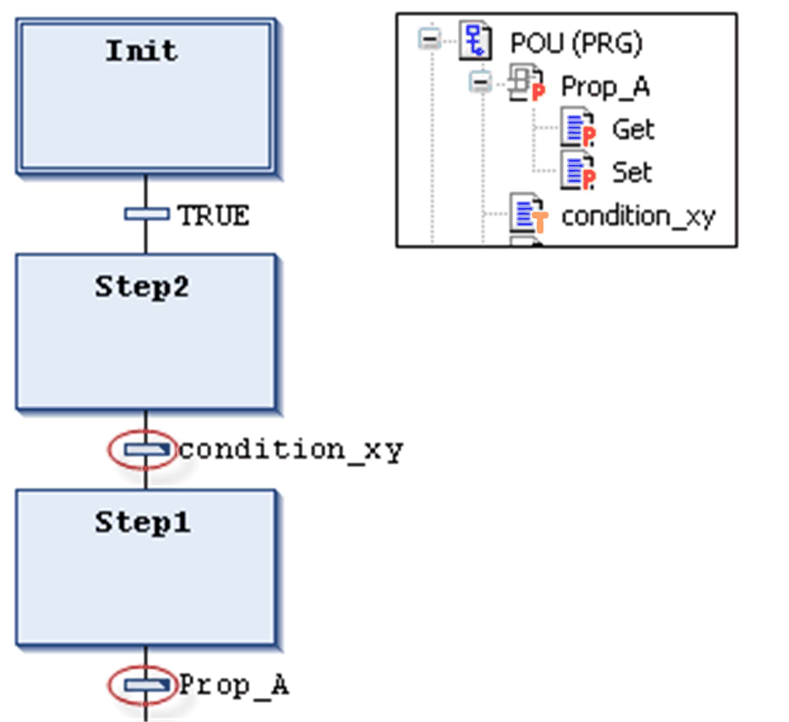

In contrast to previous versions of EcoStruxure Machine Expert, a transition call is handled like a method call. It will be entered according to the following syntax:

<transition name>:=<transition condition>;

Example: `trans1:= (a=100)`;

or just

<transition condition>;

Example: `a=100`;

See also an example (`condition_xy`) in the figure *Examples of transitions*.

## Action

An action can contain one or more statements written in one of the valid programming languages. It is assigned to a step and, in online mode, it will be processed according to the defined [sequence of processing](D-SE-0083506.html#D-SE-0083506) .

Each action to be used in SFC steps must be available as a valid POU within the SFC POU or the project (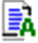).

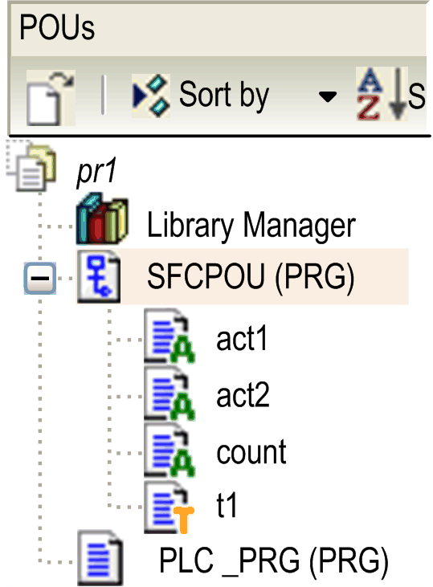

If you add IEC actions to a step as [action association](../../../../../api/crossBook?lang=en-US&virtualBookName=SoMMenu&topicID=D_SE_0084157), you can also specify a Boolean variable instead of an action object. The value of these variables is toggled between FALSE and TRUE each time the action is executed.

NOTE: When associating a boolean variable to an IEC step action, do not use this boolean variable at another place throughout this SFC POU.

Step names must be unique in the scope of the parent POU. An action may not contain a step having the same name as the step to which it is assigned; otherwise, an error will be detected during the build process.

Example of an action written in ST

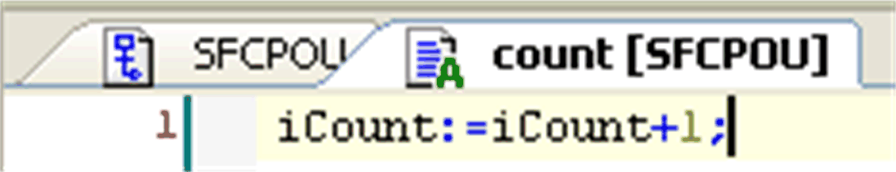

The IEC conforming and the IEC extending step actions are described in the following paragraphs.

## IEC Conforming Step Action (IEC Action)

This is an action according to the IEC61131-3 standard which will be processed according to its [qualifier](D-SE-0083504.html#D-SE-0083504) when the step becomes active, and then a second time when it becomes deactivated. In case of assigning multiple actions to a step, the action list will be executed from top to bottom.

* Different qualifiers can be used for IEC step actions in contrast to a normal step action.
* A further difference to the normal step actions is that each IEC step action is provided with a control flag. This permits that, even if the action is called also by another step, the action is executed always only once at a time. This is not the case with the normal step actions.
* An IEC step action is represented by a bipartite box connected to the right of a step via a connection line. In the left part, it shows the action qualifier, in the right part the action name. You can both edit inline.
* IEC step actions are associated to a step via the Insert action association command. You can associate one or multiple actions with a step. The position of the new action depends on the current cursor position and the command. The actions have to be available in the project and be inserted with a unique action name (for example, `plc_prg.a1`).

IEC conforming step action list associated to a step:

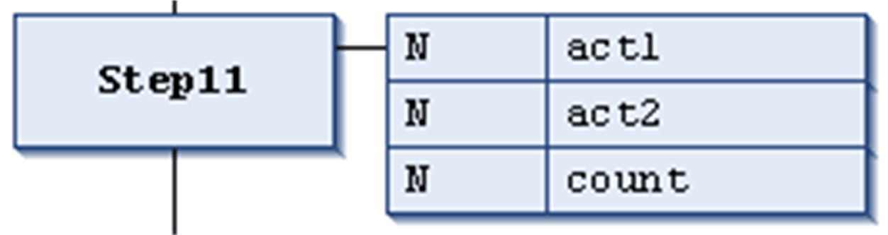

Each action box in the first column shows the qualifier and in the second the action name.

## IEC Extending Step Actions

These are actions extending the IEC standard. They have to be available as objects below the SFC object. Select unique action names. They are defined in the step properties.

The table lists the IEC extending step actions:

| Action Type | Processing | Association | Representation |
| --- | --- | --- | --- |
| step entry action (step activated) | This type of step action will be processed as soon as the step has become active and before the step active action. | The action is associated to a step via an entry in the Step entry field of the [step properties](D-SE-0083502.html#D-SE-0083502). | It is represented by an `E` in the lower left corner of the respective step box. |
| step active action (step action) | This type of step action will be processed when the step has become active and after a possible step entry action of this step has been processed. However, in contrast to an IEC step action (see above) it is not executed again when it is deactivated and cannot get assigned qualifiers. | The action is associated to a step via an entry in the Step active field of the [step properties](D-SE-0083502.html#D-SE-0083502). | It is represented by a small triangle in the upper right corner of the respective step box. |
| step exit action (step deactivated) | An exit action will be executed once when the step becomes deactivated. However, this execution will not be done in the same, but at the beginning of the subsequent cycle. | The action is associated to a step via an entry in the Step exit field of the [step properties](D-SE-0083502.html#D-SE-0083502). | It is represented by an `X` in the lower right corner of the respective step box. |

IEC extending step actions

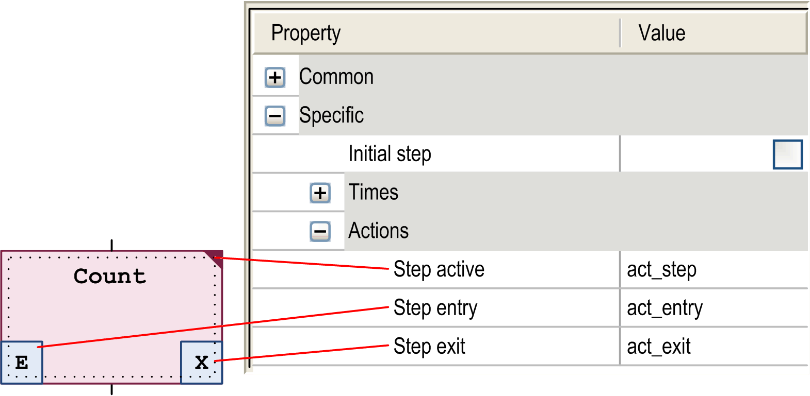

## Example: Differences Between IEC Matching / Extending Step Actions

The main difference between step actions and IEC actions with qualifier `N` is that the IEC action is at least executed twice: first time when the step is active and the second time when the step is deactivated. See the following example.

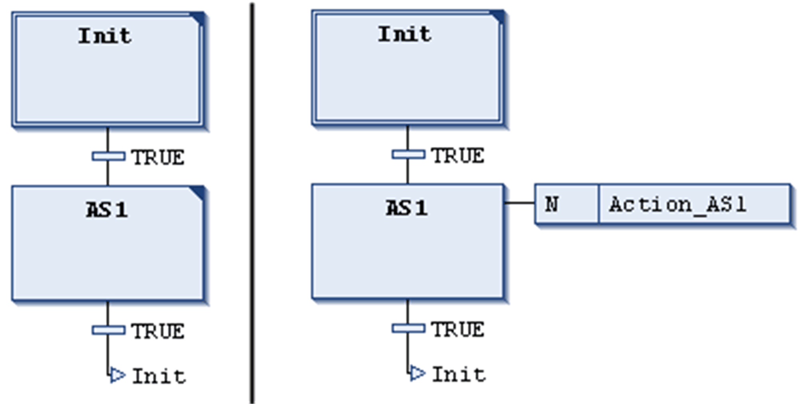

Action `Action_AS1` is associated to step `AS1` as a step action (left), or as an IEC action with qualifier `N` (right). Due to the fact that in both cases 2 transitions are used, it will take 2 controller cycles each before the initial step is reached again, assuming that a variable `iCounter` is incremented in `Action_AS1`. After a reactivation of step `Init`, `iCounter` in the left example will have value 1. In the right one however, it will have value 2 because the IEC action - due to the deactivation of `AS1` - has been executed twice.

For further information on qualifiers, refer to the [list of available qualifiers](D-SE-0083504.html#D-SE-0083504__D-SE-0083504.3).

In contrast to IEC actions, step actions can be embedded in such a way that they can only be called from the corresponding step. If you copy this step, new action objects are automatically created and the implementation code is duplicated. Select the duplication mode for step actions as Copy reference or Copy implementation in the dialog box that is displayed when you insert the first action into the step. You can select the duplication mode later by activating the Duplicate on copy [option](../../../../../api/crossBook?lang=en-US&virtualBookName=D-SE-0083502.html#D-SE-0083502__D-SE-0083502.4) in the Element Properties dialog box. It is also possible to configure the Default insertion method as a general option in the Tools > Options > SFC Editor [dialog box](../../SoMMenu&topicID=D_SE_0084059).

## Branches

A sequential function chart (SFC) can diverge; that is the processing line can be branched into 2 or several further lines (branches). [Parallel branches](#D-SE-0083503__D-SE-0083503.10) will be processed parallel (simultaneously). In the case of [alternative branches](#D-SE-0083503__D-SE-0083503.9), only one will be processed depending on the preceding transition condition. Each branching within a chart is preceded by a horizontal double (parallel) or simple (alternative) line and also terminated by such a line or by a [jump](#D-SE-0083503__D-SE-0083503.12).

## Parallel Branch

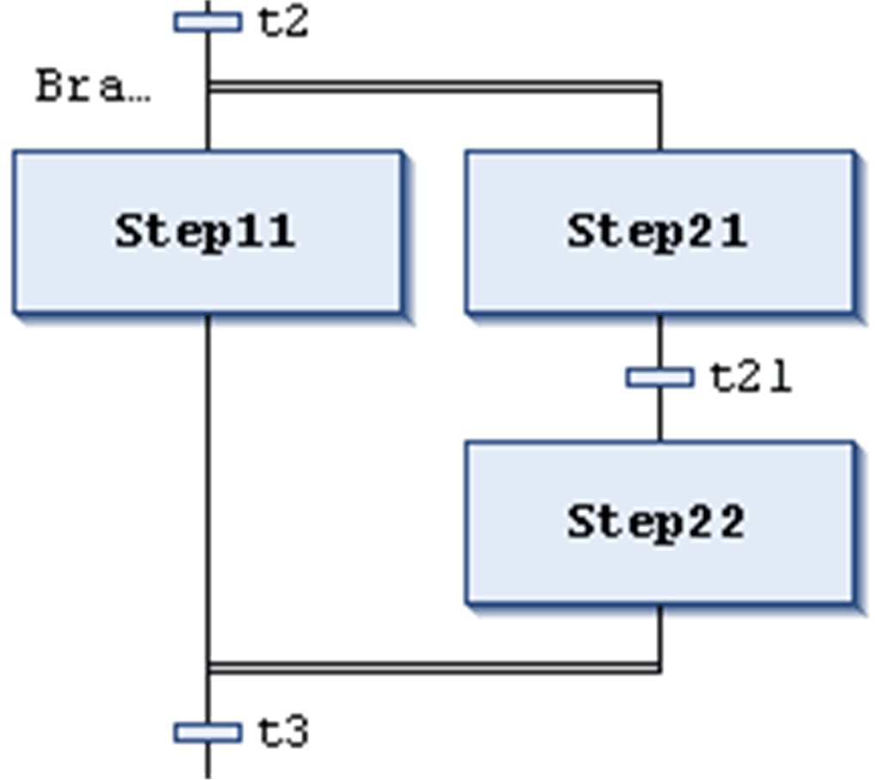

A parallel branch has to begin and end with a step. Parallel branches can contain alternative branches or other parallel branches.

The horizontal lines before and after the branched area are double-lines.

Processing in online mode: If the preceding transition (`t2` in the example shown on the left) is TRUE, the first steps of all parallel branches will become active (`Step11` and `Step21`). The particular branches will be processed in parallel to one another before the subsequent transition (`t3`) will be recognized.

To insert a parallel branch, select a step and execute the command Insert branch right.

You can transform parallel and alternative branches to each other by executing the commands Parallel or Alternative.

Automatically a branch label is added at the horizontal line preceding the branching which is named `Branch<n>` whereby `n` is a running number starting with 0. You can specify this label when defining a [jump target](#D-SE-0083503__D-SE-0083503.12).

## Alternative Branch

The horizontal lines before and after the branched area are simple lines.

An alternative branch has to begin and end with a transition. Alternative branches can contain parallel branches and other alternative branches.

If the step which precedes the alternative beginning line is active, then the first transition of each alternative branch will be evaluated from left to right. The first transition from the left whose transition condition has value TRUE, will be opened, and the following steps will be activated.

To insert alternative branches, select a transition and execute the command Insert branch right.

You can transform parallel and alternative branches from one another by executing the commands Parallel or Alternative.

## Jump

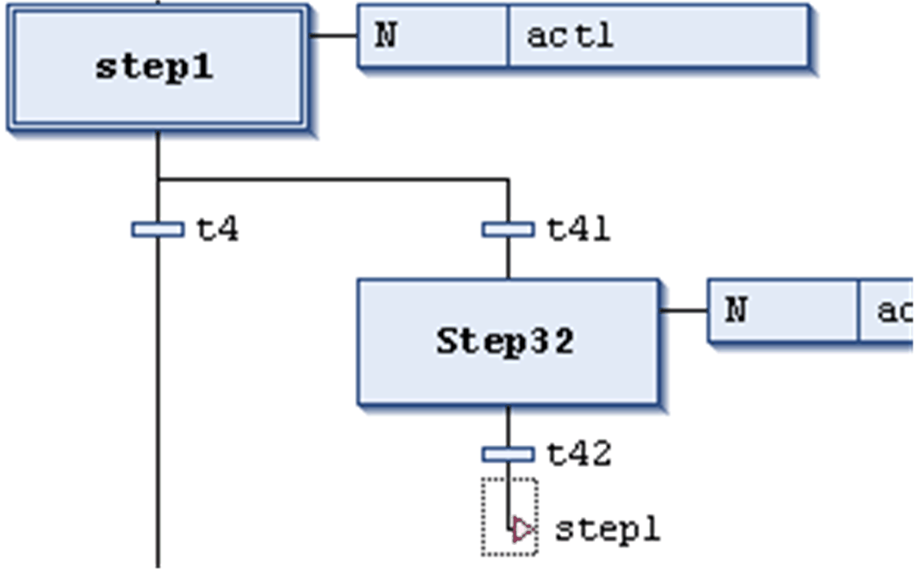

A jump is represented by a vertical connection line plus a horizontal arrow and the name of the jump target. It defines the next step to be processed as soon as the preceding transition is TRUE. You can use jumps to avoid that processing lines cross or lead upward.

Besides the default jump at the end of the chart, a jump may only be used at the end of a branch. To insert a jump, select the last transition of the branch and execute the command Insert jump.

The target of the jump is specified by the associated text string which can be edited. It can be a step name or the label of a parallel branch.

## Macro

Main SFC editor view

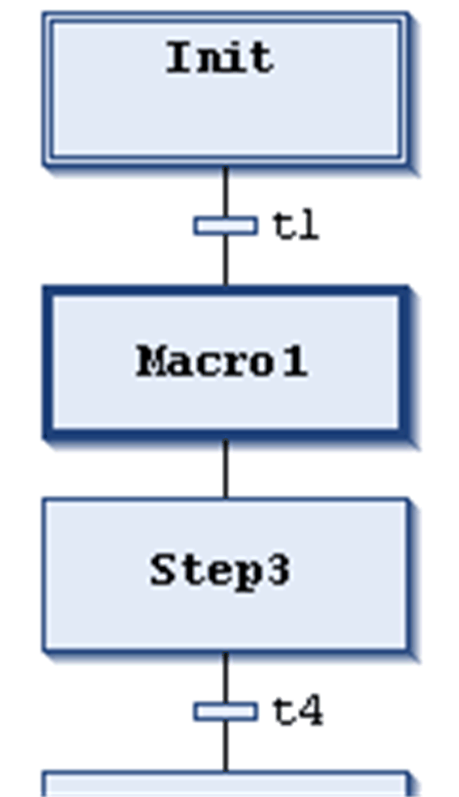

Macro editor view for `Macro1`

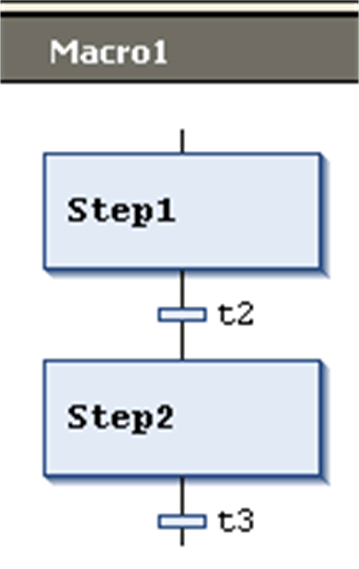

A macro is represented by a bold-framed box containing the macro name. It includes a part of the SFC chart, which thus is not directly visible in the main editor view. The process flow is not influenced by using macros; it is just a way to hide some parts of the program, for example, in order to simplify the display. To insert a macro box, execute the command Insert macro (after). The macro name can be edited.

To open the macro editor, double-click the macro box or execute the command Zoom into macro. You can edit here just as in the main editor view and enter the desired section of the SFC chart. To get out, execute the command Zoom out of macro.

The title line of the macro editor shows the path of the macro within the current SFC example:

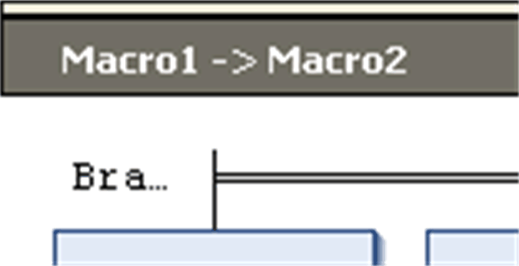

EIO0000002854.09