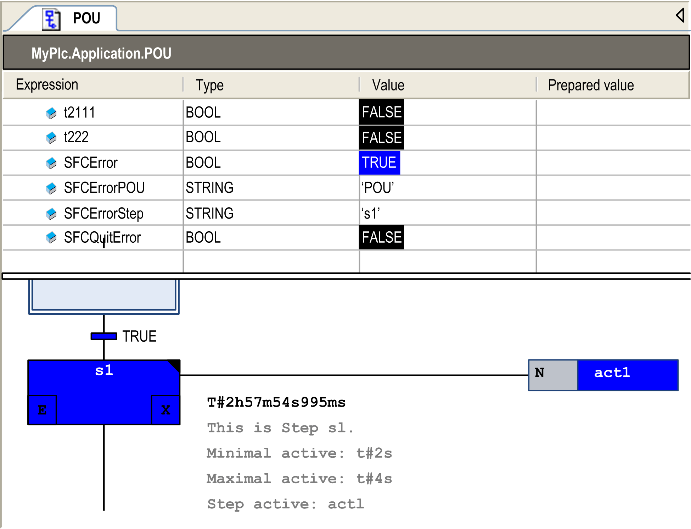

# Implicit Variables - SFC Flags

## Overview

Each SFC step and IEC action provides implicitly generated variables for watching the [status](#D-SE-0083505__D-SE-0083505.3) of steps and IEC actions during runtime. Also, you can define variables for watching and controlling the execution of an SFC (timeouts, reset, tip mode). These variables can also be generated implicitly by the SFC object.

Basically, for each step and each IEC action, an implicit variable is generated. A structure instance, named for the element, for example, step1 for a step with step name step1. You can define in the [element properties](D-SE-0083502.html#D-SE-0083502) whether for this flag a symbol definition should be exported to the symbol configuration and how this symbol should be accessible in the controller.

The data types for those implicit variables are defined in library IecSFC.library. This library will automatically be included in the project as soon as an SFC object is added.

## Step and Action Status and Step Time

Basically, for each step and each IEC action, an implicit structure variable of type SFCStepType or SFCActionType is created. The structure components (flags) describe the status of a step or action or the currently processed time of an active step.

The syntax for the implicitly done variable declaration is:

<stepname>: SFCStepType;

or

\_<actionname>:SFCActionType;

NOTE: Implicit variables for IEC actions are preceded by an underscore.

The following boolean flags for step or action states are available:

Boolean flags for **steps**:

| Boolean Flag | Description |
| --- | --- |
| <stepname>.x | shows the current activation status |
| <stepname>.\_x | shows the activation status for the next cycle |

If <stepname>.x = TRUE, the step will be executed in the current cycle.

If <stepname>.\_x = TRUE and <stepname>.x = FALSE, the step will be executed in the following cycle. Therefore, <stepname>.\_x is copied to <stepname>.x at the beginning of a cycle.

Boolean flags for **actions**:

| Boolean Flag | Description |
| --- | --- |
| \_<actionname>.x | is TRUE if the action is executed |
| \_<actionname>.\_x | is TRUE if the action is active |

**Symbol generation**

In the [element properties](D-SE-0083502.html#D-SE-0083502) of a step or an action, you can define if a symbol definition should be added to a possibly created and downloaded symbol configuration for the step or action name flag. For this purpose, make an entry for the desired access right in column Symbol of the element properties view.

NOTE: If you use the boolean flag <stepname>.x to force a certain status value for a step (for setting a step active), be aware that this will affect uncontrolled states within the SFC.

| WARNING | |
| --- | --- |
|  | UNINTENDED EQUIPMENT OPERATION  Do not use the boolean flag <stepname>.x to force a status value for setting a step active.  Failure to follow these instructions can result in death, serious injury, or equipment damage. |

**Time via TIME variables**:

The flag `t` gives the current time span which has passed since the step had become active. This is only for steps, no matter whether there is a minimum time configured in the [step attributes](D-SE-0083502.html#D-SE-0083502) or not (see below: SFCError).

For **steps**:

<stepname>.t (<stepname>.\_t not usable for external purposes)

For **actions**:

The implicit time variables are not used.

## Control of SFC Execution (Timeouts, Reset, Tip Mode)

You can use some implicitly available variables, also named SFC flags (see table below) to control the operation of an SFC. For example, for indicating time overflows or enabling tip mode for switching transitions.

In order to be able to access these flags you have to declare and activate them. Do this in the SFC Settings dialog box. This is a subdialog box of the object Properties dialog box.

Manual declaration, as it was needed in SoMachine / SoMachine Motion V3.1, is only necessary to enable write access from another POU (refer to the paragraph *Accessing Flags*).

In this case, consider the following:

If you declare the flag globally, you have to deactivate the Declare option in the SFC Settings dialog box.Otherwise this leads to an implicitly declared local flag, which then would be used instead of the global one. Keep in mind, that the SFC settings for an SFC POU initially are determined by the definitions set in the Options > SFC dialog box.

Consider that a declaration of a flag variable solely done via the SFC Settings dialog box will only be visible in the online view of the SFC POU.

The following implicit variables (flags) can be used. For this purpose, you have to declare and activate them in the SFC Settings dialog box.

| Variable | Type | Description |
| --- | --- | --- |
| SFCInit | BOOL | If this variable becomes TRUE, the sequential function chart will be set back to the [Init step](D-SE-0083503.html#D-SE-0083503). All steps and actions and other SFC flags will be reset (initialization). The initial step will remain active, but not be executed as long as the variable is TRUE. Set back SFCInit to FALSE in order to get back to normal processing. |
| SFCReset | BOOL | This variable behaves similarly to SFCInit. Unlike the latter however, further processing takes place after the initialization of the initial step. Thus, in this case, a reset to FALSE of the SFCReset flag could be done in the initial step. |
| SFCError | BOOL | As soon as any timeout occurs at 1 of the steps in the SFC, this variable will become TRUE. Precondition: SFCEnableLimit must be TRUE.  Consider that any further timeout cannot be registered before a reset of SFCError. SFCError must be defined, if you want to use the other time-controlling flags (SFCErrorStep, SFCErrorPOU, SFCQuitError).  NOTE: You can use the flags SFCErrorAnalyzation and SFCErrorAnalyzationTable to determine the components of the expression that contributes to the value TRUE of the SFCError. In the SFC editor, the flag SFCErrorAnalyzationTable uses this function implicitly for the analysis of expressions in transitions. |
| SFCEnableLimit | BOOL | You can use this variable for the explicit activation (TRUE) and deactivation (FALSE) of the time control in steps via SFCError. Therefore, if this variable is declared and activated (SFC Settings) then it must be set TRUE in order to get SFCError working. Otherwise, any timeouts of the steps will not be registered. The usage can be reasonable during start-ups or at manual operation. If the variable is not defined, SFCError will work automatically.  Precondition: SFCError must be defined. |
| SFCErrorStep | STRING | This variable stores the name of a step at which a timeout was registered by SFCError.timeout. The name is stored until the registered step error is reset by means of SFCQuitError.  Precondition: SFCError must be defined. |
| SFCErrorPOU | STRING | This variable stores the name of the SFC POU in which a timeout has occurred. The name is stored until the timeout is reset by means of SFCQuitError.  Precondition: SFCError must be defined. |
| SFCQuitError | BOOL | As long as this variable is TRUE, the execution of the SFC diagram is stopped, and variable SFCError will be reset. As soon as the variable has been reset to FALSE, all current time states in the active steps will be reset.  Precondition: SFCError must be defined. |
| SFCPause | BOOL | As long as this variable is TRUE, the execution of the SFC diagram is stopped. |
| SFCTrans | BOOL | This variable becomes TRUE, as soon as a transition is actuated. |
| SFCCurrentStep | STRING | This variable stores the name of the currently active step, independently of the time monitoring. In case of simultaneous sequences, the name of the outer right step will be registered. |
| SFCTipSFCTipMode | BOOL | These variables allow using the inching mode within the current chart. When this mode has been switched on by SFCTipMode=TRUE, you can only skip to the next step by setting SFCTip=TRUE (rising edge). As long as SFCTipMode is set to FALSE, it is possible to skip by the transitions. |
| SFCErrorAnalyzation | – | String variable that contains the variables contributing to the total value TRUE of SFCError (timeout in one step). As a prerequisite, SFCError must be activated.  SFCErrorAnalyzation implicitly uses the function of the POU AnalyzeExpression of the Analyzation library. |
| SFCErrorAnalyzationTable | – | Table that contains the variables contributing to the total value TRUE of SFCError (timeout in one step). As a prerequisite, SFCError must be activated.  SFCErrorAnalyzationTable implicitly uses the function of the POU AnalyzeExpressionTable of the Analyzation library. |

The following figure provides an example of some SFC detected error flags in online mode of the editor.

A timeout has been detected in step s1 in SFC object POU by flag SFCError.



## Accessing Flags

For enabling access on the flags for the control of SFC execution (timeouts, reset, tip mode), declare and activate the flag variables as described above ([Control of SFC Execution](#D-SE-0083505__D-SE-0083505.4)).

**Syntax for accessing from an action or transition within the SFC POU**:

<stepname>.<flag>

or

\_<actionname>.<flag>

Examples:

```
status:=step1._x;
```

```
checkerror:=SFCerror;
```

**Syntax for accessing from another POU**:

<SFC POU>.<stepname>.<flag>

or

<SFC POU>.\_<actionname>.<flag>

Examples:

```
status:=SFC_prog.step1._x;
```

```
checkerror:=SFC_prog.SFCerror;
```

Consider the following in case of write access from another POU:

* The implicit variable additionally has to be declared explicitly as a VAR\_INPUT variable of the SFC POU
* or it has to be declared globally in a GVL (global variable list).

Example: Local declaration

```
PROGRAM SFC_prog
VAR_INPUT
  SFCinit:BOOL;
END_VAR
```

Example: Global declaration in a GVL

```
VAR_GLOBAL
  SFCinit:BOOL;
END_VAR
```

Accessing the flag in `PLC_PRG`:

```
PROGRAM PLC_PRG
VAR
  setinit: BOOL;
END_VAR
SFC_prog.SFCinit:=setinit;  //Write access to SFCinit in SFC_prog
```

## Analyzation of Expressions

The Analyzation library allows to analyze expressions. It can be used, for example, in the SFC diagram to examine the result of the flag SFCError. This flag is used to monitor timeouts in the SFC diagram.

You can use the flags SFCErrorAnalyzation and SFCErrorAnalyzationTable to determine the components of the expression that contributes to the value TRUE of the SFCError.

EIO0000002854.09