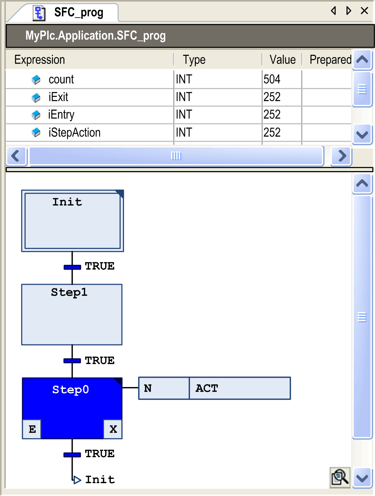

# SFC Editor in Online Mode

## Overview

In online mode, the SFC editor provides views for monitoring (see below) and for writing and forcing the variables and expressions on the controller. Debugging functionality like for the other IEC languages (breakpoints, stepping, and so on) is not available in SFC. However, consider the following hints for debugging SFC:

* For information on how to open objects in online mode, refer to the description of the [user interface in online mode](D-SE-0083360.html#D-SE-0083360).
* The editor window of an SFC object also includes the declaration editor in the upper part. For general information, refer to the chapter [*Declaration Editor in Online Mode*](D-SE-0083520.html#D-SE-0083520) . If you have declared [implicit variables (SFC flags)](D-SE-0083505.html#D-SE-0083505) via the SFC Settings dialog box, they will be added here, but will not be viewed in the offline mode of the declaration editor.
* Consider the [sequence of processing](D-SE-0083506.html#D-SE-0083506) of the elements of a Sequential Function Chart.
* See the object properties or the SFC editor options and SFC defaults for settings concerning compilation or online display of the SFC elements and their attributes.
* Consider the possible use of [flags](D-SE-0083505.html#D-SE-0083505) for watching and controlling the processing of an SFC.

## Monitoring

Active steps are displayed as filled with blue color. The display of step attributes depends on the set SFC editor options.

Online view of program object `SFC_prog`

EIO0000002854.09