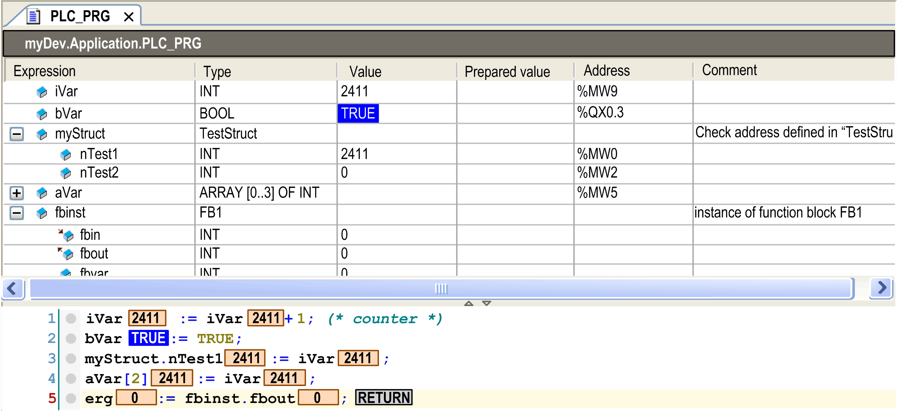
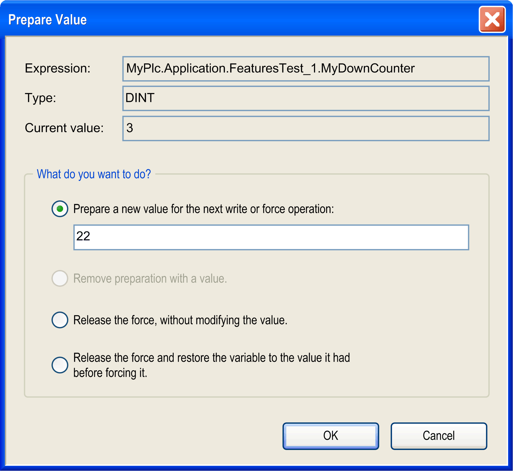

# ST Editor in Online Mode

## Overview

In online mode, the structured text editor (ST editor) provides views for [monitoring](#D-SE-0083511__D-SE-0083511.3), and for writing, and forcing the variables and expressions on the controller. Debugging (breakpoints, stepping, and so on) is available. [See Breakpoint positions in ST Editor](#D-SE-0083511__D-SE-0083511.6).

* For information on how to open objects in online mode, refer to the description of the [user interface in online mode](D-SE-0083360.html#D-SE-0083360).
* For information on how to enter prepared values for variables in online mode, see [*Forcing of variables*](#D-SE-0083511__D-SE-0083511.5).
* The editor window of an ST object also includes the declaration editor in the upper part. For information on the declaration editor in online mode, see [Declaration Editor in Online Mode](D-SE-0083520.html#D-SE-0083520).

## Monitoring

If the Enable inline monitoring option is activated in the Monitoring tab of the Tools > Options > Text editor dialog box, small monitoring boxes will be displayed behind each variable showing the actual value.

Online view of a program object `PLC_PRG` with monitoring:



## Forcing of Variables

In addition to the possibility of entering a prepared value for a variable within the declaration of any editor, the ST editor offers double-clicking the monitoring box of a variable within the implementation part (in online mode). Enter the prepared value in the dialog box that appears.

| WARNING | |
| --- | --- |
|  | UNINTENDED EQUIPMENT OPERATION  * You must have a thorough understanding of how forcing will affect the outputs relative to the tasks being executed. * Do not attempt to force I/O that is contained in tasks that you are not certain will be executed in a timely manner, unless your intent is for the forcing to take affect at the next execution of the task whenever that may be. * If you force an output and there is no apparent affect on the physical output, do not exit the online mode without removing the forcing. * If the online mode was interrupted while forcing was active, re-establish the connection with the controller and remove the forcing.  Failure to follow these instructions can result in death, serious injury, or equipment damage. |

Dialog box Prepare Value



You find the name of the variable completed by its path within the Devices Tree (Expression), its type, and current value.

By activating the corresponding item, you can choose the following options:

* preparing a new value which has to be entered in the edit field
* removing a prepared value
* releasing the variable that is being forced
* releasing the variable that is being forced and resetting it to the value it was assigned before forcing

To carry out the selected action, execute the command Debug > Force values (item Online) or press the F7 key.

## Breakpoint Positions in ST Editor

You can set a breakpoint basically at the positions in a POU where values of variables can change or where the program flow branches out or another POU is called. In the following descriptions, `{BP}` indicates a possible breakpoint position.

**Assignment**:

At the beginning of the line. Keep in mind that [assignments as expressions](D-SE-0083514.html#D-SE-0083514) define no further breakpoint positions within a line.

FOR-loop:

1. before the initialization of the counter
2. before the test of the counter
3. before a statement

```
{BP} FOR i := 12 TO {BP} x {BP} BY 1 DO
{BP} [statement1]
...
{BP} [statementn-2]
END_FOR
```

WHILE-loop:

1. before checking the condition
2. before an instruction

```
{BP} WHILE i < 12 DO
{BP} [statement1]
...
{BP} [statementn-1]
END_WHILE
```

**REPEAT**-loop:

* before checking the condition

```
REPEAT
{BP} [statement1]
...
{BP} [statementn-1]
{BP} UNTIL i >= 12
END_REPEAT
```

**Call of a program or a function block**:

At the beginning of the line.

```
{{BP} POU( );
```

**At the end of a POU**:

When stepping through, this position will also be reached after a RETURN instruction.

Breakpoint display in ST

| Breakpoint in Online Mode | Disabled Breakpoint | Program Stop at Breakpoint |
| --- | --- | --- |
|  |  |  |

NOTE: A breakpoint will be set automatically in all methods which may be called. If an interface-managed method is called, breakpoints will be set in all methods of function blocks implementing that interface and in all derivative function blocks subscribing the method. If a method is called via a pointer on a function block, breakpoints will be set in the method of the function block and in all derivative function blocks which are subscribing to the method.

EIO0000002854.09