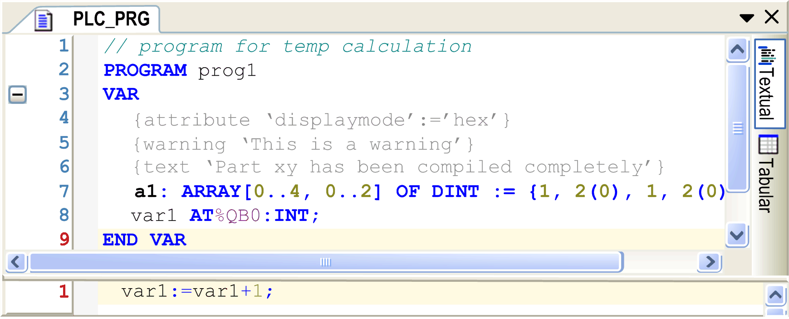

# Textual Declaration Editor

## Overview

Textual editor view

Behavior and appearance are determined by the respective current text editor settings in the Options and Customize dialog boxes. There you can define the default settings for highlight coloring, line numbers, tabs, indenting, and many more options. Editing functions, such as copy and paste, are available. Block selection is possible by pressing the Alt key while selecting the desired text area with the mouse.

* To scroll within the editor view, hold down the Shift key and use the scroll wheel of the mouse.
* To zoom within the editor view, hold down the Ctrl key and use the scroll wheel of the mouse.

EIO0000002854.09