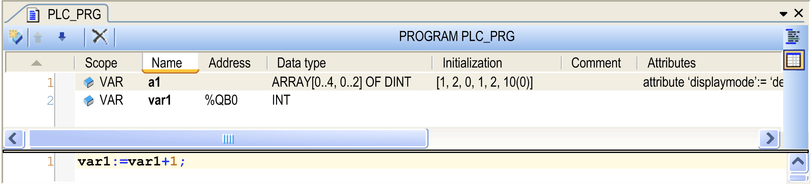
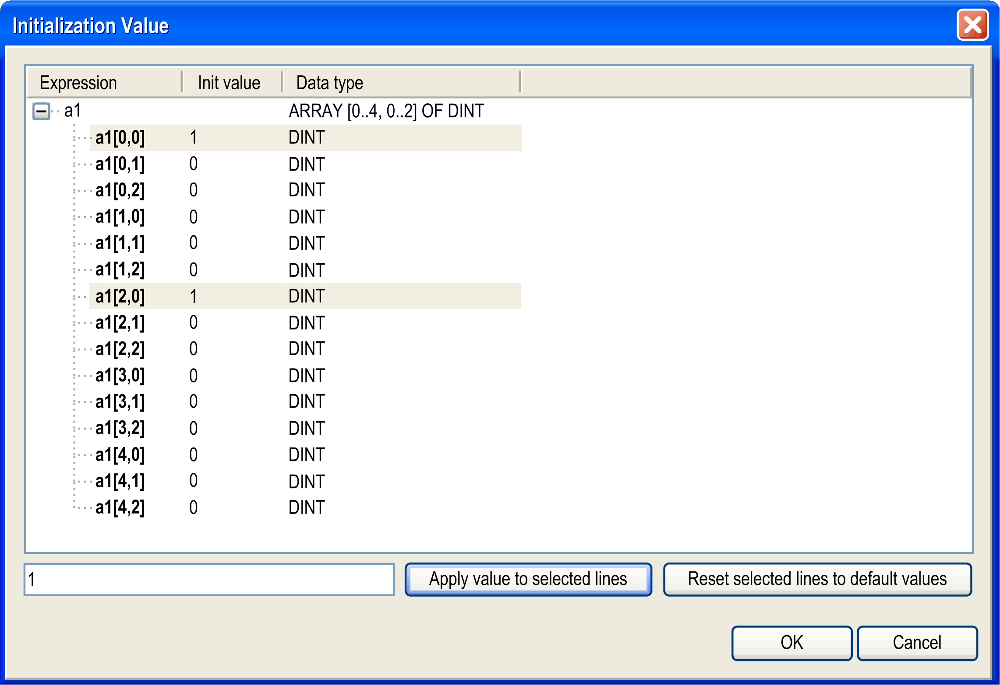
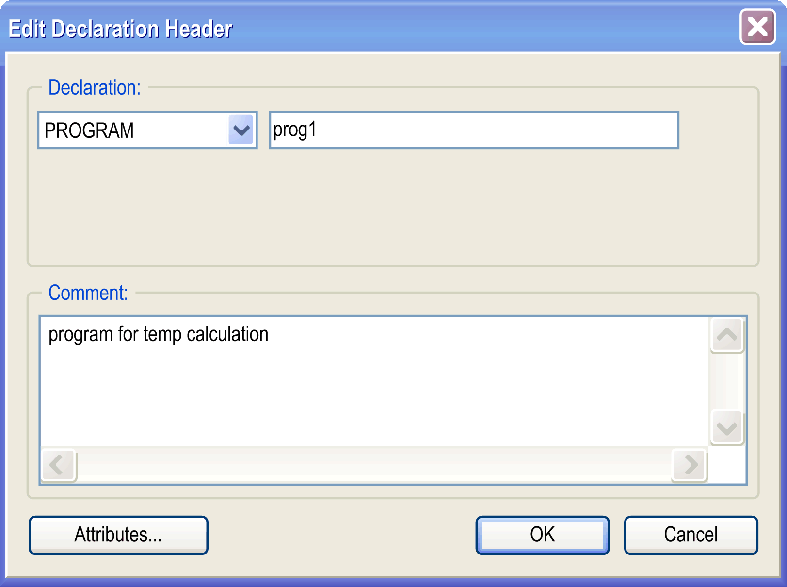
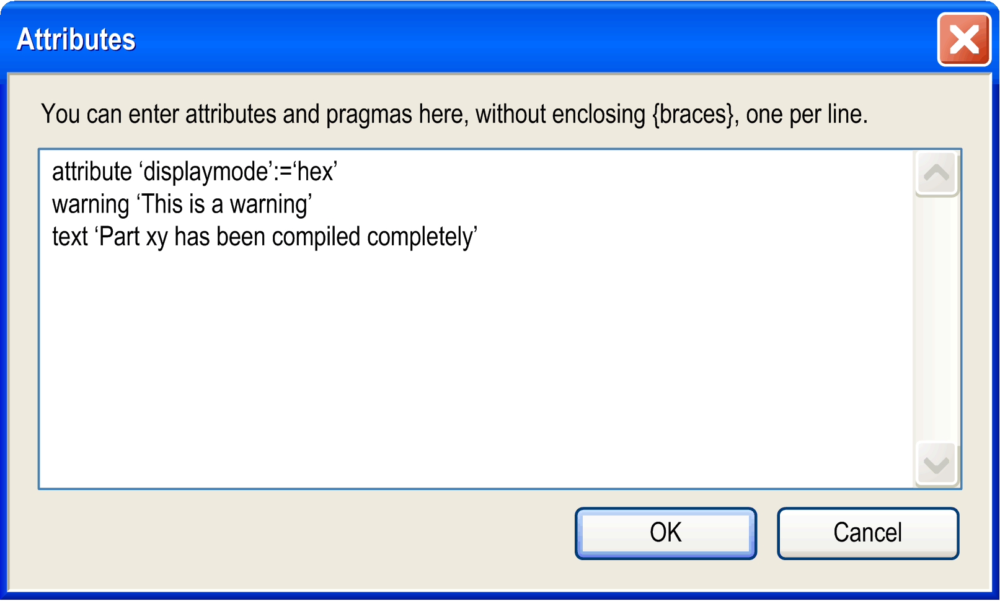

# Tabular Declaration Editor

## Overview

Tabular editor view



The tabular view of the editor provides columns for the usual definitions for [variable declaration](D-SE-0083599.html#D-SE-0083599): Scope, Name, Address, Data type, Initialization, Comment and (pragma) Attributes. The particular declarations are inserted as numbered lines.

To add a new line of declaration above an existing one, first select this line and execute the command  Insert from the toolbar or the contextual menu.

To add a new declaration at the end of the table, click beyond the last existing declaration line and also use the Insert command.

The newly inserted declaration by default first uses scope VAR and the recently entered data type. The input field for the obligatory variable Name opens automatically. Enter a valid identifier and close the field by pressing the Enter key or by clicking another part of the view.

Double-click a table cell to open the respective possibilities to enter a value.

Double-click the Scope to open a list from which you can choose the desired scope and scope attribute keyword (flag).

Type in the Data type directly or click the > button to use the Input Assistant or the Array wizard.

Type in the Initialization value directly or click the ... button to open the Initialization value [dialog box](#D-SE-0083519__D-SE-0083519.4). This is useful especially in case of arrays and structured variables.

Each variable is declared in a separate line where the lines are numbered.

You can change the order of lines (line numbers) by selecting a line and move it one up or down by the  Move up or  Move down command from the toolbar or the contextual menu.

You can sort the list of declarations according to each of the columns by clicking the header of the respective column.

To delete one or several declarations, select the respective lines and press the Delete key or execute the Delete command from the contextual menu or click the  button in the toolbar.

## Declaration of Arrays

For the declaration of array variables, use the arrow button > at the right side of the Type field and select Array Wizard. The Array dialog box opens.

Fill at least the fields marked with a red exclamation mark icon. Define the Dimensions by entering the lower and upper limits, and the Base Type of the variable. You can click the arrow button to open the Input Assistant dialog box or another Array Wizard for declaring the base type.

You can define an array of variable length with `[*,*,*]`. Arrays of variable length can only be used in VAR\_IN\_OUT declarations of function blocks, methods, and functions. To declare an array of variable length, enter an asterisk `*` for each dimension. This results in `ARRAY [*..*] OF INT`. After you have confirmed with OK, adapt the dimension string to `[*]` (one asterisk only).

Example for a two-dimensional array of variable length:

```
ARRAY [*,*]
```

The Result area of the dialog box provides a preview of the configured array declaration.

For further information, refer to the [*Arrays* description](D-SE-0083672.html#D-SE-0083672).

Click OK to close the declaration dialog box. The variable declaration appears in the declaration editor in accordance to the IEC syntax.

## Initialization Value

Initialization value dialog box



The Expressions of the variable are displayed with the present initialization values. Select the desired variables and edit the initialization value in the field below the listing. Then click the Apply value to selected lines button. To restore the default initializations, click the Reset selected lines to default values button.

Press Ctrl + Enter to insert line breaks in the Comment entry.

If the variable to be initialized is a function block instance with an extended [`FB_Init` method](D-SE-0083611.html#D-SE-0083611__D-SE-0083611.5), an additional table is displayed that lists the `FB_Init` parameters. The following differences apply to this table in contrast to the Initialization Value table:

* Assign an initialization value to each variable. Otherwise, the OK button remains disabled.
* Complex data types (structures, arrays) cannot be expanded and the components they contain cannot be displayed. Use a corresponding variable to initialize complex data types.

`FB_Init` parameters are marked in the Auto Declare dialog box by a corresponding symbol that is displayed after the initialization value.

## Edit Declaration Header

You can edit the declaration header in the Edit Declaration Header dialog box. Open it by clicking the header bar of the editor (PROGRAM PLC\_PRG in the figure above) or via the command Edit Declaration Header.

Edit Declaration Header dialog box



The Edit Declaration Header dialog box provides the following elements:

| Element | Description |
| --- | --- |
| Declaration | Insert type (from the selection list) and name of the POU object. |
| Comment | Insert a comment. Press Ctrl + Enter to insert line breaks. |
| Attributes | Opens the Attributes dialog box (see further below in this chapter) for inserting pragmas and attributes. |

## Attributes

In the Edit Declaration Header dialog box, click the Attributes... button to open the Attibutes dialog box. It allows you to enter multiple attributes and pragmas in text format. Insert them without enclosing {} braces, use a separate line per each. For the example shown in the following image, see the corresponding textual view above in the graphic of the [textual editor view](D-SE-0083518.html#D-SE-0083518__D-SE-0083518.3).

Attributes dialog box



EIO0000002854.09