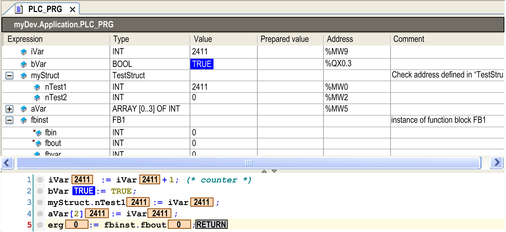

# Declaration Editor in Online Mode

## Overview

The online view of the declaration editor presents a table similar to that used in [watch views](D-SE-0083546.html#D-SE-0083546). The header line shows the actual object path *<device name>.<application name>.<object name>*. The table for each watch expression shows the type and present value as well as - if currently set - a prepared value for forcing or writing. If available, a directly assigned IEC Address and / or Comment are displayed in further columns.

The Value column displays the value on the controller offering monitoring functionality. If the variable is an array with more than 1,000 elements, you can define the range of the array indices to monitor. For further information, refer to [Defining the Range of the Array Indices](#D-SE-0083520__DefiningTheRangeOfTheArrayIndices-4C6BC154).

To establish a prepared value for a variable, either use the Prepare Value dialog box or click in the assigned field of the column Prepared value and directly type in the desired value. In case of enumerations, a list showing the enumeration values opens to select a value. In case of a boolean variable, the handling is even easier.

You can toggle boolean preparation values by use of the Return or Space key according to the following order:

* If the value is TRUE, the preparation steps are FALSE -> TRUE -> nothing.
* If the value is FALSE, the preparation steps are TRUE -> FALSE -> nothing.

If a watch expression (variable) is a structured type, for example, an instance of a function block or an array variable, then a plus or minus sign precedes the expression. With a mouse-click on this sign the particular elements of the instanced object can be additionally displayed (see `fbinst` in the following image) or hidden (see `aVar`). Icons indicate whether the variable is an input , output  or an ordinary variable .

When you point with the cursor on a variable in the implementation part, a tooltip shows the declaration and comment of the variable. See the following image showing the declaration editor in the upper part of a program object `PLC_PRG` in online view:

Online view of the declaration editor

## Defining the Range of the Array Indices

If the variable is an array with more than 1,000 elements, you can define the range of the array indices to monitor as follows:

| Step | Action |
| --- | --- |
| 1 | Double-click the Type column.  **Result**: The Monitoring Area dialog box opens. The declared array range is specified as the Valid area for monitoring. A maximum of 20,000 elements can be monitored per array. |
| 2 | Enter a Start index. |
| 3 | Enter an End index for the array to be monitored. |

The toggle button on the right-hand side of the scrollbars allows you to couple and uncouple the scrollbars.

* : The scrollbars are coupled. You can move this area while maintaining the same size.
* : The scrollbars are not coupled. You can increase or decrease the size of the area to be monitored.

EIO0000002854.09