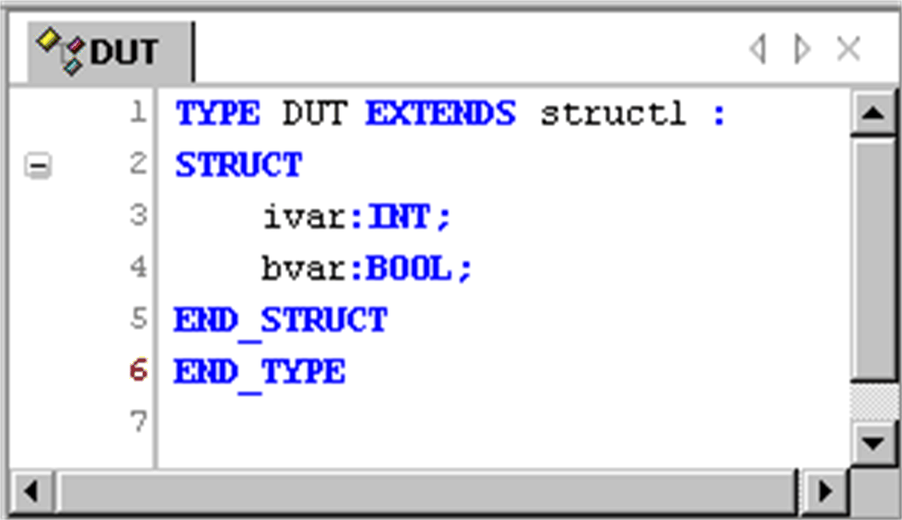

# Data Unit Type Editor

## Overview

You can create user-defined [data types](D-SE-0083660.html#D-SE-0083660) in the Data Unit Type editor (DUT editor). This is a text editor and behaves according to the currently set text editor options.

The DUT editor will be opened automatically in a window when you add a DUT object in the Add object dialog box. In this case, it provides by default the syntax of an extended structure declaration. You can use it as desired to enter a simple structure declaration or to enter the declaration of another data type unit, for example an enumeration.

The editor also opens when you open an existing DUT object currently selected in the POUs view.

DUT editor window

EIO0000002854.09