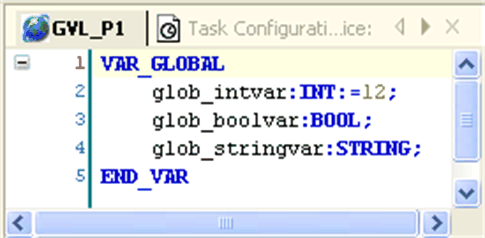

# GVL Editor

## Overview

The GVL editor is a Declaration Editor for editing Global Variables Lists. The GVL editor works as does the Declaration Editor and corresponds to the options, both offine and online, set for the text editor. The declaration starts with `VAR_GLOBAL` and ends with `END_VAR`. These keywords are provided automatically. Enter valid declarations of global variables between them.

GVL editor

## GVL Editor Used as Persistent Variables Editor

The GVL editor can also be used to manage Persistent Variables objects. In this case, the editor contains declarations of `VAR_GLOBAL PERSISTENT` variables. For further information, refer to the [chapter *Persistent Variables*](D-SE-0083430.html#D-SE-0083430) .

EIO0000002854.09