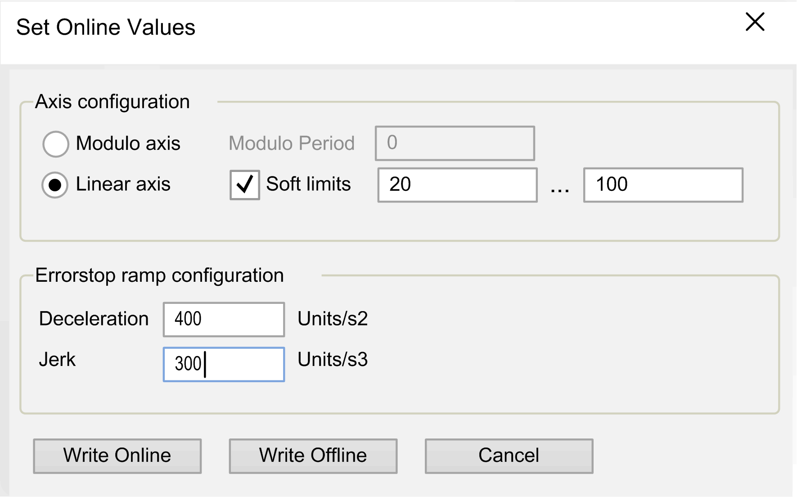

# Motion Design Object Editor

## Overview

The motion design object editor is exclusive to the M262 Motion Controller

The motion design object editor provides a generic base for configuring different motion design objects such as:

* A real axis as, for example, the Lexium 32S servo drive.
* A variable that implements a motion design objects interface.

To add a motion design object editor to your project, right-click the Application node, and execute the command Add object > Motion Design Object.... The Add Motion Design Object dialog box allows you to select the type of motion design object to be created.

## Adding a Motion Design Object of Type Virtual Axis

For the Type = Virtual Axis, the following elements are available in the Add Motion Design Object dialog box:

| Element | Description |
| --- | --- |
| Mode section | The Mode settings you specify here can be modified in the Configuration tab of the motion design object editor. |
| Target instance | Click the browse button (...) to select one of the supported function blocks or enter it directly into the field on the left-hand side. |
| Device object | Select a device object from the controller configuration that implements one of the interfaces of a motion design object, such as a Lexium 32 S standalone servo drive. |
| Generate global instance | A global variable of a motion design object interface is created. It can be accessed by IEC code by using the name of the object. |
| OK button | Click the Add button to:   * Create a Motion Design Object node as a subnode of the selected Application node. * Open the motion design object editor for the virtual axis. |

## Motion Design Object Editor of a Virtual Axis

The motion design object editor allows you to edit the parameter values. For the Type = Virtual Axis, it provides two tabs with the following parameters.

Elements of the Parameterisation tab:

| Element | Description |
| --- | --- |
| Axis configuration section | The Axis configuration section allows you to select the graphical representation of the Axis position on the lower left side of the editor:   * The option Modulo axis displays the Axis position as a modulo control.  The Modulo Period parameter defines the value that is assigned to one revolution of the circle in the diagram. * The option Linear axis displays the Axis position as a linear control.  Activate the Soft limits option to define a range of values for the x axis of the graph. If the axis is not within the defined boundaries, the axis position is displayed red. |
| Errorstop ramp configuration section | |
| Deceleration | Enter a value for the deceleration ramp in Units/s2. |
| Jerk | Enter a value for the jerk ramp in Units/s2. |
| Axis position | Graphical control of the position of the axis in modulo or linear mode, as defined with the Axis configuration parameter. |
| Axis State | Present state of the axis represented a a graphical chart. |
| Motion components | List of the components used for the virtual axis, indicating the Position, Velocity, and Acceleration values. |

Elements of the Configuration tab:

The Configuration tab contains the Mode and Access specifier parameters that are similar to the Add Motion Design Object [dialog box](#D-SE-0099475__D-SE-0099475.3) and that can be modified here.

## Modifying the Configuration in Online Mode

You can modify the values of the parameters if you are logged in to the controller by double-clicking an editable cell of the parameter list in the Configuration tab.

**Result**: The Set Online Values dialog box opens. It displays the configuration that is present in the controller.

You can modify the configuration according to your individual requirements.

The following options are available:

* Click the Write Online button to write the values to the controller. If errors are detected during this operation, a message box is displayed. After the values have been successfully written to the controller, the dialog box is closed.
* Click the Write Offline button to save the values to the project. The dialog box is closed.

EIO0000002854.09