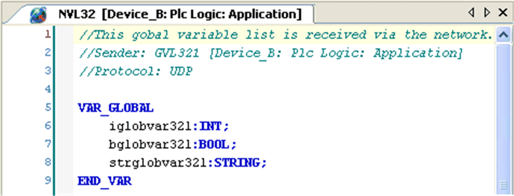

# Network Variables List Editor

## Overview

The NVL editor is a Declaration Editor for editing Network Variables Lists. The NVL editor works as does the Declaration Editor and corresponds to the options, both offine and online, set for the text editor. The declaration starts with `VAR_GLOBAL` and ends with `END_VAR`.These keywords are provided automatically. Enter valid [variable declarations](D-SE-0083597.html#D-SE-0083597) of global variables between them.

NVL editor

EIO0000002854.09