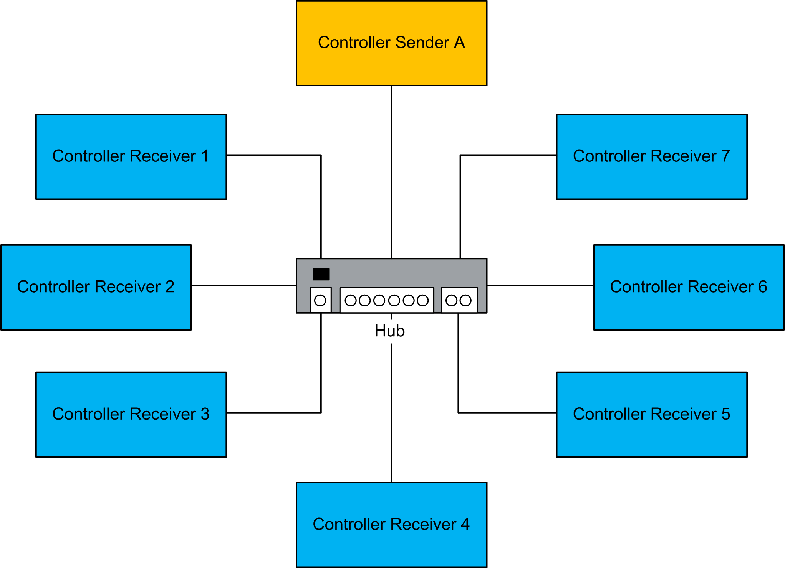

# Introduction to Network Variables List (NVL)

## Overview

The Network Variables List (NVL) feature consists of a fixed list of variables that can be sent or received through a communication network. This enables data exchange within a network via network variables, if supported by the controller (target system).

The list must be defined in the sender and in the receiver controllers (and can be handled in a single or in multiple projects). Their values are transmitted via broadcasting through User Datagram Protocol (UDP) datagrams. UDP is a connectionless Internet communications protocol defined by IETF RFC 768. This protocol facilitates the direct transmission of datagrams on Internet Protocol (IP) networks. UDP/IP messages do not expect a response, and are therefore ideal for applications in which dropped packets do not require retransmission (such as streaming video and networks that demand real-time performance).

The NVL functionality is a powerful feature. It allows you to share and monitor data between controllers and their applications. However, there are no restrictions as to the purpose of the data exchanged between controllers, including, but not limited to, attempting machine or process interlocking or even controller state changes.

NOTE: The type of the network variable is not shared between different controllers. You have to ensure that the used types have the same definition on all devices; otherwise NVL communication is not possible. This applies, for example, to the types SEC.ETH\_R\_STRUCT or SEC.PLC\_R\_STRUCT. They are available by default in various controllers with different size or fields.

Only you, the application designer and/or programmer, can be aware of all the conditions and factors present during operation of the machine or process and, therefore, only you can determine the proper communication strategies, interlocks and related safeties necessary for your purposes in exchanging data between controllers using this feature. Strict care must be taken to monitor this type of communication feature, and to be sure that the design of the machine or process will not present safety risks to people or property.

| WARNING | |
| --- | --- |
|  | LOSS OF CONTROL  * Perform a Failure Mode and Effects Analysis (FMEA), or equivalent risk analysis, of your application, and apply preventive and detective controls before implementation. * Provide a fallback state for undesired control events or sequences. * Provide separate or redundant control paths wherever required. * Supply appropriate parameters, particularly for limits. * Review the implications of transmission delays and take actions to mitigate them. * Review the implications of communication link interruptions and take actions to mitigate them. * Provide independent paths for control functions (for example, emergency stop, over-limit conditions, and error conditions) according to your risk assessment, and applicable codes and regulations. * Apply local accident prevention and safety regulations and guidelines.1 * Test each implementation of a system for proper operation before placing it into service.  Failure to follow these instructions can result in death, serious injury, or equipment damage. |

1 For additional information, refer to NEMA ICS 1.1 (latest edition), *Safety Guidelines for the Application, Installation, and Maintenance of Solid State Control* and to NEMA ICS 7.1 (latest edition), *Safety Standards for Construction and Guide for Selection, Installation and Operation of Adjustable-Speed Drive Systems* or their equivalent governing your particular location.

You can use [Diagnostic](../../../../../api/crossBook?lang=en-US&virtualBookName=NVLlib&topicID=D_SE_0020072) and [Error Management](../../../../../api/crossBook?lang=en-US&virtualBookName=NVLlib&topicID=D_SE_0020071) function blocks as well as network properties parameters to monitor the health, status and integrity of communications using this feature. This feature was designed for data sharing and monitoring and cannot be used for critical control functions.

## Network Variables List (NVL)

The network variables to be exchanged are defined in the following two types of lists:

* Network Variables Lists (NVL sender) in a sending controller
* Network Variables List (NVL receiver) in a receiving controller

The corresponding NVL (sender) and NVL (receiver) contain the same variable declarations. You can view their contents in the respective editor that opens after double-clicking the NVL (sender) or NVL (receiver) node in the Devices tree.

An NVL (sender) contains the network variables of a sender. In the Network properties of the sender, protocol and transmission parameters are defined. According to these settings, the variable values are broadcasted within the network. They can be received by the controllers that have a corresponding NVL (receiver).

NOTE: For network variables exchange, the respective network libraries must be installed. This is done automatically for the network type UDP as soon as the network properties for an NVL (sender) are set.

Network variables are broadcasted from the NVL (sender) to one or more NVL (receiver). For each controller, you can define NVL (sender) as well as NVL (receiver). Thus each controller can act as sender as well as receiver.

An NVL (sender) can be provided by the same or by another project. So, when creating an NVL (receiver), the NVL (sender) can either be chosen from a selection list of all available NVL (sender) within the network, or it can be read from an export file, which previously has been generated (for example, by using the Link to File dialog box) from the NVL (sender).

NOTE: An export file is needed if the NVL (sender) to be used is defined within another project.

## NVL Considerations

The following table shows the list of controllers that support the network variables list (NVL) functionality:

| Function Name | M241  M251 | M262 Logic / Motion | LMC Eco  LMC Pro  LMC Pro2 |
| --- | --- | --- | --- |
| Network Variables List | Yes | Yes | Yes |

NOTE: Since the exchange of network variables is performed via UDP, adjust the firewall settings of your controller accordingly. For further information, refer to the [How to Configure the Firewall for PacDrive LMC Controllers User Guide](../../../../../api/crossBook?lang=en-US&virtualBookName=FireLmcUG&topicID=D_SE_0104283)  and to the Programming Guide of your controller.

The figure shows a network consisting of one sender and the maximum of seven receivers:

**Controller Sender A:** Sender with the NVL (sender) and receiver controller with network variables lists (NVL (receiver))

**Controller Receiver 1...7:** Receivers (with NVL (receiver)) from A and sender controller (NVL (sender)) only for A

EIO0000002854.09