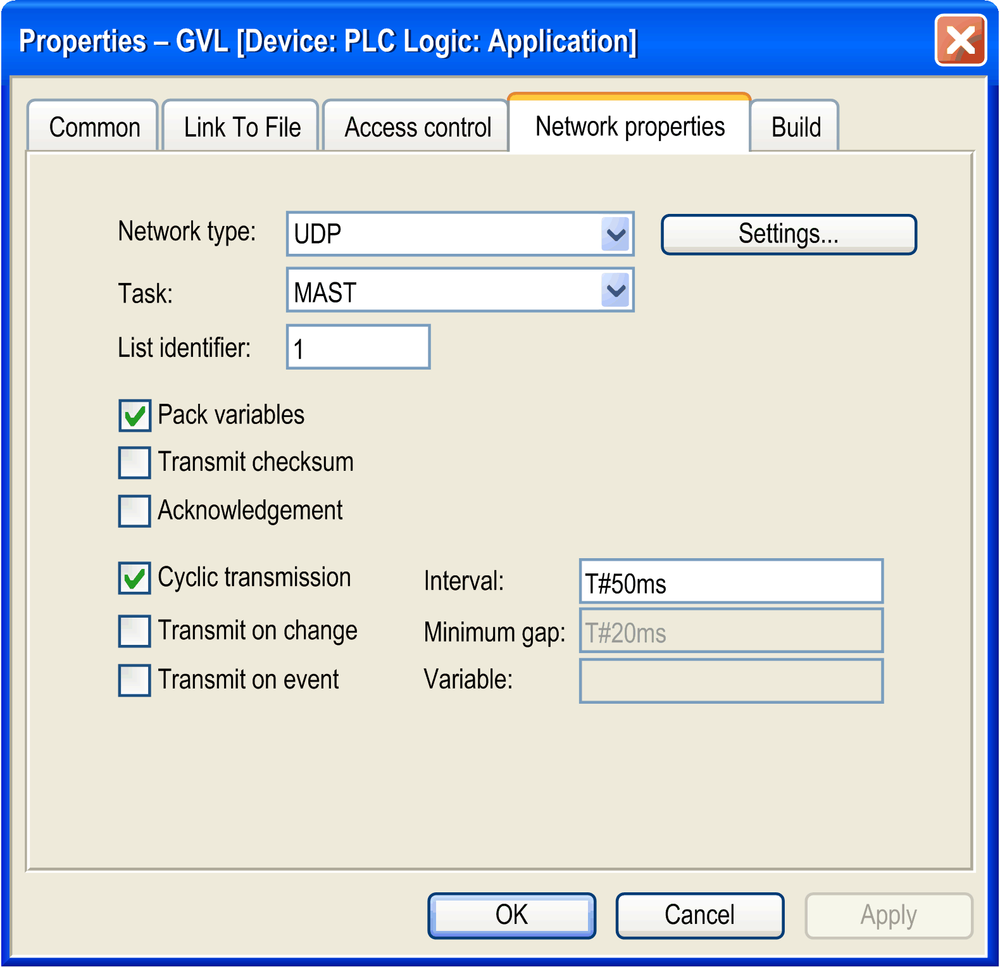
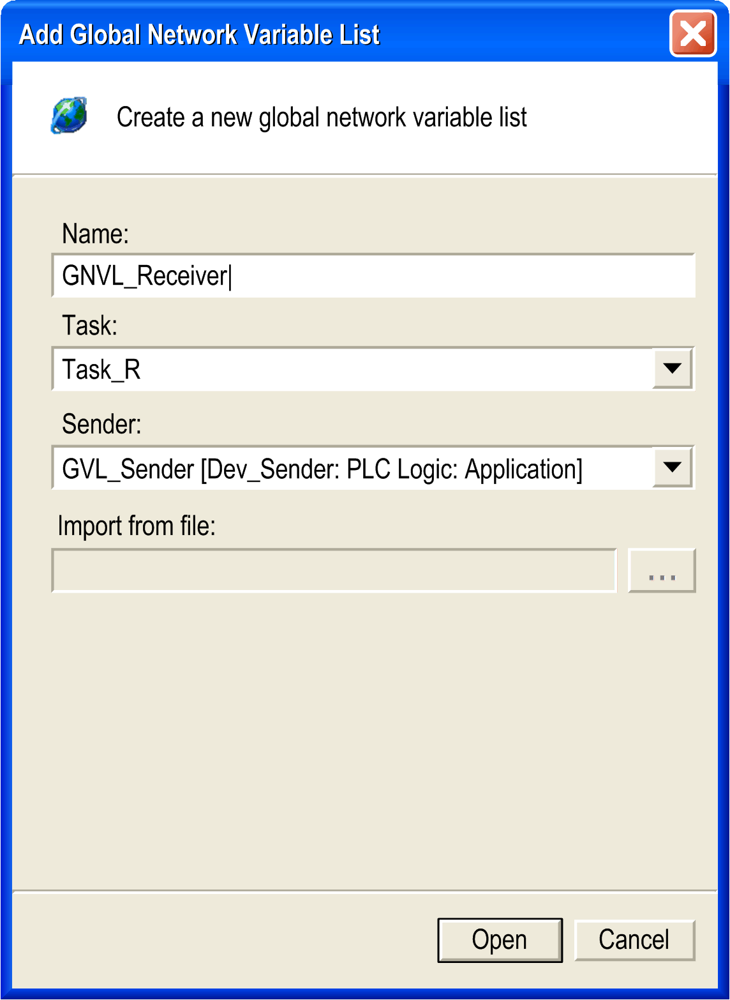

# Configuring the Network Variables Exchange

## Overview

To exchange network variables between a sender and a receiver, one sender and one receiver controller must be available in the Devices tree. These are the controllers that are assigned the network properties described below.

Proceed as follows to configure the network variables list:

| Step | Action |
| --- | --- |
| 1 | Create a sender and a receiver controller in the Devices tree. |
| 2 | Create a program (POU) for the sender and receiver controller. |
| 3 | Add a task for the sender and receiver controller.  NOTE: In order to maintain performance transparency, you should set the task priority of the dedicated NVL task to something greater than 25, and regulate communications to avoid saturating the network unnecessarily. |
| 4 | Define the NVL (sender) for the sender. |
| 5 | Define the NVL (receiver) for the receiver. |

An example with further information is provided in the [Appendix](../../../../../api/crossBook?lang=en-US&virtualBookName=NVLlib&topicID=D_SE_0083535).

## Global Variables List

To create the NVL (sender), define the following network properties in the GVL > Properties > Network properties dialog box:

Description of parameters

| Parameter | Default Value | Description |
| --- | --- | --- |
| Network type | UDP | Only the network type UDP is available.  To change the Broadcast Address and the Port, click the Settings... button. |
| Task | MAST | Select the task you configured below the Task Configuration item for executing NVL code.  To help maintain performance transparency, it is a good practice configure a cycle time Interval ≥50 ms for this task.  NOTE: In order to maintain performance transparency, you should set the task priority of the dedicated NVL task to something greater than 25, and regulate communications to avoid saturating the network unnecessarily.  NOTE: NVL must not be linked to the MAST M241/M251 controller. |
| List identifier | 1 | Enter a unique number for each NVL (sender) on the network. It is used by the receivers for identifying the [variables list](../../../../../api/crossBook?lang=en-US&virtualBookName=NVLlib&topicID=D_SE_0083533). |
| Pack variables | activated | With this option activated, the variables are bundled in packets (datagrams) for transmission.  If this option is deactivated, one packet per variable is transmitted. |
| Transmit checksum | deactivated | Activate this option to add a checksum to each packet of variables during transmission.  Receivers will then check the checksum of each packet they receive and will reject those with a non-matching checksum. A notification will be issued with the `NetVarError_CHECKSUM` [parameter](../../../../../api/crossBook?lang=en-US&virtualBookName=NVLlib&topicID=D_SE_0020072). |
| Acknowledgement | deactivated | Activate this option to prompt the receiver to send an acknowledgement message for each data packet it receives.  A notification will be issued with the `NetVarError_ACKNOWLEDGE` [parameter](../../../../../api/crossBook?lang=en-US&virtualBookName=NVLlib&topicID=D_SE_0020072) if the sender does not receive this acknowledgement message from the receiver before it sends the next data packet. |
| Cyclic transmission   * Interval | activated | Select this option for cyclic data transmission at the defined Interval.  This Interval should be a multiple of the cycle time you defined in the task for executing NVL code to achieve a precise transmission time of the network variables. |
| Transmit on change   * Minimum gap | deactivated   * T#20ms | Select this option to transmit variables whenever their values have changed.  NOTE: After the first download or using of Reset Cold or Reset Warm command in Online Mode the receiver controllers are not updated and keep their last value, whereas the sender controller value becomes 0 (zero).  The Minimum gap parameter defines a minimum time span that has to elapse between the data transfer. |
| Transmit on event   * Variable | deactivated   * – | Select this option to transmit variables as long as the specified Variable equals TRUE. The variable is checked with every cycle of the task for executing NVL code. |

Description of the button Settings...

| Parameter | Default Value | Description |
| --- | --- | --- |
| Port | 1202 | Enter a unique port number (≥ 1202) for each NVL (sender). |
| Broadcast Address | 255.255.255.255 | Enter a specific broadcast IP address for your application. |

## Network Variables List (Receiver)

A global network variables list can only be added in the Devices tree. It defines variables, which are specified as network variables in another controller within the network.

Thus, an NVL (receiver) object can only be added to an application if an NVL (sender) with network properties (network variables list) has already been created in one of the other network controllers. These controllers may be in the same or different projects.

To create the NVL (receiver), define the following parameters in the Add Object > Global Network Variable List dialog box:

Description of parameters

| Parameter | Default Value | Description |
| --- | --- | --- |
| Name | NVL | Enter a name for the NVL (receiver). |
| Task | task defined in the Task Configuration node of this Application | Select a task from the list of tasks which will receive the frames from the sender that are available under the Task Configuration node of the receiver controller. |
| Sender | 1 of the NVL (sender) available in the project | Select the NVL (sender) from the list of the NVL (sender) with network properties available in the project.  Select the entry Import from file from the list to use an NVL (sender) from another project. This activates the Import from file: parameter below. |
| Import from file: | – | This parameter is only available after you selected the option Import from file for the parameter Sender.  The ... opens a Windows Explorer window that allows you to browse to the export file *\*.gvl* you created from an NVL (sender) in another project.  For further information, refer to the *How to Add an NVL (Receiver) From a Different Project* paragraph below. |

## How to Add an NVL (Receiver) in the Same Project

When you add an NVL (receiver) via the Add Object dialog box, the corresponding NVL (sender) that are found within the present project for the present network are provided for selection in the Sender list box. NVL (sender) from other projects must be imported (see the *How to Add an NVL (Receiver) From a Different Project* paragraph below).

Due to this selection, each NVL (receiver) in the present controller (sender) is linked to one specific NVL (sender) in another controller (receiver).

Additionally, you have to define a name and a task, that is responsible for handling the network variables, when adding the NVL (receiver).

## How to Add an NVL (Receiver) From a Different Project

Alternatively to directly choosing an NVL (sender) from another controller, you can also specify an NVL (sender) export file you had generated previously from the NVL (sender) by using the Link to file properties. This allows you to use an NVL (sender) that is defined in another project.

To achieve this, select the option Import from file for the Sender: parameter and specify the path in the Import from file: parameter.

You can modify the settings later on via the Properties - GVL dialog box.

## NVL (Receiver) Properties

If you double-click an NVL (receiver) item in the Devices tree, its content will be displayed on the right-hand side in an editor. But the content of the NVL (receiver) cannot be edited, because it is only a reference to the content of the corresponding NVL (sender). The exact name and the path of the sender that contains the corresponding NVL (sender) is indicated at the top of the editor pane together with the type of network protocol used. If the corresponding NVL (sender) is changed, the content of the NVL (receiver) is updated accordingly.

EIO0000002854.09