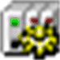
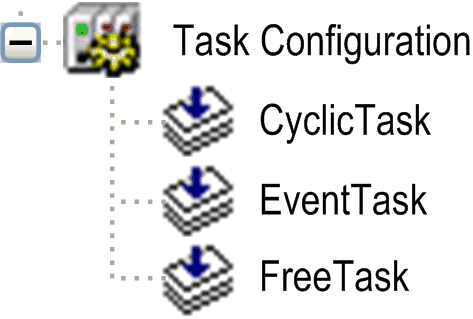

# Information on the Task Configuration

## Overview

The task configuration defines one or several tasks for controlling the processing of an application program. Thus, task configuration is an essential object for an application and must be available in the Applications Tree.

## Description of the Task Configuration Tree

At the topmost position of a task configuration tree, there is the entry Task Configuration . Below there are the defined tasks, each represented by the task name. The POU calls of the particular tasks are displayed in the task configuration tree.

You can edit the task tree (add, copy, paste, or remove tasks) by the corresponding commands usable for the Applications tree. For example, for adding a new task, select the Task Configuration node, click the green plus button, and execute the command Task.... Alternatively, you can right-click the Task Configuration node, and execute the command Add Object > Task....

Configure the particular tasks in the [task editor](D-SE-0083541.html#D-SE-0083541) which additionally provides a monitoring view in online mode. The options available for task configuration depend on the controller platform.

Task configuration in Applications tree

## Tasks

A [task](D-SE-0083541.html#D-SE-0083541) is used to control the processing of an IEC program. It is defined by a name, a priority and by a type determining which condition will trigger the start of the task. You can define this condition by a time (cyclic, freewheeling) or by an internal or external event which will trigger the task; for example, the rising edge of a global project variable or an interrupt event of the controller.

For each task, you can specify a series of program POUs that will be started by the task. If the task is executed in the present cycle, these programs will be processed for the length of 1 cycle.

The combination of priority and condition will determine in which [chronological order](D-SE-0083542.html#D-SE-0083542__D-SE-0083542.2) the tasks will be executed.

For each task, you can configure a time control (watchdog). The possible settings depend on the specific controller platform.

Keep in mind that all tasks share the same process image.

When you develop a project with several tasks, ensure that the input as well as the output data are copied to a location where they can only be accessed by one task to help avoid concurrent access to the same data by different tasks.

To help avoid consistency and synchronization issues caused by, for example, multiple read and write operations to one variable or when accessing other global objects (global variables or POUs), use function blocks of the SysSem library, for example.

EIO0000002854.09