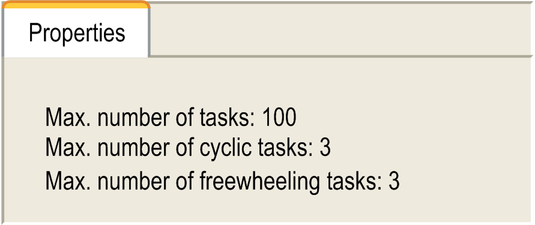

# Properties Tab

## Overview

When the [**Task Configuration**](D-SE-0083538.html#D-SE-0083538) node is selected, the Properties tab will be opened in the Task Configuration editor.

Task configuration, Properties tab, example

Information on the current task configuration as provided by the controller will be displayed, for example, the maximum allowed numbers of tasks per task type.

EIO0000002854.09