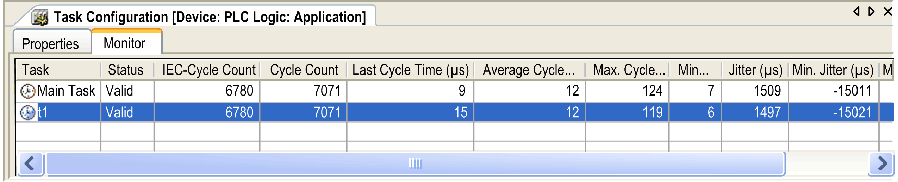

# Monitor Tab

## Overview

If it is supported by the target system, the monitoring functionality is allowed. This is a dynamic analysis of the execution time and the number of the calls which are controlled by a task. In online mode, the task processing can be monitored.

## Online View of the Task Configuration Editor

When you select the top node in the Task Configuration tree, besides the Properties [tab](D-SE-0083539.html#D-SE-0083539), the Monitor tab is available. In online mode, it shows the status and some current statistics on the cycles and cycle times in a table view. The update interval for the values is the same as used for the monitoring of controller values.

## Description of the Elements

When the top node in the Task Configuration tree is selected, besides the Properties [dialog](D-SE-0083539.html#D-SE-0083539) on a further tab the Monitoring dialog is available. In online mode, it shows the status and some current statistics on the cycles and cycle times are displayed in a table view. The update interval for the values is the same as used for the monitoring of controller values.

Task Configuration, Monitoring

For each task the following information is displayed in a line:

|  |  |
| --- | --- |
| Task | Task name as defined in the Task configuration. |
| State | Possible entries:   * Not created: has not been started since last update; especially used for event tasks * Created: task is known in the runtime system, but is not yet set up for operation * Valid: task is in normal operation * Exception: task has got an exception |
| IEC-Cycle Count | Number of run cycles since having started the application; 0 if the function is not supported by the target system. |
| Cycle Count | Number of already run cycles (depending on the target system, this can be equal to the IEC Cycle Count, or bigger if cycles are even counted when the application is not running.) |
| Last Cycle Time (µs) | Last measured runtime in µs |
| Average Cycle Time (µs) | Average runtime of all cycles in µs |
| Max. Cycle Time (µs) | Maximum measured runtime of all cycles in µs |
| Min. Cycle Time (µs) | Minimum measured runtime of all cycles in µs |
| Jitter (µs) | Present value of the periodic jitter1) in µs |
| Min. Jitter (µs) | Minimum measured periodic jitter1) in µs |
| Max. Jitter (µs) | Maximum measured periodic jitter1) in µs |
| 1) Periodic jitter Jper is the deviation of the task cycle time Tper from the specified task cycle time T0.  ***J p e r* = *T p e r* − *T 0***  The cycle time T0 is specified in the configuration of the task as Interval. | |

To reset the values to 0 for a task, place the cursor on the task name field and execute the Reset command available in the contextual menu.

EIO0000002854.09