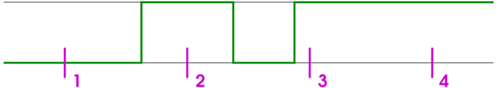

# Configuration of a Specific Task

## Overview

When you insert a task in the Task Configuration node of the Applications tree, the task editor view for setting the task configuration opens with the Configuration tab.

It also opens if you double-click an available task (for example, MAST) in order to modify the configuration of the task.

NOTE: You can modify the task name by editing the respective entry in the Applications tree.

Insert the desired attributes.

| Priority | |
| --- | --- |
| Priority (0...31) | A number from 0...31; 0 is the highest priority, 31 is the lowest  The default value for new tasks is defined by your controller.  NOTE: The assigned priority is only considered when tasks are grouped to one processor core.  NOTE: Consider the controller-specific task settings to find the settings for your application tasks. This may be important when assigning priority to tasks dedicated to communications, and its relation to topics such as cybersecurity. |
| Task group | This function is exclusive to Multicore controllers.  Assigned [task group](TaskGroupsTab-CE1329A2.html) can be assigned to specific processor cores in multicore devices.  Example: IEC-Tasks  In the Devices tree, the task group is displayed in brackets at the end of the task node name. |

| Type | |
| --- | --- |
| The target device defines which task types are supported. Not all types are available for some target devices. Consult the *Programming Guide* specific to your controller for more information. | |
| Cyclic | The task will be processed cyclic according to the time definition (task cycle time) given in the field Interval (see below). |
| Event | The task will be started as soon as the variable defined in the Event field gets a rising edge. |
| Freewheeling | The task will be processed as soon as the program is started and at the end of one run it will automatically be restarted in a continuous loop. There is no cycle time defined. |
| External | The task will be started as soon as the system event, which is defined in the External Event field, occurs. It depends on the target, which events will be supported and offered in the selection list. (Not to be mixed up with system events.) |
| Status | The task will be started if the variable defined in the Event field is TRUE. |

## Obligatory Entries Depending on Task Type

| Entry | Description |
| --- | --- |
| Interval (for example, t#200ms) | Obligatory for task type Cyclic.  The time (in milliseconds [ms]) after which the task should be restarted.  When you set the task cycle time, consider the bus system used by the application. For example, on a CAN bus system, you can set the Bus cycle task in the CANopen I/O Mapping tab. The task cycle time must match the transmission rate and the number of frames used on the bus. Additionally, the times set for heartbeat, nodeguarding and sync always should be a multiple of the task cycle time. Otherwise, CAN frames may go unrecognized. For further information, refer to the *Device Editor* part of the online help.  Deviations of the task from the configured task cycle time are displayed at runtime as periodic jitter in the Monitor [tab](D-SE-0083540.html#D-SE-0083540) |
| Event | Obligatory for type Event or triggered by an External event.  A global boolean variable which will trigger the start of the task as soon as a rising edge is detected. Use button ... or the Input Assistant to get a list of all available global event variables.  NOTE: If the event that is driving a task stems from an entry, there must be at least one task which is not driven by events. Otherwise, the I/Os will never get updated and the task will never get started.  NOTE: Only internal IEC variables and values of onboard touchprobes and digital inputs (controller) are permitted. Referencing a property (including system parameter) in an event task will lead to a [watchdog exception error](#D-SE-0083541__D-SE-0083541.5) being detected during download. |

## Difference Between Status and Event

The specified event being TRUE fulfills the start condition of a status driven task, whereas an event driven task requires the change of the event from FALSE to TRUE. If the event changes too fast from TRUE to FALSE and back to TRUE, then this event may be left undetected and thus the Event task will not be started.

The following example illustrates the resulting behavior of the task in reaction to an event (green line):

At sampling points 1...4 tasks of different types show a different reaction:

| Behavior at Point: | 1 | 2 | 3 | 4 |
| --- | --- | --- | --- | --- |
| Status | No start | Start | Start | Start |
| Event | No start | Start | No start because the event changed too fast from TRUE to FALSE and back to TRUE | No start |

## Watchdog Settings

For each task, you can configure a timeout control (watchdog).

The default watchdog settings depend on your controller.

When the Enable option is activated (check mark is set), the watchdog is enabled. When the task watchdog is enabled, an Exception error is raised if the execution time of the task exceeds the defined task time limit (Time) given in the defined Sensitivity.

When the exception is detected, the application is stopped. If option Update IO while in stop is enabled in the controller settings dialog box, the outputs are set to the pre-defined default values depending upon the particular controller platform.

NOTE: This function is not available for all supported controllers. Consult the *Programming Guide* specific to your controller.

The defined Sensitivity is taken into account when determining when to raise an exception error. The Sensitivity allows you to adjust for variations in cycle times in the execution of the task. The Sensitivity can be defined as follows:

* After consecutive timeouts:

  + Sensitivity set to 0 or 1: exception in the first cycle after time expires
  + Sensitivity set to 2: exception in the second cycle after time expires
  + Sensitivity set to n: exception in the nth cycle after time expires
* After a single timeout: exception if the cycle time of the present cycle is longer than (task time limit \* sensitivity).

NOTE: The watchdog function is not available in simulation mode.

Consult the *Programming Guide* specific to your controller, chapter *System and Task Watchdog*, for information on task time, sensitivity and other possible watchdog parameters.

## POUs

The POUs which are controlled by the task are listed here in a table with the POU name and an optional Comment. Above the table there are commands for editing:

* In order to define a new POU, open the Input Assistant dialog box via the command Add Call. Choose 1 of the programs available in the project. You can also add POUs of type program to the list by drag and drop from the Applications tree.
* In order to replace a program call by another 1, select the entry in the table, open the Input Assistant via command Change Call.. and choose another program.
* In order to delete a call, select it in the table and use the command Remove Call.
* The command Open POU opens the selected program in the corresponding editor.

The sequence of the listed POU calls from top to bottom determines the sequence of execution in online mode. You can shift the selected entry within the list via the commands Move up and Move down.

EIO0000002854.09