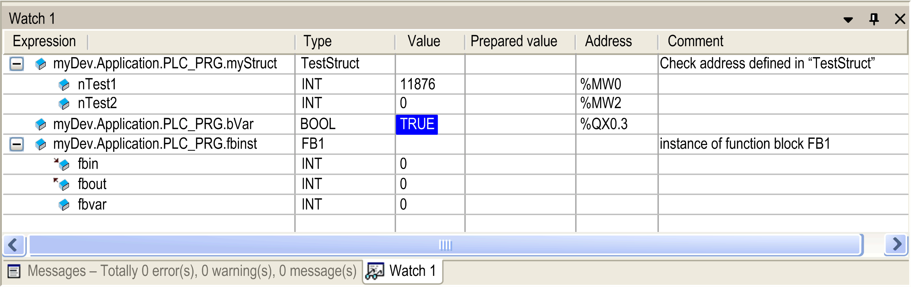
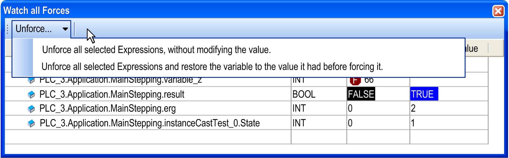

# Watch List in Online Mode

## Monitoring

A [watch list](D-SE-0083544.html#D-SE-0083544) (Watch<n>) in online mode displays the current value of a variable in the Value column. This is the value the variable has between two task cycles.

Also any assigned direct IEC address and/or comment are displayed. The components of the view correspond to those of the online view of the [declaration editor](D-SE-0083520.html#D-SE-0083520).

See chapter [*Creating a Watch List*](D-SE-0083545.html#D-SE-0083545) for a description on how to set up such a watch list and how to handle folds in case of structured variables.

Watch view in online mode

NOTE: In online mode you can add expressions to the watch list by use of the command Add Watch.

## Write and Force Values

In column Prepared value, you can enter a desired value which will be written or forced to the respective expression on the controller by command Write values or Force values. Refer to the descriptions of the commands Write and Force, usable also in other monitoring views (for example, declaration editor).

## Watch All Forces

This is a special watch list view, which in online mode is automatically filled with all currently forced values of the active application. Each Expression, Type, Value, and Prepared value will be shown, as in the online view of a Watch<n> list.

You can unforce values by one of the following commands available via the button Unforce...:

* Unforce all selected Expressions, without modifying the value.
* Unforce all selected Expressions and restore the variable to the value it had before forcing it.

Watch all Forces dialog box

EIO0000002854.09