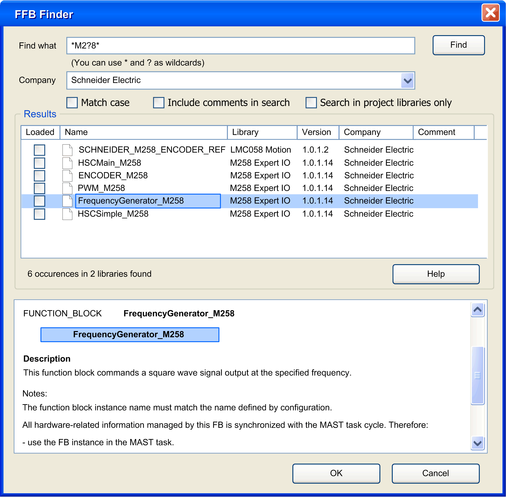

# Function and Function Block Finder

## Overview

EcoStruxure Machine Expert provides the FFB (function and function block) finder that assists you in finding a specific function or function block even if you do not know its exact name.

You can use the function and function block finder in the following programming languages that allow to insert function blocks:

* CFC
* LD
* IL
* FBD
* ST

## How to Find a Function or Function Block with the FFB Finder

When you are about to create programming code in the Logic Builder, go to the place where you want to insert the function block and open the FFB finder as follows:

* select the menu Edit > FFB Finder

  or
* right-click at the respective place in the editor and select the command FFB Finder... from the contextual menu

The FFB Finder dialog box opens:

The FFB Finder dialog box contains the following elements for finding a function or function block:

| Element | Description |
| --- | --- |
| Find what | In the Find what textbox, enter the name of the function or function block you want to insert into your programming code.  As wildcards you can use a question mark (?), which replaces exactly one character, or an asterisk (\*), which can replace several characters or no character at all. |
| Company | If you know the company that created the library which includes the function block you are searching for, you can select the companies from the Company list.  This parameter is by default set to All companies. |
| Match case | Check the Match case check box to perform a case-sensitive search.  By default, this check box is not selected. |
| Include comments in search | Check the Include comments in search check box to search for the entered string not only in the names of functions and function blocks but also in the comments that are saved with them.  By default, this check box is not selected. |
| Search in project Libraries only | Check the Search in project libraries only check box to limit the search to those libraries that are used in the current application.  By default, this check box is not selected and the find operation includes all libraries that are installed on the EcoStruxure Machine Expert PC. |
| Find | Click the Find button or press the ENTER key to start searching for the function or function block. |

## Results Returned by the FFB Finder

Any function or function block that matches the entered search criteria will be listed in the Results list with the following information:

* Name of the function or function block
* the Library the function or function block is saved in
* the Version of the library
* the Company that created the library
* A comment, if available, will be displayed in the column on the right side.
* The column Loaded on the left side indicates whether the library, the function or function block is saved in, is already used in the current project.

To display further information on one of the functions or function blocks, select it from the list. In the field below, a graphic of the function / function block with its inputs and outputs will be displayed, as well as a description or any further information, if available.

## Integrating a Function / Function Block into the Programming Code

To integrate a function / function block that was found by the FFB Finder in your programming code, select it in the Results list, and

* either double-click the selected entry in the Results list,
* or click the OK button.

The selected function / function block will be inserted at the place where your cursor is positioned in your programming code and the respective library will be loaded automatically.

Repeat this operation whenever you need assistance in finding a specific function / function block.

EIO0000002854.09