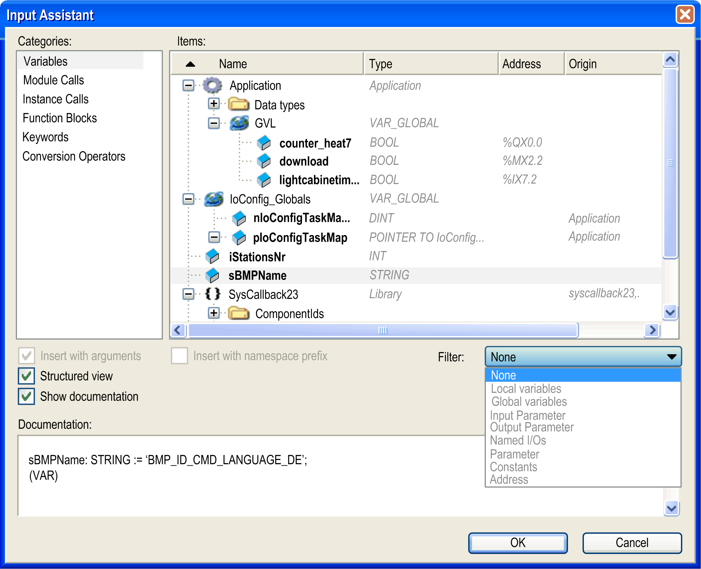

# Input Assistant

## Overview

The Input Assistant dialog box and the corresponding command Input Assistant (by default in the Edit > Smart Coding menu) are only available if the cursor is placed in a text editor window. The dialog box offers the available project items for being inserted at the current cursor position.

Default shortcut: F2

Input Assistant dialog box



## Description of the Elements

The Input Assistant dialog box provides the following elements:

| Element | Description |
| --- | --- |
| Categories | In this area, the project items are sorted by Categories. |
| Filter | You can set a Filter for the category Variables. To display a certain type of variable, select an entry from the list, such as Local variables, Global variables, Constants. |
| Items area | |
| Name, Type, Address, Origin | The Items area shows the available items and - depending on the category - also their data Type, Address, and Origin for the category selected in the Categories area.  The Origin is shown for I/O variables (path within the Devices Tree) and library-defined variables (library name and category).  You can sort the items by Name, Type, Address, Origin in ascending or descending alphabetic order. To achieve this, click in the respective column header (arrow-up or arrow-down symbol).  To hide or display the columns Type, Address or Origin, right-click the headline of the respective column. |
| Structured view | If the option Structured view is selected, the project items are displayed in a structure tree supplemented with icons.  If the option is not selected, the project items are arranged flat. Each project item is displayed with the POU it belongs to (example: GVL1.gvar1). |

NOTE: If there are objects with the same name available in the Global node of the Applications Tree as well as below an application (Applications Tree), only 1 entry is offered in the Input Assistant because the usage of the object is determined by the usual call priorities (first the application-assigned object, then the global one).

| Element | Description |
| --- | --- |
| Show documentation | If the option Show documentation is selected, the Input Assistant dialog box is extended by the Documentation field.  If the selected element is a variable and an address is assigned to this variable or a comment has been added at its declaration, these are displayed here. |
| Insert with arguments | If this option is selected, items which include arguments, for example functions, are inserted with those arguments.  Example:  If function block FB1, which contains an input variable fb1\_in and an output variable fb1\_out, is inserted with arguments, the following will be written to the editor:   ``` fb1(fb1_in:= , fb1_out=> ) ``` |
| Insert with namespace prefix | If this option is selected, the item is inserted with the prefixed namespace.  This option has to be selected when inserting objects into libraries which have defined in their Properties that the use of the namespace prefix is obligatory (option [**Only allow qualified access to all identifiers**](../../../../../api/crossBook?lang=en-US&virtualBookName=SoLibref&topicID=D_SE_0081235) is selected). |

EIO0000002854.09