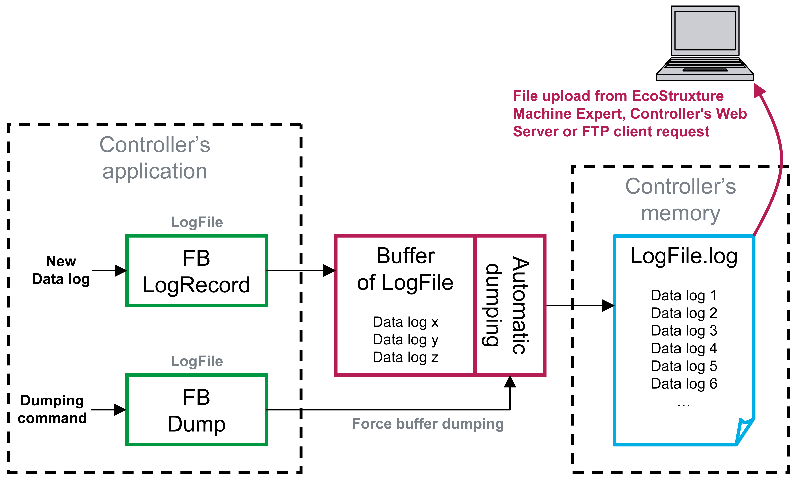

# Introduction to Data Logging

## Overview

You can monitor and analyze application data by examining the data log file (.log).



The figure shows an application that includes the 2 function blocks, `LogRecord` and `Dump`. The `LogRecord` function block writes data to the buffer, which empties into the data log file (.log) located into the controller memory. The buffer dumping is automatic when 80% full or it can be forced by the `Dump` function. As a standard FTP client, a PC can access this data log file when the controller acts as an FTP server. It is also possible to upload the file with EcoStruxure Machine Expert.

NOTE: Only controllers with file management functionality can support data logging. Refer to your controller programming manual to see if it supports file management.

## **Sample Data Log File (.log)**

```
Entries in File: 8; Last Entry: 8;
```

```
18/06/2009;14:12:33;cycle: 1182;
```

```
18/06/2009;14:12:35;cycle: 1292;
```

```
18/06/2009;14:12:38;cycle: 1450;
```

```
18/06/2009;14:12:40;cycle: 1514;
```

```
18/06/2009;14:12:41;cycle: 1585;
```

```
18/06/2009;14:12:43;cycle: 1656;
```

```
18/06/2009;14:14:20;cycle: 6346;
```

```
18/06/2009;14:14:26;cycle: 6636;
```

## Implementation Procedure

First declare and configure the data log files in your application before starting to write your program.

EIO0000002854.09