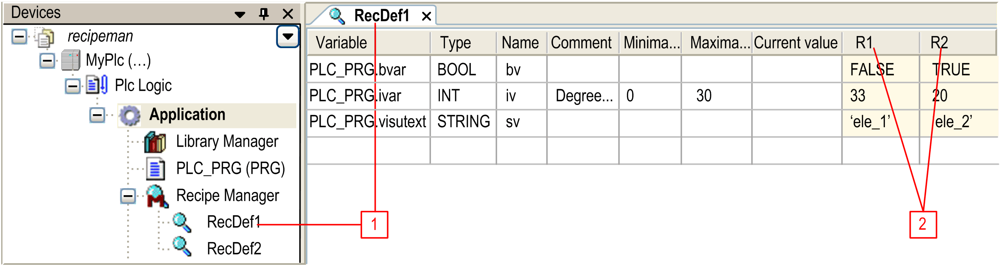

# Recipe Definition

## Overview

The [Recipe Manager](D-SE-0083554.html#D-SE-0083554) handles 1 or several recipe definitions. A recipe definition contains a list of variables and 1 or several recipes (value sets) for these variables. You can save a recipe to a file or write recipe files to the controller. By using different recipes, you can assign another set of values to a set of variables on the controller in one stroke. There is no limitation of the number of recipe definitions, recipes, and variables per recipe.

NOTE: The recipe management reads the values of the variables that are defined in the recipe definition at the end of the initialization phase of the application. Since the initial values of the application variables have all been set at this point, missing values from recipe files can be correctly initialized.

## Recipe Definition

You can add one or several Recipe Definition objects to a Recipe Manager node in the Tools tree. To achieve this, click the green plus button of the Recipe Manager node and execute the command Recipe Definition....

Double-click the node to view and edit recipe definitions including the particular recipes in a separate editor view.

Recipe definition editor view

**1** Recipe definition name

**2** Recipe names

The editor window is titled with the name of the recipe definition.

| Parameter | Description |
| --- | --- |
| Variable | In the table, you can enter several project variables for which you want to define 1 or several recipes. For this purpose, you can use the command Insert Variable when the cursor is in any field of any line. Alternatively, you can double-click a Variable field, or you can select it and press the spacebar to get into editor mode. Enter the valid name of a project variable, for example plc\_prg.ivar. You can click the ... button to open the Input Assistant.  You can also specify a POU, for example, a program like `PLC_PRG` shown in the figure above. In this case, all variables defined within the POU are added to the recipe definition automatically when you close the input field. The same applies to data types or function blocks.  You can toggle between the normal and the structured view using the buttons on the right side.  After you have modified the declaration of structured data types or POUs, the recipe definition can be reduced or extended by the concerned variables automatically. For further information, refer to the Update structured variables [command](../../../../../api/crossBook?lang=en-US&virtualBookName=SoMMenu&topicID=D_SE_0084170). |
| Type | The Type field is filled automatically. Optionally, you can define a symbolic Name. |
| Name | You can define a symbolic Name. |
| Comment | Enter additional information, such as the unit of the value recorded in the variable. |
| Minimal Value and Maximal Value | You can optionally specify these values which should be permissible for being written on this variable. |
| Current Value | This value is monitored in online mode. |
| Save recipe changes to recipe files automatically | It is a good practice to activate this option in the General tab of the Recipe manager editor because it affects the usual behavior of a recipe management: the storage files are updated immediately at any modification of a recipe during run time. Consider that the option can only be effective as long as the recipe manager is available on the controller. |

You can remove a variable (line) from the table by pressing the Delete key when one of its cells is selected. You can select multiple lines by keeping the Ctrl key pressed while selecting cells. You can copy the selected lines by copy and paste. The paste command inserts the copied lines above the selected line. In doing so, recipe values are inserted in the matching recipe column, if available.

To add a recipe to the recipe definition, execute the Add a new recipe [command](../../../../../api/crossBook?lang=en-US&virtualBookName=SoMMenu&topicID=D_SE_0084170) when the focus is in the editor view. For each recipe, an own column is created, titled with the recipe name (example: R1 and R2 in the figure above).

In online mode, a recipe can be changed either by an appropriately configured visualization element (input configuration execute command) or by using the appropriate methods of the function block RecipeManCommands of the Recipe\_Management.library.

For a list of methods available in the contextual menu of a recipe column in the recipe definition editor view, refer to [Using Recipes in Online Mode](#D-SE-0083555__D-SE-0083555.5).

See in the following paragraphs how the recipes behave in the particular online states. It is a good practice to set the option Save recipe changes to recipe files automatically (in order to get the usual behavior of a recipe management).

## Recipe

You can add or remove a recipe offline or online. In offline mode, use the commands [**Add a new recipe**](../../../../../api/crossBook?lang=en-US&virtualBookName=SoMMenu&topicID=D_SE_0084170) and [**Remove recipes**](../../../../../api/crossBook?lang=en-US&virtualBookName=SoMMenu&topicID=D_SE_0084170) within the recipe manager editor. In online mode, either configure an input on an appropriately configured visualization element, or use the appropriate methods of function block RecipeManCommands of the Recipe\_Management.library.

When adding a recipe, a further column is added behind the right-most column, titled with the name of the recipe (see the figure of the recipe definition editor view). The fields of a recipe column can be filled with appropriate values. Thus, for the same set of variables, different sets of values can be prepared in the particular recipes.

## Using Recipes in Online Mode

The recipes can be handled (created, read, written, saved, loaded, deleted) by using the methods of the function block RecipeManCommands, provided by the library Recipe\_Management.libray, in the application code, or via inputs on visualization elements.

Recipe handling in online mode if Save recipe changes to recipe files automatically is activated:

| Actions | Recipes Defined Within the Project | Recipes Created During Run Time |
| --- | --- | --- |
| Online Reset Warm  Online Reset Cold  Download | The recipes of all recipe definitions get set with the values out of the open project. | Dynamically created recipes remain unchanged. |
| Online Reset Origin | The application is removed from the controller. If a new download is done afterwards, the recipes will be restored like on an Online Reset Warm. | |
| Shut down and restart the controller | After the restart, the recipes are reloaded from the automatically created files. So the status before shutdown will be restored. | |
| Online Change | The recipe values remain unchanged. During run time, a recipe can only be modified by the commands of the RecipeManCommands function block. | |
| Stop | At a stop/start of the controller, the recipes remain unchanged. | |

NOTE: Floating point values (type REAL/LREAL) are stored in the textual recipe files in decimal format as well as in hexadecimal format. (Because the hexadecimal value represents the exact value whereas the decimal REAL value represents the value to the seventh decimal place.)

Example: `PLC_PRG.realVar:=22.0F16#1600000H-5`

For manually modifying a value in the recipe file, edit the decimal value and remove the subsequent hexadecimal entry. (If both values are available, the hexadecimal value is loaded.)

Recipe handling in online mode if Save recipe changes to recipe files automatically is NOT activated:

| Actions | Recipes Defined Within the Project | Recipes Created During Run Time |
| --- | --- | --- |
| Online Reset Warm  Online Reset Cold  Download | The recipes of all recipe definitions get set with the values out of the open project. However, these are only set in the memory. In order to store the recipe in a file, the Save Recipe command must be used explicitly. | Dynamically created recipes get lost. |
| Online Reset Origin | The application is removed from the controller. If a new download is done afterwards, the recipes will be restored. | Dynamically created recipes get lost. |
| Shut down and restart the controller | After the restart the recipes are reloaded from the initial values which had been created at download from the values out of the project. So the status as it was before shutdown will not be restored. | |
| Online Change | The recipe values remain unchanged. During run time, a recipe can only be modified by the commands of the RecipeManCommands function block. | |
| Stop | At a stop/start of the controller, the recipes remain unchanged. | |

Further information:

* Concerning the storage of recipes in files, which are reloaded at a restart of the application, refer to the description of the [*Recipe Manager Editor, Storage Tab*](D-SE-0083554.html#D-SE-0083554__D-SE-0083554.4).
* For a description of the particular RecipeManCommands [methods](D-SE-0083556.html#D-SE-0083556), refer to the documentation within the library.
* For the input configuration of a visualization element, refer to the help page (category Input > execute command).

The following actions on recipes are possible:

| Actions | Description |
| --- | --- |
| Create recipe (= Add a new recipe) | A new recipe is created in the specified recipe definition. |
| Read recipe | The values of the variables of the specified recipe definition are read from the controller and are written to the specified recipe. Therefore, the values will be stored implicitly (in a file on the controller). They will also be monitored immediately in the recipe definition table in the Recipe Manager. In other words, the recipe managed in the Recipe Manager gets updated with the actual values from the controller. |
| Write recipe | The values of the given recipe, as visible in the recipe manager, are written to the variables on the controller. |
| Save Recipe | The values of the specified recipe are written to a file with extension *\*.txtrecipe* or *\* .rcp*, the name of which you have to define. For this purpose, the dialog box for saving a file in the local file system opens.  NOTE: The implicitly used recipe files, necessary as a buffer for reading and writing of the recipe values, may not get overwritten. Therefore, the name for the new recipe file must be different from <recipe name>.<recipe definition name>.txtrecipe / .rcp. |
| Load Recipe | The recipe which has been stored in a file (see the Save Recipe description) can be reloaded from this file. The dialog box for browsing for a file opens for this purpose. The filter is automatically set to extension *\*.txtrecipe* / *\* .rcp*. After reloading the file, the recipe values will be updated accordingly in the recipe manager. For further information, refer to the description of the Load Recipe command in the [Menu Commands Online Help](../../../../../api/crossBook?lang=en-US&virtualBookName=SoMMenu&topicID=D_SE_0084170). |
| Delete recipe (= Remove recipe) | The specified recipe is removed from the recipe definition. |
| Change recipe | The value of the project variables can be changed. With a following write recipe action, the project variables are written with the new values. |

NOTE:

When using recipe files (create, read, write, delete), create [specific tasks](D-SE-0083541.html#D-SE-0083541) with low priority and with the Watchdog function disabled.

EIO0000002854.09